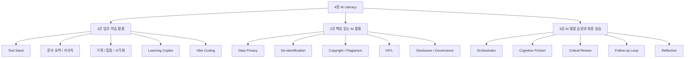
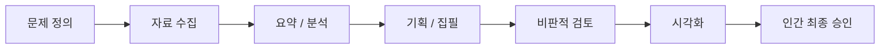
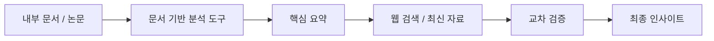
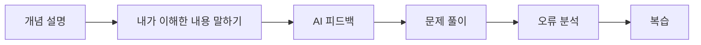
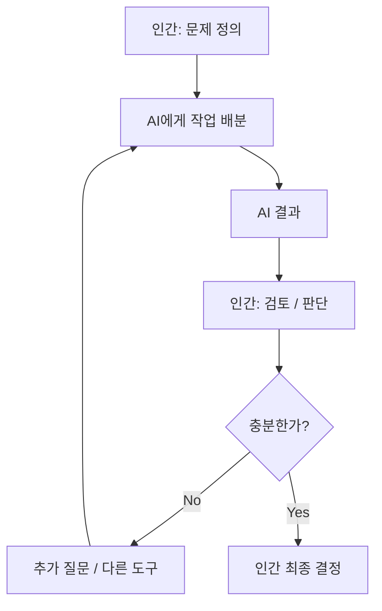
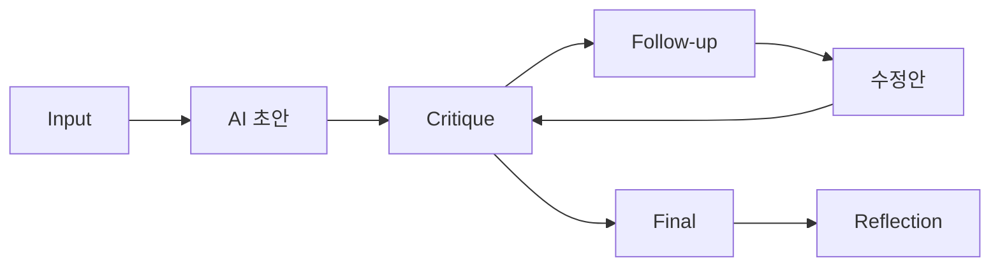
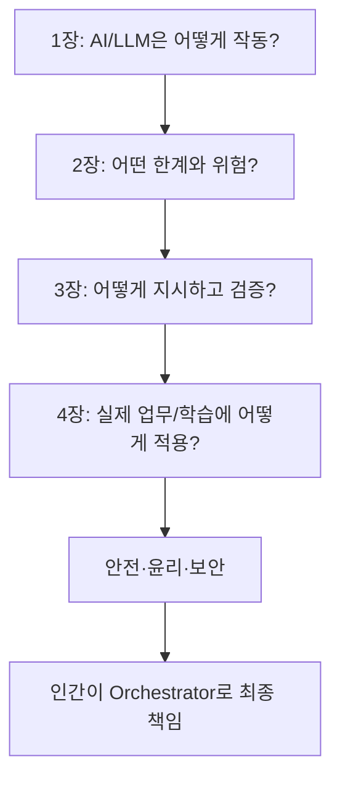

# [AI Literacy] 업무·학습 활용과 책임 있는 AI 활용·최종 실습 예습 정리

> **예습 목표: 아침 10분 안에 4장 전체 흐름을 잡는다.**  
> 이번 장은 **“AI를 실제 업무와 학습에 어떻게 조합해 쓸 것인가 → 어떻게 안전하게 쓸 것인가 → 어떻게 인간 주도 피드백 루프로 완성도를 높일 것인가”**를 배우는 마지막 장이다.

---

# 🚨 이것만 알고 강의 들어가기

## 핵심 7줄 요약

1. **AI 활용의 핵심은 단일 도구가 아니라 Tool Stack과 Workflow 설계**다.
2. 문서 요약·조사·기획·집필·시각화처럼 큰 과업은 **단계별로 쪼개고 각 단계에 적합한 AI를 배치**한다.
3. AI는 학습에서도 정답 대행자가 아니라 **Learning Copilot**으로 써야 한다.
4. 업무 데이터는 민감도에 따라 다르게 다루고, **PII·사내 기밀은 비식별화와 사내 정책 확인이 우선**이다.
5. AI 산출물은 **초안(Draft)** 으로 보고 저작권·표절·환각·편향을 인간이 검토한다.
6. 인간은 AI의 수동적 승객이 아니라 **Orchestrator**, 즉 도구를 지휘하고 최종 판단하는 사람이어야 한다.
7. 완성도는 한 번의 프롬프트가 아니라 **Input → Critique → Iteration → Reflection** 피드백 루프에서 올라간다.

### 중요도

- 🔥🔥🔥 **Tool Stack / Workflow**
- 🔥🔥🔥 **Human-in-the-loop / Orchestrator**
- 🔥🔥🔥 **데이터 프라이버시와 비식별화**
- 🔥🔥🔥 **AI 결과물 = Draft + Fact-Check**
- 🔥🔥 **Feedback Loop / Follow-up**
- 🔥🔥 **Learning Copilot / Vibe Coding**
- 🔥 **Style Transfer / Devil's Advocate / Disclosure 등 확장 개념**

---

# 🗺️ 4장 전체 학습 구조



## 이 장을 한 문장으로

> **AI를 여러 도구와 단계로 조합해 생산성을 높이되, 개인정보·저작권·환각을 인간이 통제하고 반복 검토를 통해 최종 결과를 책임지는 법을 배우는 장이다.**

---

# 🥇 1순위: Tool Stack = 한 AI에게 다 시키지 않는다

## Tool Stack

하나의 복잡한 일을 **여러 단계로 나누고**, 각 단계에 적합한 도구를 연결하는 방식이다.



### 핵심 사고

```text
"어떤 AI 하나가 제일 좋아?" X

"이 작업은 몇 단계이고,
각 단계에 어떤 능력이 필요한가?" O
```

---

# 🥇 2순위: 큰 과업은 쪼개서 처리한다

예: 긴 보고서를 활용해 기획서 만들기

```text
1. 문서 구조 파악
2. 핵심 내용 요약
3. 최신 정보 외부 확인
4. 목차 설계
5. 본문 초안
6. 반대 관점 검토
7. 문체 교정
8. 시각화
9. 사람 검수
```

한 번에:

```text
"이 100페이지 보고서를 읽고 완벽한 전략기획서 만들어줘"
```

라고 하는 것보다 안정적이다.

### 이유

- 컨텍스트 부담 감소
- 오류 위치 추적 쉬움
- 단계별 품질 검증 가능
- AI를 역할별로 교체 가능

---

# 🥈 3순위: 문서 요약과 리서치 워크플로우

교안의 핵심은 특정 제품명을 외우는 게 아니라 **폐쇄형 문서 분석 + 외부 최신 정보 검증** 조합이다.



### 기억할 것

```text
내가 준 문서 안에서 깊게 분석
+
외부 최신 정보로 사실 확인
```

둘을 분리하면 좋다.

---

# 🥈 4순위: 기획서 5단계 파이프라인

```text
기획
→ 조사
→ 집필
→ 교정
→ 시각화
```

## 1. 기획

```text
목표
타깃
문제
목차
논리 구조
```

부터 만든다.

## 2. 조사

근거 수치, 사례, 출처를 확보한다.

## 3. 집필

확보한 맥락과 자료를 기반으로 초안을 쓴다.

## 4. 교정

논리·문체·톤을 다시 검토한다.

## 5. 시각화

표, 차트, 흐름도, 인포그래픽으로 핵심을 보이게 만든다.

---

# 🥈 5순위: Devil's Advocate

기획을 더 좋게 만드는 방법은 AI에게 칭찬만 받는 것이 아니다.

```text
"이 아이디어가 실패한다고 가정하고,
가장 치명적인 문제 5개를 찾아줘."
```

처럼 일부러 **반대자 / 심사역 / 공격자** 역할을 준다.

### 목적

```text
초안
→ 반박
→ 취약점 발견
→ 보완
→ 더 강한 기획
```

---

# 🥈 6순위: Style Transfer

좋은 샘플을 제공하고 그 스타일에 맞게 다시 쓰게 하는 방식이다.

```text
사내 우수 보고서 예시
        ↓
문장 길이 / 어조 / 구조 파악
        ↓
내 초안 재작성
```

### 주의

스타일을 참고하는 것과 특정 저자의 표현을 과도하게 복제하는 것은 다르다.

실무에서는 **조직의 톤·구조·형식**을 맞추는 용도로 생각하면 된다.

---

# 🥇 7순위: Learning Copilot

AI를 학습에 쓸 때 가장 중요한 관점이다.

```text
AI = 과제 대신 해주는 사람 X
AI = 설명 / 질문 / 피드백 / 퀴즈를 주는 코치 O
```

## 좋은 학습 루프



### 핵심

> **AI가 생각을 대신하지 않고, 내 생각을 점검하게 해야 한다.**

---

# 🥈 8순위: Vibe Coding

자연어로 원하는 기능을 설명해 AI와 함께 소프트웨어를 만드는 방식이다.

```text
원하는 기능 설명
→ AI 코드 생성
→ 실행
→ 오류 확인
→ 수정 요청
→ 재실행
```

### 진짜 중요한 부분

```text
작동만 하면 끝 X

왜 작동하는지
어디서 입력되고
어떤 함수가 호출되고
어떤 값이 바뀌는지
확인 O
```

즉, **AI 생성 코드도 읽고 검토할 수 있어야 한다.**

---

# 🥇 9순위: 데이터 프라이버시

AI에 무엇을 입력해도 되는지 판단하는 능력이다.

## 입력 전 먼저 묻기

```text
이 정보는 공개 정보인가?
개인정보가 포함됐나?
회사 기밀인가?
외부 AI에 넣어도 되는가?
사내 정책이 허용하는가?
```

---

# 🥇 10순위: PII와 비식별화

## PII

개인을 식별하거나 식별 가능하게 하는 정보.

예:

- 이름
- 전화번호
- 이메일
- 주민등록번호
- 계좌번호
- 고객 ID 등

## De-identification

식별 가능한 정보를 제거하거나 치환한다.

```text
김지현 → 고객 A
프로젝트 알파 → 신규 사업 X
010-1234-5678 → [전화번호 삭제]
```

### 핵심

> **민감한 원문을 그대로 외부 AI에 넣는 것보다, 먼저 최소화·비식별화하는 습관이 우선이다.**

---

# ⚠️ 프라이버시에서 꼭 주의할 점

서비스의 저장·학습·임시 채팅 정책은 **제품·계정 유형·설정에 따라 달라질 수 있다.**

따라서:

```text
"임시 채팅이니까 모든 기밀 입력 가능"
X
```

보다는:

```text
사내 정책 확인
→ 데이터 최소화
→ 비식별화
→ 필요한 경우 승인된 기업용/폐쇄형 환경 사용
```

순서가 안전하다.

---

# 🥇 11순위: AI 결과물은 Draft

```text
AI 출력
≠
최종본
```

AI가 특히 틀리기 쉬운 것:

```text
숫자
연도
고유명사
출처
법령
인용
최신 정보
```

그래서:

```text
AI 초안
→ 사실 확인
→ 편향 확인
→ 문체 수정
→ 저작권/유사도 점검
→ 인간 승인
```

이 필요하다.

---

# 🥈 12순위: 저작권과 표절

핵심은 두 가지다.

```text
AI가 만들었다
→ 자동으로 안전하다 X
```

```text
AI가 만들었다
→ 내가 그대로 가져다 써도 무조건 내 저작권이다 X
```

상업·학술·대외 결과물이라면:

- 기존 작품과 지나치게 유사하지 않은지
- 인용·출처가 정확한지
- 조직/학교의 AI 사용 정책을 지켰는지
- 필요한 고지가 있는지

확인해야 한다.

---

# 🥈 13순위: Privacy by Design

보안 문제를 사고 난 뒤 처리하는 것이 아니라 **처음부터 설계에 넣는 것**이다.

```text
서비스 기획
→ 어떤 데이터를 받을지 결정
→ 최소 수집
→ 민감 정보 분리
→ 권한 설정
→ 저장/삭제 정책
→ 감사/검토
```

### 한 문장

> **보안은 마지막 체크리스트가 아니라 처음 설계 조건이다.**

---

# 🥇 14순위: Orchestrator = 인간이 지휘관

이번 전체 AI Literacy 과정의 최종 핵심이다.



인간의 역할:

```text
문제 정의
맥락 설계
도구 선택
검증 기준 설정
결과 큐레이션
최종 책임
```

AI의 역할:

```text
초안
분석
반복 작업
아이디어
정리
변환
```

---

# 🥇 15순위: Cognitive Friction

AI가 너무 편리해서 **생각 없이 통과하는 것을 막기 위한 의도적인 방지턱**이다.

예:

```text
AI 결과를 바로 제출하지 않기
반대 관점 질문하기
중요 수치 원문 확인하기
내 말로 다시 설명하기
시간을 두고 재검토하기
```

### 핵심

> **속도를 조금 늦춰서 판단 품질을 높이는 장치다.**

---

# 🥇 16순위: Feedback Loop

최종 실습의 핵심 구조다.



## 1. Input

문제를 정의하고 구조화된 프롬프트를 넣는다.

## 2. Critique

AI 답변의 문제를 **내가 먼저 찾는다.**

기준:

```text
Fact
Logic
Relevance
```

## 3. Iteration

꼬리 질문으로 수정한다.

## 4. Reflection

어떤 질문이 효과적이었는지 기록한다.

---

# 🧠 꼬리 질문 3종류

## 확장형

더 깊고 넓게.

```text
이 전략의 실제 사례를 3개 더 보여줘.
```

## 수렴형

범위를 좁힌다.

```text
예산 1,000만 원 안에서 가능한 것만 남겨줘.
```

## 전환형

반대 관점이나 새 시각으로 돌린다.

```text
이 전략이 실패한다면 가장 큰 이유는 뭐야?
```

---

# ⚠️ 강의에서 헷갈릴 가능성이 높은 부분

## 1. Tool Stack ≠ AI 많이 쓰기

도구 수가 많다고 좋은 게 아니다.

```text
문제
→ 단계
→ 각 단계에 필요한 능력
→ 최소한의 적합한 도구
```

가 핵심이다.

---

## 2. Learning Copilot ≠ 과제 대행

```text
정답 대신 작성
X

설명 → 질문 → 피드백 → 검증
O
```

---

## 3. Temporary Chat ≠ 기밀정보 면허증

서비스 기능보다 먼저 **조직의 데이터 정책과 데이터 최소화 원칙**을 봐야 한다.

---

## 4. AI 사용 고지 ≠ 모든 상황에서 같은 법적 의무

AI 표시·고지 의무는 **콘텐츠 유형, 서비스 제공자 여부, 적용 법령, 조직 정책**에 따라 달라질 수 있다.

따라서 실무에서는 최신 법령과 사내 가이드라인을 확인한다.

---

## 5. 인간 주도성 ≠ AI를 적게 쓰기

AI를 많이 써도 인간이:

```text
문제를 정의하고
검증 기준을 세우고
최종 판단을 한다면
```

주도권을 유지할 수 있다.

---

# 🔗 1~4장 전체 연결



## 전체 과정 한 문장

> **LLM의 작동 원리를 이해하고 → 한계를 인식하고 → 프롬프트와 검증법을 익힌 뒤 → 실제 업무·학습 Workflow에 안전하게 적용하는 과정이다.**

---

# 🔗 앞으로 AI Agent 학습과 연결하기

이번 4장의 개념은 AI Agent 개발로 그대로 이어진다.

```text
사용자 목표
→ 작업 분해
→ 적합한 Tool 선택
→ Context 제공
→ AI 실행
→ 결과 검증
→ 실패 시 재시도
→ Human Approval
```

이 구조 자체가 나중에 배울 **Agent Workflow**의 기본 골격이다.

### 특히 기억할 것

```text
Tool Stack
Context Engineering
HITL
Feedback Loop
Orchestrator
```

이 다섯 개는 Agent 개발에서도 계속 나온다.

---

# ⏱️ 아침 10분 예습 코스

## 0~2분 — 전체 지도

```text
Tool Stack
→ 업무/학습 적용
→ Privacy / Copyright
→ Human Review
→ Feedback Loop
→ Orchestrator
```

---

## 2~4분 — 실무 Workflow

```text
기획
→ 조사
→ 집필
→ 검토
→ 시각화
→ 승인
```

---

## 4~6분 — 안전

```text
민감정보인가?
→ 최소화
→ 비식별화
→ 사내 정책 확인
→ 승인된 환경 사용
```

---

## 6~8분 — 인간의 역할

```text
AI = Draft
Human = Verify + Decide + Responsible
```

---

## 8~9분 — 피드백 루프

```text
Input
→ Critique
→ Follow-up
→ Improve
→ Reflection
```

---

## 9~10분 — 마지막 암기

### 내일 강의 전에 이 10개만 기억하기

1. **Tool Stack = 단계별 적합한 AI 조합**
2. **큰 과업은 쪼갠다.**
3. **Learning Copilot = 생각을 돕는 학습 파트너**
4. **Vibe Coding도 생성 코드 검토가 필요하다.**
5. **PII·기밀은 비식별화와 정책 확인이 우선이다.**
6. **AI 결과물은 Draft다.**
7. **저작권·표절·환각을 인간이 확인한다.**
8. **Orchestrator = 인간이 문제와 도구를 지휘한다.**
9. **Cognitive Friction = 생각의 방지턱**
10. **Input → Critique → Iteration → Reflection**

---

# ✅ 강의 들어가기 전 30초 셀프 체크

아래 질문에 한 문장씩 답할 수 있으면 예습 성공이다.

- Tool Stack은 왜 필요한가?
- 복잡한 업무를 왜 단계로 나누는가?
- Learning Copilot과 과제 대행의 차이는?
- 민감 정보를 AI에 넣기 전에 뭘 해야 하는가?
- AI 산출물을 왜 Draft로 봐야 하는가?
- Orchestrator의 역할은?
- Cognitive Friction은 왜 필요한가?
- Feedback Loop의 4단계는?

---

# 🎓 AI Literacy 1~4장 최종 지도

```text
1장
AI / ML / DL / LLM
Token / Embedding / Transformer
Next-Token / Context Window
        ↓
2장
Hallucination / Cutoff / Bias
Automation Bias / HITL
RTCCF
        ↓
3장
Zero-shot / Few-shot / CoT / RGC
SIFT / Micro Fact-Check
Cross-Validation
        ↓
4장
Tool Stack / Workflow
Privacy / Copyright
Learning Copilot / Vibe Coding
Feedback Loop / Orchestrator
```

> **최종 한 줄:**  
> AI 리터러시의 핵심은 AI에게 일을 맡기는 기술이 아니라, **문제를 구조화하고 적합한 도구를 선택하고 결과를 검증하며 최종 책임을 인간이 갖는 능력**이다.
