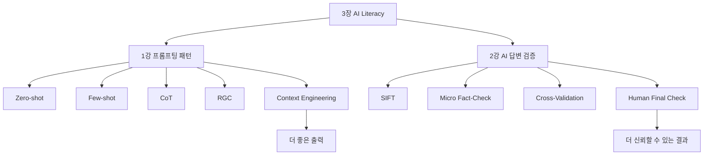
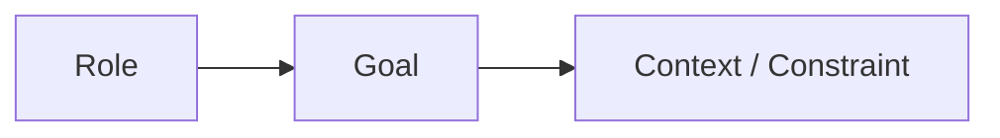
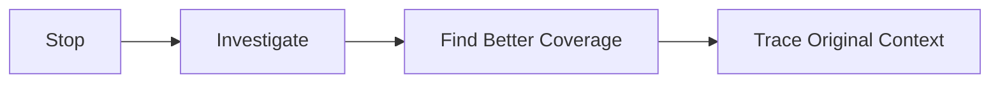
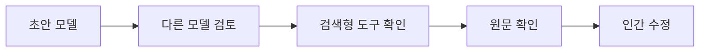
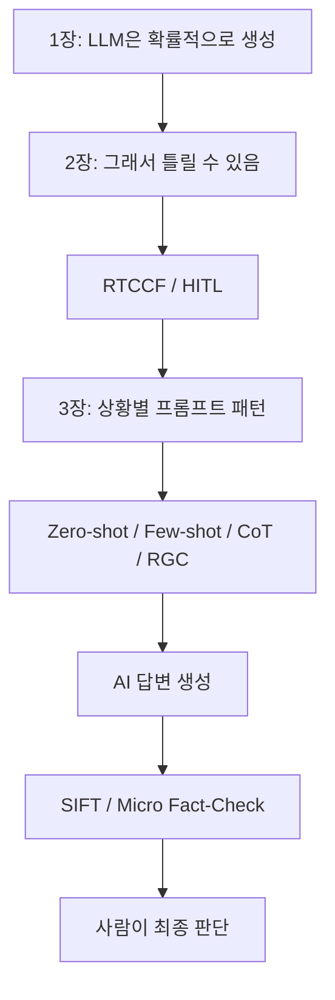

# [AI Literacy] 프롬프팅 패턴과 AI 답변 검증 예습 정리

> **예습 목표: 아침 10분 안에 3장 전체 흐름을 잡는다.**  
> 이번 장은 **“어떤 프롬프트 패턴을 언제 쓸지 → 복잡한 문제에서 어떻게 추론을 돕게 할지 → AI 답변을 어떻게 검증할지”**를 배우는 장이다.

---

# 🚨 이것만 알고 강의 들어가기

## 핵심 6줄 요약

1. **Zero-shot**은 예시 없이 지시만 주는 방식이다.
2. **Few-shot**은 모범 예시를 몇 개 제공해 출력 패턴을 맞추는 방식이다.
3. **CoT(Chain-of-Thought)**는 복잡한 문제를 단계적으로 풀게 유도하는 추론 강화 방식이다.
4. **RGC**는 `Role → Goal → Context/Constraint`로 프롬프트를 구조화하는 프레임워크다.
5. AI 답변은 그럴듯해도 틀릴 수 있으므로 **SIFT + Micro Fact-Check**로 검증해야 한다.
6. 중요한 결과는 **다중 모델 교차 검증 + 인간의 원문 확인**까지 가야 한다.

### 중요도

- 🔥🔥🔥 **Zero-shot vs Few-shot**
- 🔥🔥🔥 **CoT의 역할과 한계**
- 🔥🔥🔥 **SIFT 검증 루틴**
- 🔥🔥🔥 **Micro Fact-Check**
- 🔥🔥 **RGC 프레임워크**
- 🔥🔥 **다중 모델 교차 검증**
- 🔥 **Cognitive Debt / Lateral Reading 등 확장 개념**

---

# 🗺️ 3장 전체 학습 구조



## 이 장을 한 문장으로

> **좋은 답을 얻기 위한 프롬프트 패턴과, 그 답이 맞는지 검증하는 방법을 함께 배우는 장이다.**

---

# 🥇 1순위: Zero-shot vs Few-shot

## Zero-shot

예시 없이 바로 지시한다.

```text
이 고객 리뷰를 긍정/부정으로 분류해줘.
```

### 언제 좋나?

- 간단한 요약
- 번역
- 일반적인 분류
- 보편적인 질문

### 장점

```text
빠름
간단함
작성 비용 낮음
```

### 단점

복잡한 형식이나 특수한 기준은 모델이 제멋대로 해석할 수 있다.

---

## Few-shot

예시를 함께 준다.

```text
예시 1
입력: 배송이 너무 늦었어요.
출력: 부정

예시 2
입력: 제품 상태가 아주 좋아요.
출력: 긍정

실제 입력: 설명서가 너무 복잡했어요.
출력:
```

### 핵심

> **예시는 모델에게 “이런 식으로 답해”라고 보여주는 패턴 가이드다.**

### 언제 좋나?

- 출력 형식을 맞춰야 할 때
- 분류 기준이 특수할 때
- 특정 말투를 반복해야 할 때
- JSON/표처럼 구조가 중요할 때

---

# 🧠 Zero-shot / Few-shot 한 번에 구분하기

```text
Zero-shot
= 예시 0개

One-shot
= 예시 1개

Few-shot
= 예시 여러 개
```

### 가장 중요한 차이

```text
Zero-shot
→ 모델의 기존 지식에 의존

Few-shot
→ 내가 준 예시 패턴을 추가 맥락으로 사용
```

---

# 🥇 2순위: CoT = 복잡한 문제를 단계화한다

## Chain-of-Thought

복잡한 문제에서 바로 답을 내지 말고, **문제를 단계로 나눠 처리하도록 유도**하는 방식이다.

```text
문제
→ 조건 정리
→ 중간 계산
→ 비교
→ 최종 결론
```

예:

```text
A 트럭은 5시간
B 트럭은 7시간
A는 B보다 2시간 늦게 출발
```

이걸 한 번에 답하면 실수할 수 있지만:

```text
1. B 출발 = 0시
2. B 도착 = 7시
3. A 출발 = 2시
4. A 도착 = 7시
5. 차이 = 0시간
```

처럼 분해하면 오류 가능성을 줄일 수 있다.

---

# ⚠️ CoT에서 꼭 알아둘 점

교안에서는 “생각 과정을 보여줘” 방식으로 설명하지만, 실제 활용에서는 **내부 사고 전체를 길게 노출시키는 것보다 필요한 중간 근거·계산·검증 단계만 명확히 요구하는 방식**이 더 실용적이다.

예:

```text
최종 답과 함께
- 핵심 계산 단계
- 사용한 가정
- 검증 포인트
만 간단히 보여줘.
```

즉:

```text
무조건 긴 사고 과정
X

문제 해결에 필요한 핵심 단계
O
```

---

# 🥈 3순위: Zero-shot CoT vs Few-shot CoT

## Zero-shot CoT

예시 없이 단계적 해결을 요구한다.

```text
이 문제를 단계별로 계산해서 최종 답을 내줘.
```

### 장점

- 빠름
- 복잡한 문제에 바로 적용 가능

---

## Few-shot CoT

문제뿐 아니라 **풀이 방식 예시**도 준다.

```text
예시 문제
→ 단계별 풀이
→ 최종 답
```

그 다음 실제 문제를 준다.

### 장점

- 특정 방식으로 풀이하게 만들기 좋음
- 계산 순서나 판단 기준을 통제하기 좋음

### 단점

잘못된 예시를 주면 잘못된 풀이 패턴까지 따라 할 수 있다.

---

# 🥇 4순위: RGC 프레임워크

## 구조



## R — Role

어떤 관점과 전문성으로 답할지 정한다.

```text
너는 15년 차 UX 디자이너야.
```

---

## G — Goal

무엇을 완성해야 하는지 정한다.

```text
모바일 앱 온보딩 개선안 5개를 제안해줘.
```

---

## C — Context / Constraint

상황과 조건을 함께 준다.

```text
타깃은 20대 초보 사용자
가입 완료율이 낮음
예산 제한 있음
전문 용어는 최소화
표 형식으로 출력
```

### 핵심

> **RGC는 “누가 → 무엇을 → 어떤 상황과 조건에서”를 잡는 프레임워크다.**

---

# 🔗 2장의 RTCCF와 RGC 연결하기

둘은 완전히 다른 세계가 아니라 비슷한 목적을 가진 구조화 도구다.

```text
RTCCF
Role
Task
Context
Constraint
Format

RGC
Role
Goal
Context/Constraint
```

쉽게 말하면:

```text
RGC = 더 압축된 프레임
RTCCF = 출력 형식까지 더 세분화된 프레임
```

---

# 🥈 5순위: Context Engineering

프롬프트 한 문장만 다듬는 게 아니라, AI가 참고할 **전체 정보 환경**을 설계하는 것.

```text
역할
+ 목표
+ 배경 문서
+ 이전 대화
+ 예시
+ 제약 조건
+ 출력 형식
```

이 전체가 AI의 판단 환경이 된다.

### 앞으로 Agent와 연결

```text
Prompt Engineering
= 질문/지시를 잘 쓴다

Context Engineering
= AI가 참고하는 정보 환경 전체를 설계한다
```

---

# 🥇 6순위: SIFT = AI 답변 검증 4단계



## S — Stop

바로 믿지 않는다.

```text
너무 그럴듯하다
너무 내 생각과 잘 맞는다
너무 충격적이다
```

이럴수록 잠깐 멈춘다.

---

## I — Investigate the Source

출처가 실제로 존재하는지 본다.

```text
논문 제목
저자
기관
언론사
통계 출처
```

---

## F — Find Better Coverage

다른 신뢰할 만한 출처가 같은 내용을 말하는지 확인한다.

```text
출처 A
출처 B
출처 C
```

한 출처만 믿지 않는다.

---

## T — Trace to the Original Context

원문까지 간다.

```text
AI 요약
→ 링크 클릭
→ 원문 확인
→ 앞뒤 문맥 확인
```

### 핵심

> **AI가 요약한 출처가 아니라, 가능하면 원문을 직접 확인한다.**

---

# 🥇 7순위: Micro Fact-Check

긴 답변 전체를 한 번에 검증하지 말고, **틀리면 치명적인 요소만 뽑아 집중 검증**한다.

## 우선 검증 대상

```text
숫자
연도
비율
금액
고유명사
논문 제목
법률명
기업명
인용구
출처 링크
```

### 왜?

이런 요소는 하나만 틀려도 전체 문서의 신뢰도가 무너진다.

---

# 🧪 Micro Fact-Check 예시

AI 초안:

```text
2025년 A기업의 시장점유율은 37.2%였고,
B연구소의 조사에 따르면...
```

검증 대상:

```text
37.2%
2025년
A기업
B연구소
```

이 4개를 각각 따로 확인한다.

---

# 🥈 8순위: 다중 모델 교차 검증

하나의 AI 답을 다른 AI와 비교하는 방법이다.



### 중요한 점

```text
AI 3개가 똑같이 말함
≠
무조건 사실
```

서로 같은 잘못된 웹 정보를 참고했을 수도 있다.

그래서 마지막은:

```text
공식 출처 / 원문 확인
```

이 필요하다.

---

# 🥈 9순위: Fact Verification Prompting

AI에게 스스로 검증 작업을 시키는 방법이다.

## 2-Step Verification

```text
1단계: 검증해야 할 질문 5개 만들어라
2단계: 각 질문을 따로 검증해라
```

---

## Factored Verification

```text
수치만 검증
인용문만 검증
고유명사만 검증
```

처럼 분리한다.

---

## Factor + Revise

```text
초안
+ 검증 결과
→ 둘을 비교
→ 틀린 부분 수정
```

### 핵심

> **한 번에 다 시키지 말고, 검증 작업도 쪼갠다.**

---

# ⚠️ 강의에서 헷갈릴 가능성이 높은 부분

## 1. Few-shot ≠ Fine-tuning

```text
Few-shot
= 프롬프트 안에 예시 제공
= 모델 자체는 안 바뀜

Fine-tuning
= 모델 가중치를 추가 학습
= 모델 자체가 바뀜
```

---

## 2. CoT ≠ 무조건 정답

```text
단계적으로 풀기
→ 오류 감소에 도움
```

하지만:

```text
잘못된 전제
잘못된 데이터
잘못된 계산
```

이면 단계적으로 틀릴 수도 있다.

---

## 3. RGC와 RTCCF는 경쟁 관계가 아니다

둘 다 **프롬프트 구조화 도구**다.

상황에 맞게 더 간단한 틀을 쓰거나 더 세분화된 틀을 쓰면 된다.

---

## 4. AI로 AI를 검증하면 끝? → X

```text
AI A
→ AI B 검토
→ AI C 검토
```

까지만 하면 여전히 AI들끼리 잘못된 정보를 공유할 수 있다.

최종적으로:

```text
원문 / 공식 데이터 / 신뢰 가능한 출처
```

확인이 필요하다.

---

## 5. SIFT의 핵심은 T까지 가는 것

출처 이름만 보는 게 끝이 아니다.

```text
출처 존재 확인
→ 더 나은 출처 비교
→ 원문 맥락 확인
```

까지 가야 한다.

---

# 🔗 1~3장 전체 연결



### 지금까지 한 문장으로

> **LLM은 확률 모델이므로, 좋은 지시로 출력 품질을 높이고 검증 절차로 신뢰성을 확보해야 한다.**

---

# 🔗 앞으로 AI Agent와 연결하기

AI Agent에서도 똑같다.

```text
문제 정의
→ 프롬프트/컨텍스트 설계
→ 도구 실행
→ 결과 생성
→ 검증
→ 필요하면 재실행
→ 인간 승인
```

즉:

```text
Few-shot / CoT / RGC
= Agent에게 어떻게 일 시킬지

SIFT / Fact-Check / Cross-Validation
= Agent 결과를 어떻게 검증할지
```

---

# ⏱️ 아침 10분 예습 코스

## 0~2분 — 프롬프트 패턴 지도

```text
Zero-shot = 예시 없음
Few-shot = 예시 있음
CoT = 단계적 문제 해결
RGC = 역할/목표/맥락 구조화
```

---

## 2~4분 — Zero vs Few

이것만 기억:

```text
출력 패턴이 중요하다
→ Few-shot

간단하고 보편적인 작업이다
→ Zero-shot
```

---

## 4~6분 — CoT

```text
복잡한 문제
→ 조건 분해
→ 중간 계산
→ 검증
→ 최종 답
```

---

## 6~8분 — SIFT

```text
S Stop
I Investigate
F Find Better Coverage
T Trace Original Context
```

---

## 8~9분 — Micro Fact-Check

```text
숫자
연도
고유명사
인용
출처
```

부터 핀셋 검증.

---

## 9~10분 — 마지막 암기

### 내일 강의 전에 이 8개만 기억하기

1. **Zero-shot = 예시 없음**
2. **Few-shot = 예시 있음**
3. **Few-shot은 프롬프트 안에서 패턴을 보여주는 것**
4. **CoT = 복잡한 문제를 단계화**
5. **RGC = Role, Goal, Context/Constraint**
6. **SIFT = Stop, Investigate, Find, Trace**
7. **Micro Fact-Check = 숫자·연도·고유명사부터 검증**
8. **AI 교차 검증 뒤에도 원문 확인이 필요**

---

# ✅ 강의 들어가기 전 30초 셀프 체크

아래 질문에 한 문장씩 답할 수 있으면 예습 성공이다.

- Zero-shot과 Few-shot의 차이는?
- Few-shot과 Fine-tuning의 차이는?
- CoT는 언제 쓰는가?
- RGC의 세 요소는?
- SIFT의 네 단계는?
- Micro Fact-Check는 무엇부터 확인하는가?
- 여러 AI가 같은 답을 하면 왜 여전히 검증이 필요한가?

---

> **최종 한 줄:**  
> 좋은 AI 활용은 **상황에 맞는 프롬프트 패턴으로 답을 끌어내고, SIFT와 마이크로 팩트체크로 그 답을 다시 검증하는 과정**이다.
