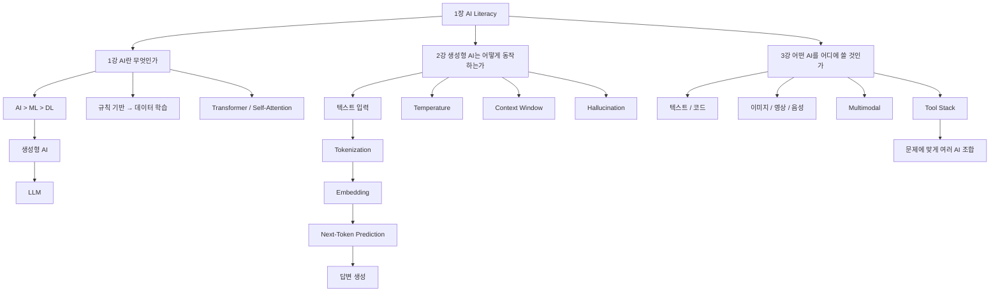
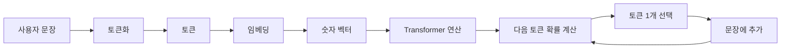
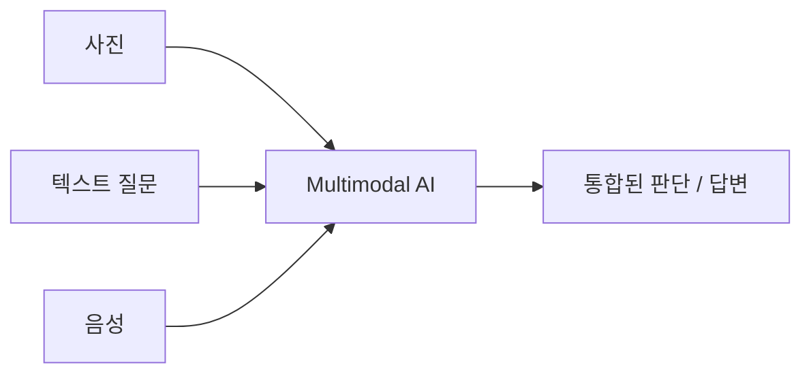
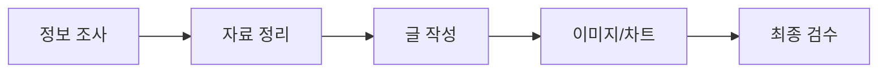
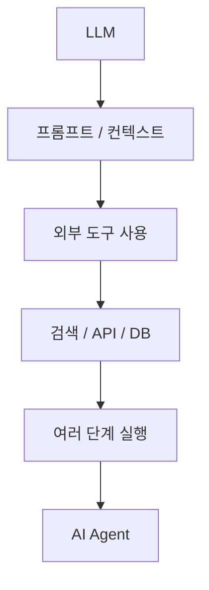

# [AI Literacy] AI 기본 개념과 생성형 AI 동작 원리·활용 영역 예습 정리

> **예습 목표: 아침 10분 안에 1장 전체 흐름을 잡는다.**  
> 세부 모델 이름을 외우는 것보다 **AI의 계층 구조 → LLM의 동작 원리 → 도구 선택 기준**을 이해하는 것이 우선이다.

---

# 🚨 이것만 알고 강의 들어가기

## 핵심 5줄 요약

1. **AI가 가장 큰 개념**이고, 그 안에 `머신러닝(ML) → 딥러닝(DL)`이 포함된다.
2. **생성형 AI**는 학습한 패턴을 이용해 새로운 글·이미지·음악·코드 등을 만들어내는 AI다.
3. **LLM은 생성형 AI 중 언어를 다루는 모델**이며, 문장을 통째로 기억해서 꺼내는 것이 아니라 **다음 토큰을 확률적으로 예측**하며 답변을 만든다.
4. AI는 텍스트를 그대로 이해하지 못하므로 `텍스트 → 토큰 → 숫자 벡터(임베딩) → 다음 토큰 예측` 과정을 거친다.
5. 좋은 AI 활용은 한 모델을 맹신하는 것이 아니라 **문제에 맞는 모델을 고르고, 결과를 검증하고, 필요하면 여러 도구를 조합하는 것**이다.

### 중요도

- 🔥🔥🔥 **AI → ML → DL의 포함 관계**
- 🔥🔥🔥 **토큰 → 임베딩 → 다음 토큰 예측**
- 🔥🔥🔥 **컨텍스트 윈도우와 환각**
- 🔥🔥 **트랜스포머 / 셀프 어텐션**
- 🔥🔥 **멀티모달 / 툴 스택**
- 🔥 **세부 AI 제품 이름과 서비스별 특징**

---

# 🗺️ 1장 전체 학습 구조



## 이 장을 한 문장으로

> **AI가 무엇인지 구분하고 → LLM이 답을 만드는 원리를 이해하고 → 그 한계를 고려해 목적에 맞는 도구를 선택하는 법을 배우는 장이다.**

---

# 🥇 1순위: AI 가족 관계부터 잡기

## 1. AI → ML → DL

```text
AI (가장 넓음)
└── Machine Learning
    └── Deep Learning
        └── 많은 생성형 AI 모델의 기반 기술
```

| 개념 | 한 줄 이해 | 대표 느낌 |
|---|---|---|
| **AI** | 인간의 지능적 행동을 컴퓨터로 구현하려는 가장 큰 범주 | 판단·추천·대화 등 전체 |
| **ML** | 사람이 규칙을 전부 짜지 않고 데이터에서 규칙을 학습 | 스팸 분류, 추천 |
| **DL** | 인공신경망을 깊게 쌓아 복잡한 패턴을 학습 | 이미지·음성·언어 |
| **생성형 AI** | 학습한 패턴을 이용해 새로운 결과물을 생성 | 글·그림·코드·음악 |
| **LLM** | 대규모 텍스트를 학습해 언어를 생성·처리하는 모델 | ChatGPT류 언어 모델 |

### 꼭 주의

교안에서는 이들을 원형 포함 관계처럼 설명하지만, **생성형 AI 전체가 곧 LLM인 것은 아니다.**  
LLM은 주로 **언어**를 다루는 생성형 AI 모델의 한 종류다.

---

# 🥇 2순위: 규칙을 직접 짜는 방식에서 학습하는 방식으로

## 전통 프로그래밍

```text
사람이 규칙 작성
      ↓
입력 데이터
      ↓
규칙 적용
      ↓
결과
```

예:

```python
if score >= 60:
    print("합격")
```

사람이 **합격 기준 60점**이라는 규칙을 직접 알려줬다.

## 머신러닝

```text
많은 데이터 + 정답 사례
        ↓
기계가 패턴 학습
        ↓
모델 생성
        ↓
새 데이터 예측
```

### Python과 연결하기

지금까지 배운 `if`는 **사람이 조건을 직접 정하는 방식**이었다.  
머신러닝에서는 사람이 모든 `if` 조건을 작성하기 어려운 문제를 **데이터를 통해 모델이 패턴으로 학습**하게 만든다.

> 핵심 변화: **규칙을 사람이 일일이 작성 → 데이터에서 규칙을 학습**

---

# 🥇 3순위: LLM이 답변을 만드는 진짜 흐름

## 전체 흐름



쉽게 말하면:

```text
사람의 문장
→ 잘게 쪼갠다
→ 숫자로 바꾼다
→ 문맥 관계를 계산한다
→ 다음에 올 토큰의 확률을 계산한다
→ 하나를 선택한다
→ 다시 반복한다
```

---

## 3-1. Token

**AI가 텍스트를 처리하기 위해 나눈 기본 단위**다.

```text
"나는 AI를 공부한다"
        ↓
여러 개의 token으로 분할
```

### 중요한 점

`단어 1개 = 토큰 1개`가 아니다.

특히 한국어는 조사·어미·형태가 복잡해서 하나의 단어가 여러 토큰으로 나뉠 수 있다.

---

## 3-2. Embedding

토큰을 컴퓨터가 계산할 수 있는 **숫자 벡터**로 바꾸는 과정이다.

```text
왕 ─┐
    ├─ 의미가 비슷하므로 가까운 위치
여왕 ┘

사과 ───────── 멀리 떨어진 위치
```

### 핵심

컴퓨터는 `왕`, `여왕`이라는 글자 자체의 의미를 사람처럼 읽는 것이 아니라, **숫자로 표현된 관계와 패턴**을 계산한다.

---

## 3-3. Next-Token Prediction

LLM이 하는 가장 핵심적인 일이다.

예:

```text
오늘 점심에는 김치 ____
```

모델 내부에서는 대략 이런 후보가 생긴다고 생각하면 된다.

```text
찌개   45%
볶음밥 25%
국     15%
피자    1%
...
```

이 확률 분포를 바탕으로 **다음 토큰 하나를 선택**한다.

그리고 다시:

```text
오늘 점심에는 김치찌개를 ____
```

다음 토큰을 예측한다.

즉, 긴 답변도 실제로는:

```text
토큰 1개
→ 토큰 1개
→ 토큰 1개
→ 토큰 1개
→ ...
```

가 매우 빠르게 반복된 결과다.

---

# 🥈 4순위: Transformer와 Self-Attention

## 기존 방식의 문제

과거 언어 모델은 문장을 앞에서부터 순서대로 처리하는 방식이 많아, 문장이 길어질수록 먼 위치의 정보 관계를 다루기 어려웠다.

## Transformer

2017년 발표된 Transformer는 **Attention**을 핵심 메커니즘으로 사용한다.

```text
"지현은 노트북을 샀다. 그것은 매우 가벼웠다."
                     ↑
                  그것은?
                     ↓
                  노트북
```

Self-Attention은 문장 속 각 요소가 **다른 요소와 얼마나 관련 있는지** 계산한다.

### 기억할 것

> Transformer = 현대 LLM의 핵심 아키텍처  
> Self-Attention = 문맥 속 요소들의 관계를 계산하는 핵심 메커니즘

---

# 🥇 5순위: Context Window = AI의 작업 책상

## 비유

```text
┌─────────────────────────┐
│     AI의 작업 책상      │
│                         │
│ 이전 대화               │
│ 사용자 질문             │
│ 첨부 문서               │
│ 지시사항                 │
│ 생성 중인 답변           │
└─────────────────────────┘
       Context Window
```

AI가 한 번의 처리 과정에서 참고할 수 있는 토큰의 범위에는 한계가 있다.

### 그래서 생기는 현상

```text
대화가 매우 길어짐
      ↓
참고해야 할 정보가 많아짐
      ↓
컨텍스트 한계에 가까워짐
      ↓
초기 지시를 제대로 활용하지 못할 가능성 증가
```

### Context Engineering

한정된 작업 공간 안에 **무엇을, 어떤 순서로, 얼마나 명확하게 넣을지 설계하는 것**이다.

좋은 입력:

```text
역할
+ 목표
+ 배경정보
+ 제약조건
+ 참고자료
+ 원하는 출력 형식
```

단순히 질문을 길게 쓰는 것이 아니다.

---

# 🥇 6순위: 왜 AI는 틀린 말을 그럴듯하게 할까?

## Hallucination

LLM은 기본적으로 **사실 데이터베이스에서 정답 한 문장을 검색해 그대로 가져오는 시스템이 아니다.**

기본 생성 원리는:

```text
현재 문맥
   ↓
다음에 올 가능성이 높은 토큰 계산
   ↓
문장 생성
```

따라서:

```text
문장은 자연스러움
≠
내용이 반드시 사실임
```

### AI 리터러시 핵심

> **잘 쓴 답변과 정확한 답변은 같은 것이 아니다.**

그래서 중요한 정보는:

```text
AI 답변
→ 출처 확인
→ 사실 검증
→ 다른 자료와 교차 검증
→ 사람이 최종 판단
```

---

# 🥈 7순위: Temperature

Temperature는 출력의 **무작위성 정도**를 조절하는 설정이라고 이해하면 충분하다.

| 낮음 | 중간 | 높음 |
|---|---|---|
| 일관성↑ | 균형 | 다양성↑ |
| 예측 가능 | 일반 대화 | 창의적 발산 |
| 코드·요약·정확성 중심 작업 | 일반 문서 | 아이디어·창작 |

### 주의

Temperature를 낮춘다고 해서 **사실 정확성이 자동으로 보장되는 것은 아니다.**  
환각을 줄이는 데 도움이 될 수는 있지만, 별도의 사실 검증은 여전히 필요하다.

---

# 🥈 8순위: Multimodal AI

## Modal = 데이터 형태

```text
Text   = 글
Image  = 이미지
Audio  = 소리
Video  = 영상
```

## Multimodal

여러 형태의 데이터를 함께 처리한다.



예:

```text
강아지 사진
+ 짖는 소리
+ "상태가 어때?"라는 질문
        ↓
종합 분석
```

핵심은 **여러 종류의 정보를 따로 보는 것이 아니라 함께 연결해서 이해하는 것**이다.

---

# 🥈 9순위: AI Tool Stack

툴 스택은 **하나의 AI로 모든 일을 해결하려 하지 않고, 작업 단계마다 적합한 도구를 조합하는 것**이다.



예를 들면:

```text
검색에 강한 도구
      ↓
긴 자료 분석에 강한 도구
      ↓
문서 작성에 강한 도구
      ↓
이미지 생성 도구
```

### 핵심 사고

```text
"어떤 AI가 제일 좋아?"  X

"지금 내가 해결하려는 문제에는
어떤 능력이 필요한가?"  O
```

특정 제품의 순위는 계속 바뀔 수 있지만, **문제 → 필요한 능력 → 적합한 도구 선택**이라는 사고방식은 계속 남는다.

---

# 🥉 10순위: 모델별 이름은 이렇게만 보기

교안에는 GPT, Claude, Gemini, Llama 및 여러 이미지·영상·음성 AI 서비스가 등장한다.

예습 단계에서는 제품 이름을 전부 외우지 말고 **종류와 선택 기준**만 기억한다.

| 필요한 능력 | 찾아볼 AI 종류 |
|---|---|
| 글·요약·추론 | LLM |
| 코드 생성·보조 | 코드에 강한 LLM / Coding Agent |
| 긴 문서 분석 | 큰 컨텍스트를 지원하는 모델 |
| 보안·내부 구축 | 자체 호스팅 가능한 모델 |
| 이미지 제작 | Image Generation |
| 영상 제작 | Video Generation |
| 음성·음악 | Audio Generation |
| 글+이미지+음성 함께 분석 | Multimodal AI |

> **제품명은 변한다. 개념과 선택 기준은 오래간다.**

---

# ⚠️ 강의에서 헷갈릴 가능성이 높은 부분

## 1. AI = ChatGPT가 아니다

```text
AI
└── 아주 넓은 개념

ChatGPT
└── AI를 활용한 특정 서비스
```

---

## 2. 생성형 AI = LLM이 아니다

```text
생성형 AI
├── 텍스트 생성
├── 이미지 생성
├── 영상 생성
├── 음악 생성
└── 기타 생성 모델
```

LLM은 그중 **언어를 다루는 모델**이다.

---

## 3. Token ≠ Word

```text
단어 1개가
토큰 1개일 수도 있고
여러 토큰일 수도 있다.
```

---

## 4. Embedding ≠ Tokenization

```text
Tokenization
= 문장을 나눈다

Embedding
= 나눈 토큰을 숫자 벡터로 표현한다
```

순서:

```text
Text
→ Tokenization
→ Token
→ Embedding
→ Vector
```

---

## 5. LLM의 자연스러운 문장 ≠ 사실

LLM의 기본 목표는 **다음 토큰을 잘 예측하는 것**이다.

따라서:

```text
말을 매우 자연스럽게 함
      ↓
사실도 반드시 정확함
```

이 논리는 성립하지 않는다.

---

# 🔗 앞으로 배울 AI Agent와 연결하기

이번 1장은 이후 AI Agent를 이해하기 위한 바닥 개념이다.



앞으로 Agent를 만들 때 계속 만나게 될 질문:

- LLM에게 **어떤 컨텍스트**를 줄 것인가?
- LLM의 **환각을 어떻게 줄일 것인가?**
- 필요한 정보를 **검색/RAG/API**로 어떻게 가져올 것인가?
- 어떤 모델과 도구를 **어떻게 조합할 것인가?**

즉, 이번 장의 개념은 단순 AI 상식이 아니라 이후 **LLM → RAG → AI Agent** 학습의 기반이다.

---

# ⏱️ 아침 10분 예습 코스

## 0~2분 — 전체 지도

이것만 읽기:

```text
AI
↓
ML
↓
DL
↓
생성형 AI
↓
LLM
```

그리고:

```text
Text
→ Token
→ Embedding
→ Transformer
→ Next Token
→ Answer
```

---

## 2~5분 — LLM 작동 원리

다음 4개만 설명할 수 있으면 된다.

- Token
- Embedding
- Next-Token Prediction
- Context Window

---

## 5~7분 — 한계

```text
확률 기반 생성
      ↓
자연스러운 답변
      ↓
하지만 사실이 아닐 수도 있음
      ↓
Hallucination
      ↓
사람의 검증 필요
```

---

## 7~9분 — 활용

```text
문제 정의
→ 필요한 능력 확인
→ 적합한 AI 선택
→ 필요하면 여러 도구 조합
→ 결과 검증
```

이게 **AI Literacy + Tool Stack**이다.

---

## 9~10분 — 마지막 암기

### 내일 강의 전에 이 8개만 기억하기

1. `AI > ML > DL`
2. 생성형 AI는 **새 결과물을 생성**한다.
3. LLM은 **언어 중심 생성 모델**이다.
4. `Text → Token → Embedding`
5. LLM은 **Next Token을 반복 예측**한다.
6. Transformer의 핵심 중 하나는 **Attention**이다.
7. Context Window는 AI가 참고할 수 있는 **작업 공간**이다.
8. AI의 답은 **검증해야 한다.**

---

# ✅ 강의 들어가기 전 30초 셀프 체크

아래 질문에 한 문장씩 답할 수 있으면 예습 성공이다.

- **AI, ML, DL의 관계는?**
- **토큰과 임베딩의 차이는?**
- **LLM은 문장을 어떻게 만드는가?**
- **컨텍스트 윈도우란?**
- **왜 환각이 발생할 수 있는가?**
- **멀티모달이란?**
- **툴 스택이란?**

---

> **최종 한 줄:**  
> 생성형 AI는 마법처럼 생각해서 답을 꺼내는 존재가 아니라, **텍스트를 수치화하고 문맥을 계산하여 다음 토큰을 반복 예측하는 모델**이며, 우리는 그 원리와 한계를 알고 **문제에 맞게 선택·조합·검증**해야 한다.
