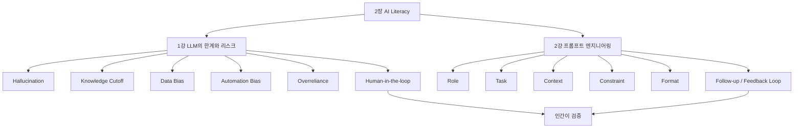
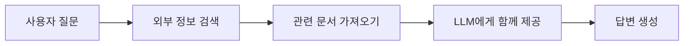
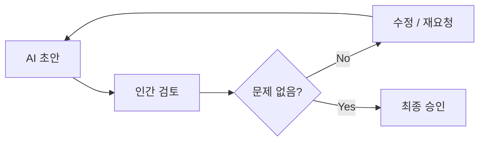
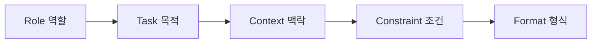
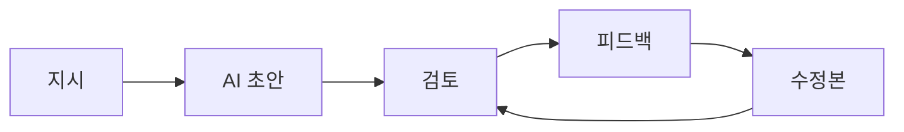
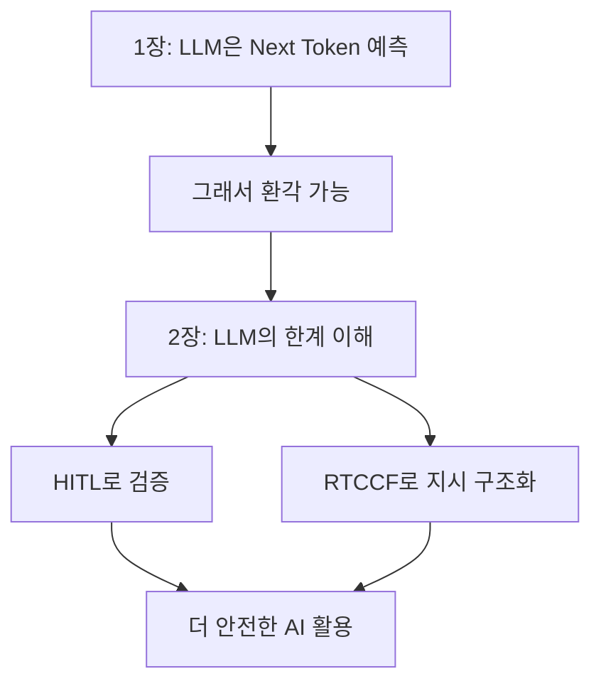
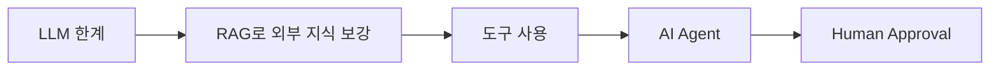

# [AI Literacy] LLM 한계와 프롬프트 엔지니어링 예습 정리

> **예습 목표: 아침 10분 안에 2장 전체 흐름을 잡는다.**  
> 이번 장은 **“AI를 왜 그대로 믿으면 안 되는가 → 어떻게 검증할 것인가 → 어떻게 더 잘 지시할 것인가”**를 배우는 장이다.

---

# 🚨 이것만 알고 강의 들어가기

## 핵심 6줄 요약

1. **LLM은 사실을 판정하는 기계가 아니라 다음 토큰을 예측하는 모델**이므로 환각이 발생할 수 있다.
2. **지식 컷오프**는 모델의 기본 지식이 특정 시점에 멈춰 있다는 뜻이다.
3. **데이터 편향**은 학습 데이터에 있던 인간 사회의 편견이 AI 결과에 반영되는 문제다.
4. 사용자는 AI의 유창함 때문에 **자동화 편향·과신**에 빠질 수 있다.
5. 그래서 중요한 업무에는 **HITL(Human-in-the-loop)**, 즉 인간의 검토·수정·승인이 필요하다.
6. 프롬프트는 질문이 아니라 **작업 지시서**이며 `Role → Task → Context → Constraint → Format`으로 구조화하면 결과를 더 잘 통제할 수 있다.

### 중요도

- 🔥🔥🔥 **환각(Hallucination)의 원인**
- 🔥🔥🔥 **자동화 편향 / 과신 / HITL**
- 🔥🔥🔥 **R-T-C-C-F 프롬프트 구조**
- 🔥🔥 **지식 컷오프 / 데이터 편향**
- 🔥🔥 **꼬리 질문과 피드백 루프**
- 🔥 **AI Divide / Deskilling 등 확장 개념**

---

# 🗺️ 2장 전체 학습 구조



## 이 장을 한 문장으로

> **AI의 한계를 이해하고, 인간 검증을 끼워 넣고, 프롬프트 구조화로 출력 품질과 방향을 통제하는 법을 배우는 장이다.**

---

# 🥇 1순위: 환각은 왜 생길까?

## Hallucination

AI가 **사실이 아닌 내용을 그럴듯하게 만들어내는 현상**이다.

핵심 원인은 1장에서 배운 내용과 바로 연결된다.

```text
사용자 입력
   ↓
문맥 계산
   ↓
다음 토큰 확률 계산
   ↓
가장 자연스러운 토큰 선택
   ↓
문장 생성
```

여기서 중요한 점:

```text
자연스러운 문장
≠
사실인 문장
```

LLM은 기본적으로 **“이 말이 사실인가?”를 확인하는 장치**가 아니라 **“다음에 무슨 토큰이 자연스러운가?”를 계산하는 모델**이다.

---

## 환각의 3가지 얼굴

| 유형 | 뜻 | 쉽게 이해하기 |
|---|---|---|
| **입력 충돌** | 사용자가 준 정보를 무시하거나 왜곡 | 내가 준 조건과 다른 답 |
| **맥락 충돌** | 앞뒤 내용이 서로 모순 | 처음 말과 나중 말이 다름 |
| **사실 충돌** | 현실의 객관적 사실과 다름 | 존재하지 않는 정보 생성 |

### 기억용 문장

> **입력과 싸우면 입력 충돌, 자기 앞말과 싸우면 맥락 충돌, 현실과 싸우면 사실 충돌.**

---

# 🥇 2순위: 지식 컷오프와 환각은 다르다

## Knowledge Cutoff

모델이 기본 학습 과정에서 알게 된 정보가 **특정 시점까지만 포함되는 한계**다.

```text
학습 데이터 수집
      ↓
모델 학습
      ↓
학습 종료 시점
      ↓
그 이후 정보는 기본 지식에 없을 수 있음
```

### 환각과 차이

```text
Hallucination
= 생성 과정에서 틀린 내용을 만들어냄

Knowledge Cutoff
= 최신 정보를 기본적으로 모를 수 있음
```

둘은 원인이 다르다.

---

## RAG와 검색이 왜 필요한가?



이런 방식이 **RAG(Search/Retrieval Augmented Generation)**의 기본 아이디어다.

### 하지만

외부에서 가져온 문서 자체가 틀릴 수도 있으므로:

```text
검색 연결됨
≠
100% 사실 보장
```

---

# 🥈 3순위: 데이터 편향 = AI가 학습한 재료의 문제

## Data Bias

AI는 인간 사회의 데이터를 학습한다.

그 데이터 안에 편견이나 불균형이 있으면:

```text
편향된 데이터
     ↓
편향된 패턴 학습
     ↓
편향된 결과 출력
```

예:

```text
"성공한 CEO"
→ 특정 성별·인종 이미지에 치우침

"간호사"
→ 특정 성별 고정관념 재생산
```

### 핵심

> AI가 새로 편견을 발명했다기보다 **기존 데이터의 편견을 확대·재생산할 수 있다.**

---

# 🥇 4순위: 진짜 위험한 건 AI 오류 + 인간의 과신

## Automation Bias

AI의 판단을 **내 판단보다 자동으로 더 믿는 현상**이다.

```text
AI가 전문적으로 말함
       ↓
신뢰감 상승
       ↓
검증 생략
       ↓
잘못된 결과도 수용
```

## Overreliance

AI에 **과도하게 의존**하는 상태다.

둘은 연결된다.

```text
자동화 편향
→ AI를 더 믿음
→ 과신
→ 검증 감소
→ 사고 가능성 증가
```

---

# 🥈 5순위: Deskilling

AI에 너무 의존하면 인간이 원래 가지고 있던 사고·판단 능력을 덜 쓰게 된다.

```text
직접 생각
   ↓ 감소
AI에게 바로 질문
   ↓ 반복
스스로 구조화하는 능력 약화 가능
```

이게 **Deskilling**이다.

### 학습과 연결하기

코드를 AI에게 전부 맡기고 읽지 않으면:

```text
코드는 만들어짐
하지만
실행 흐름 / 오류 원인 / 구조 판단 능력은 안 늘 수 있음
```

그래서 AI를 **답안 생성기보다 검토 가능한 보조자**로 쓰는 게 중요하다.

---

# 🥇 6순위: HITL = 인간을 루프 안에 넣는다

## Human-in-the-loop

AI가 혼자 최종 결정을 내리게 하지 않고, **중요 단계에 인간 검증을 넣는 설계**다.



### 실무 예

```text
AI가 계약서 요약
→ 사람이 원문과 대조
→ 위험 조항 수정
→ 승인
```

```text
AI가 코드 작성
→ 개발자가 실행/테스트/보안 검토
→ 수정
→ 배포
```

### 핵심

> **AI가 생성하고, 인간이 책임진다.**

---

# 🥇 7순위: 프롬프트는 질문이 아니라 작업 지시서

나쁜 프롬프트:

```text
이거 좀 잘 정리해줘.
```

문제:

- 무엇을?
- 왜?
- 누구 기준으로?
- 어떤 형식으로?
- 무엇을 빼고?

가 없다.

좋은 프롬프트는 **작업 요구사항**을 명확히 준다.

---

# 🥇 8순위: R-T-C-C-F 5대 요소



## R — Role

AI에게 어떤 관점으로 답할지 지정한다.

```text
너는 10년 차 데이터 분석가야.
```

### 역할

- 어휘 수준
- 관점
- 전문성 방향

을 맞추는 데 도움을 준다.

---

## T — Task

AI가 **무엇을 해야 하는지** 명확히 한다.

좋은 예:

```text
회의록에서 실행 과제만 추출해라.
```

핵심은 **행동 동사**다.

```text
요약해라
비교해라
분석해라
추출해라
분류해라
작성해라
```

---

## C — Context

AI가 판단하는 데 필요한 배경이다.

```text
우리 회사는 50명 규모 스타트업이고,
대상은 신입 개발자 5명이며,
목표는 빠른 조직 적응이다.
```

### 핵심

> AI는 내가 머릿속으로만 알고 있는 상황을 모른다.

---

## C — Constraint

AI가 지켜야 할 조건이다.

```text
500자 이하
전문 용어 금지
예시는 3개만
근거가 없으면 모른다고 말할 것
```

### Negative Prompting

하지 말아야 할 것도 조건에 포함된다.

```text
뻔한 표현은 제외해라.
근거 없는 수치는 만들지 마라.
```

---

## F — Format

결과물의 **그릇**을 지정한다.

```text
표
불릿 리스트
JSON
CSV
이메일
코드
```

예:

```text
| 문제 | 원인 | 해결책 |
형태의 표로 출력해라.
```

---

# 🧠 RTCCF 한 번에 외우기

```text
Role       = 누가 답하나?
Task       = 뭘 해야 하나?
Context    = 어떤 상황인가?
Constraint = 뭘 지켜야 하나?
Format     = 어떤 모양으로 줄까?
```

---

# 🥈 9순위: 좋은 프롬프트도 한 번에 끝나지 않는다

## Feedback Loop



### 핵심

첫 답변은 **완성본이 아니라 1차 초안**으로 보는 게 좋다.

꼬리 질문 예:

```text
더 짧게 바꿔줘.
```

```text
2번 항목만 더 자세히 설명해줘.
```

```text
이 결과의 약점을 반대 입장에서 비판해줘.
```

---

# ⚠️ 강의에서 헷갈릴 가능성이 높은 부분

## 1. Hallucination ≠ Knowledge Cutoff

```text
Hallucination
= 틀린 내용을 생성

Knowledge Cutoff
= 최신 정보를 모를 수 있음
```

---

## 2. Automation Bias ≠ Data Bias

```text
Data Bias
= AI 학습 데이터 쪽의 편향

Automation Bias
= AI를 믿는 인간 쪽의 편향
```

이 차이는 꼭 기억한다.

---

## 3. HITL ≠ AI를 쓰지 말자는 뜻

```text
AI 사용 X
```

가 아니라:

```text
AI 사용
+ 인간 검토
+ 인간 승인
```

이다.

---

## 4. 프롬프트가 좋으면 환각이 사라진다? → X

프롬프트를 잘 쓰면:

```text
생성 범위 좁힘
→ 오류 가능성 감소
```

에는 도움이 된다.

하지만:

```text
좋은 프롬프트
≠
사실 정확성 100% 보장
```

중요한 정보는 여전히 검증해야 한다.

---

## 5. Role을 길게 쓰면 무조건 좋아진다? → X

역할은 **필요한 관점과 전문성을 지정하는 도구**다.

쓸데없이 과장된 페르소나를 길게 적는 것보다:

```text
목표에 필요한 역할만 정확히 지정
```

하는 게 더 중요하다.

---

# 🔗 1장과 연결하기



이번 2장은 사실 1장의 자연스러운 다음 단계다.

```text
LLM은 확률 모델이다
        ↓
틀릴 수 있다
        ↓
인간이 검증해야 한다
        ↓
애초에 지시도 더 명확하게 해야 한다
```

---

# 🔗 앞으로 배울 RAG / AI Agent와 연결하기



앞으로 Agent를 만들 때 핵심 질문은 계속 같다.

- 최신 정보는 어디서 가져올까?
- AI가 틀리면 어떻게 막을까?
- 어떤 단계에서 인간 승인을 받을까?
- 지시와 제약을 어떻게 구조화할까?

즉, **HITL과 프롬프트 구조화는 Agent 설계의 기본 안전장치**다.

---

# ⏱️ 아침 10분 예습 코스

## 0~2분 — 위험 지도

이 4개만 본다.

```text
Hallucination
Knowledge Cutoff
Data Bias
Automation Bias
```

---

## 2~4분 — 환각 원인

```text
Next-Token Prediction
      ↓
자연스러운 문장 생성
      ↓
사실 검증은 별도 문제
      ↓
Hallucination 가능
```

---

## 4~6분 — 대응 방법

```text
AI 초안
→ 출처 확인
→ 교차 검증
→ 인간 수정
→ 인간 승인
```

= **HITL**

---

## 6~9분 — RTCCF

```text
R = Role
T = Task
C = Context
C = Constraint
F = Format
```

이 5개 이름과 역할만 외운다.

---

## 9~10분 — 마지막 암기

### 내일 강의 전에 이 8개만 기억하기

1. **LLM은 사실 판정기가 아니라 확률 모델이다.**
2. **환각은 자연스러운 문장과 사실이 다를 수 있어서 생긴다.**
3. **지식 컷오프는 시간적 한계다.**
4. **데이터 편향은 학습 데이터의 문제다.**
5. **자동화 편향은 인간이 기계를 지나치게 믿는 문제다.**
6. **HITL = AI 결과에 인간 검토·승인을 넣는다.**
7. **RTCCF = Role, Task, Context, Constraint, Format**
8. **첫 답변은 초안이고, 꼬리 질문으로 개선한다.**

---

# ✅ 강의 들어가기 전 30초 셀프 체크

아래 질문에 한 문장씩 답할 수 있으면 예습 성공이다.

- 환각은 왜 발생하는가?
- 환각과 지식 컷오프의 차이는?
- Data Bias와 Automation Bias의 차이는?
- HITL은 왜 필요한가?
- RTCCF의 5요소는?
- Context와 Constraint의 차이는?
- 좋은 프롬프트도 왜 검증이 필요한가?

---

> **최종 한 줄:**  
> LLM은 똑똑하지만 틀릴 수 있는 확률 모델이므로, **RTCCF로 지시를 구조화하고 HITL로 검증·승인하는 인간 중심의 사용 방식**이 필요하다.
