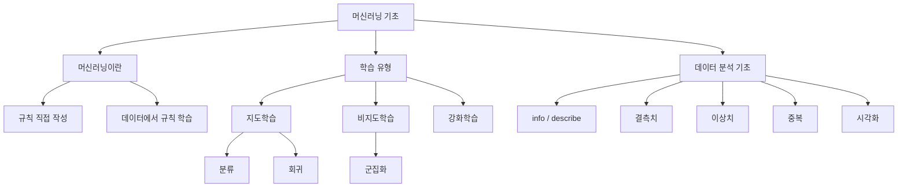

# [MACHINE LEARNING] 머신러닝 기초와 데이터 분석 예습 정리

> **예습 목표: 아침 10분 안에 1강 전체 흐름을 잡는다.**  
> 세부 함수명을 외우는 것보다 **머신러닝이 무엇인지 → 문제 유형을 어떻게 나누는지 → 모델 학습 전에 데이터를 왜 정리하는지**를 이해하는 것이 우선이다.

---

# 🚨 이것만 알고 강의 들어가기

## 핵심 5줄 요약

1. **머신러닝은 사람이 규칙을 직접 짜는 대신, 데이터에서 규칙을 학습하는 방식**이다.
2. 정답이 있으면 **지도학습**, 정답 없이 비슷한 것끼리 묶으면 **비지도학습**, 행동과 보상으로 배우면 **강화학습**이다.
3. 지도학습에서 정답이 범주면 **분류**, 숫자면 **회귀**다.
4. 머신러닝 전에 반드시 데이터의 **타입, 결측치, 이상치, 중복, 분포**를 확인해야 한다.
5. 좋은 모델의 출발점은 알고리즘보다 먼저 **좋은 데이터와 올바른 전처리**다.

### 중요도

- 🔥🔥🔥 **전통 프로그래밍 vs 머신러닝**
- 🔥🔥🔥 **지도 / 비지도 / 강화학습 구분**
- 🔥🔥🔥 **분류 vs 회귀**
- 🔥🔥🔥 **EDA: info / describe / 결측치 / 이상치**
- 🔥🔥 **Pandas 데이터 정제**
- 🔥 **그래프 함수 세부 옵션**

---

# 🗺️ 1강 전체 학습 구조



## 이 강의를 한 문장으로

> **머신러닝 문제의 종류를 구분하고, 모델에 넣기 전에 데이터를 제대로 이해하고 정리하는 법을 배우는 강의다.**

---

# 🥇 1순위: 머신러닝은 무엇이 다른가

## 전통 프로그래밍

```text
데이터 + 사람이 만든 규칙
          ↓
        결과
```

예:

```python
if score >= 60:
    result = "합격"
```

사람이 **60점 이상 = 합격**이라는 규칙을 직접 만들었다.

## 머신러닝

```text
데이터 + 정답 사례
       ↓
패턴 학습
       ↓
모델
       ↓
새 데이터 예측
```

### 핵심 변화

> **규칙을 사람이 작성 → 데이터에서 규칙을 학습**

---

# 🥇 2순위: 지도 / 비지도 / 강화학습

## 지도학습 Supervised Learning

정답(Label)이 있는 데이터를 이용한다.

```text
입력 X + 정답 y
      ↓
    학습
      ↓
새로운 X의 y 예측
```

### 분류 Classification

정답이 **종류/범주**다.

예:

```text
고객 → 이탈 / 유지
메일 → 스팸 / 정상
```

### 회귀 Regression

정답이 **연속적인 숫자**다.

예:

```text
집 면적 → 집값
광고비 → 매출액
```

## 비지도학습 Unsupervised Learning

정답이 없다.

```text
고객 구매 패턴
      ↓
비슷한 고객끼리 묶기
      ↓
군집화 Clustering
```

## 강화학습 Reinforcement Learning

행동에 따라 보상을 받으며 학습한다.

```text
상태
 ↓
행동
 ↓
보상
 ↓
더 좋은 행동 학습
```

---

# 🥇 3순위: 문제 유형 빠르게 구분하기

```text
정답이 있는가?
│
├─ YES → 지도학습
│          ├─ 범주 → 분류
│          └─ 숫자 → 회귀
│
└─ NO
    ├─ 비슷한 것끼리 묶기 → 비지도학습
    └─ 행동 + 보상 → 강화학습
```

| 문제 | 유형 |
|---|---|
| 고객 이탈 여부 예측 | 분류 |
| 다음 분기 매출 예측 | 회귀 |
| 비슷한 고객 그룹화 | 군집화 |
| 게임 점수 최대화 | 강화학습 |

---

# 🥇 4순위: EDA = 모델 만들기 전 데이터 건강검진

EDA는 **Exploratory Data Analysis**, 탐색적 데이터 분석이다.

```text
데이터 받기
   ↓
구조 확인
   ↓
문제 찾기
   ↓
정제
   ↓
시각화
   ↓
모델링
```

## 먼저 볼 것

```python
df.info()
df.describe()
df.isnull().sum()
```

### info()

- 행/열 구조
- 데이터 타입
- 결측 여부

### describe()

- 평균
- 표준편차
- 최소/최대
- 사분위수

### 핵심

> **모델을 만들기 전에 데이터가 숫자인지, 비어 있는지, 튀는 값이 있는지 먼저 확인한다.**

---

# 🥈 5순위: 결측치 Missing Value

## 숫자형

평균 또는 중앙값 등을 활용할 수 있다.

```python
mean_age = df['age'].mean()
df.loc[:, 'age'] = df['age'].fillna(mean_age)
```

## 범주형

최빈값을 활용할 수 있다.

```python
mode_value = df['embark_town'].mode()[0]
df.loc[:, 'embark_town'] = df['embark_town'].fillna(mode_value)
```

### 주의

```text
결측치 존재
→ 무조건 평균으로 채운다  X
```

데이터의 의미와 분포를 보고 처리 방법을 정해야 한다.

---

# 🥈 6순위: 이상치와 중복

## 이상치 Outlier

다른 값과 비교해 지나치게 크거나 작은 값이다.

```text
대부분 집값: 2~5억
한 개 집값: 100억
           ↑
        확인 필요
```

박스 플롯(Box Plot)로 확인하는 경우가 많다.

## 중복 Duplicate

```python
df.duplicated().sum()
```

중복 제거:

```python
df = df.drop_duplicates().reset_index(drop=True)
```

### 핵심

> 이상치와 중복은 분석 결과와 모델 학습을 왜곡할 수 있다.

---

# 🥈 7순위: 문자열 숫자를 진짜 숫자로 바꾸기

현실 데이터에서는 다음처럼 저장될 수 있다.

```text
"$1,200"
"₩50,000"
```

컴퓨터는 이를 문자열로 볼 수 있다.

```python
df['price'] = df['price'].str.replace('$', '', regex=False)
df['price'] = df['price'].str.replace(',', '', regex=False)
df['price'] = pd.to_numeric(df['price'])
```

### 흐름

```text
문자 제거
→ 숫자 형태 문자열
→ to_numeric()
→ 계산 가능한 숫자
```

---

# 🥈 8순위: .loc[]을 쓰는 이유

데이터를 수정할 때는 다음 방식이 안전하다.

```python
df.loc[:, 'age'] = ...
```

연속 대괄호 방식은 피한다.

```python
df['A']['B'] = value
```

### 기억할 것

> **조회·수정 위치를 한 번에 명확히 지정하려면 `.loc[]`을 사용한다.**

---

# 🥈 9순위: 시각화는 무엇을 보는가

| 그래프 | 보는 것 |
|---|---|
| Histogram | 분포 |
| Box Plot | 중앙값·사분위수·이상치 |
| Scatter Plot | 두 변수의 관계 |

시각화의 목적은 예쁜 그래프를 만드는 것이 아니라 **숫자만 봐서는 놓치기 쉬운 패턴을 찾는 것**이다.

---

# ⚠️ 강의에서 헷갈릴 가능성이 높은 부분

## 1. Feature ≠ Label

```text
Feature = 예측에 사용하는 입력 정보
Label   = 맞혀야 하는 정답
```

예:

```text
집 면적 → Feature
집 가격 → Label
```

---

## 2. 분류 ≠ 군집화

```text
분류
= 정답 범주가 있음

군집화
= 정답 없이 비슷한 것끼리 묶음
```

---

## 3. 평균으로 결측치 대체 = 항상 좋은 방법이 아니다

평균으로 모두 채우면 특정 값 주변에 데이터가 인위적으로 몰릴 수 있다.

---

## 4. 이상치 = 무조건 삭제가 아니다

이상치는:

```text
입력 오류일 수도 있고
실제로 중요한 극단값일 수도 있다.
```

먼저 의미를 확인해야 한다.

---

## 5. 상관관계 ≠ 인과관계

```text
요금이 높은 사람이 생존률도 높다
```

라는 패턴이 보여도:

```text
요금이 높아서 생존했다
```

라고 바로 결론내리면 안 된다.

---

# 🔗 다음 머신러닝 학습과 연결하기


다음 강의에서 배우는 **선형 회귀, MSE, MAE, 경사하강법**은 모두 이 정리된 데이터를 모델에 넣은 뒤 일어나는 과정이다.

---

# ⏱️ 아침 10분 예습 코스

## 0~2분 — 머신러닝 정의

```text
전통 프로그래밍
데이터 + 규칙 → 답

머신러닝
데이터 + 정답 → 규칙/모델
```

## 2~4분 — 문제 유형

```text
지도 → 분류 / 회귀
비지도 → 군집화
강화 → 행동 / 보상
```

## 4~7분 — EDA

다음 3개만 기억한다.

```python
df.info()
df.describe()
df.isnull().sum()
```

## 7~9분 — 데이터 정제

- 결측치
- 이상치
- 중복
- 타입 변환

## 9~10분 — 최종 질문

다음 질문에 답할 수 있으면 예습 완료다.

1. 머신러닝은 전통 프로그래밍과 무엇이 다른가?
2. 분류와 회귀의 차이는?
3. 군집화는 왜 비지도학습인가?
4. EDA를 왜 모델 학습 전에 하는가?
5. 결측치와 이상치를 무조건 삭제하면 안 되는 이유는?

---

# ✅ 예습 완료 기준

> 아래 문장을 스스로 말할 수 있으면 충분하다.

**“머신러닝은 데이터에서 규칙을 학습하는 기술이고, 문제는 지도·비지도·강화학습으로 나뉜다. 모델을 학습하기 전에는 EDA를 통해 데이터 타입, 결측치, 이상치, 중복과 분포를 먼저 확인하고 정제해야 한다.”**
