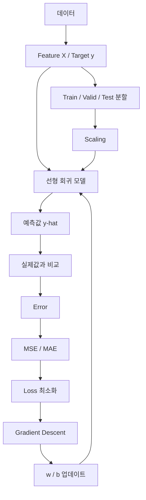
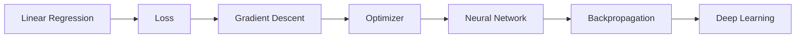

# [MACHINE LEARNING] 선형 회귀·오차 평가·경사하강법·데이터 분할 예습 정리

> **예습 목표: 아침 10분 안에 2강 전체 흐름을 잡는다.**  
> 미분 공식을 외우는 것보다 **예측 → 오차 계산 → 파라미터 수정 → 반복 학습 → 처음 보는 데이터로 평가**라는 머신러닝 학습 흐름을 이해하는 것이 우선이다.

---

# 🚨 이것만 알고 강의 들어가기

## 핵심 5줄 요약

1. **선형 회귀는 입력 X와 정답 y의 관계를 가장 잘 설명하는 직선 `ŷ = wx + b`를 찾는 모델**이다.
2. 모델이 학습한다는 것은 데이터에 맞도록 **가중치 w와 편향 b를 조정해 오차를 줄이는 것**이다.
3. **MSE와 MAE는 예측이 실제값과 얼마나 다른지 측정하는 지표**이며, MSE는 큰 오차에 더 큰 벌점을 준다.
4. **경사하강법은 손실이 줄어드는 방향으로 w와 b를 반복해서 이동시키는 최적화 방법**이고, 학습률은 한 번에 움직이는 보폭이다.
5. 모델의 진짜 실력을 보려면 데이터를 **Train / Validation / Test**로 나누고, 스케일링은 학습을 안정적으로 만드는 데 도움을 준다.

### 중요도

- 🔥🔥🔥 **ŷ = wx + b / w / b**
- 🔥🔥🔥 **실제값 y vs 예측값 ŷ → Error → Loss**
- 🔥🔥🔥 **MSE vs MAE**
- 🔥🔥🔥 **경사하강법과 Learning Rate**
- 🔥🔥🔥 **Train / Validation / Test**
- 🔥🔥 **Scaling / MinMaxScaler / StandardScaler**
- 🔥 **미분 공식 자체의 계산**

---

# 🗺️ 2강 전체 학습 구조



## 이 강의를 한 문장으로

> **직선으로 값을 예측하고, 틀린 정도를 계산한 뒤, 오차가 줄어드는 방향으로 모델을 반복 수정하고, 처음 보는 데이터로 진짜 성능을 확인하는 과정을 배우는 강의다.**

---

# 🥇 1순위: 선형 회귀 = 가장 잘 맞는 직선 찾기

기본 구조는 중학교 때 배운 1차 함수와 같다.

```text
ŷ = wX + b
```

| 기호 | 의미 | 집값 예측 비유 |
|---|---|---|
| X | Feature / 입력값 | 집 면적 |
| y | 실제 정답 | 실제 집값 |
| ŷ | 모델의 예측값 | 예상 집값 |
| w | Weight / 가중치 | 면적 1단위 증가 시 가격 변화량 |
| b | Bias / 편향 | 직선의 시작 위치 |

### 머신러닝의 학습

```text
처음 w, b
   ↓
예측
   ↓
실제값과 비교
   ↓
오차 계산
   ↓
w, b 수정
   ↓
다시 예측
```

> **학습 = 좋은 w와 b를 찾는 과정**

---

# 🥇 2순위: Error와 Loss를 구분하기

## Error

개별 데이터 하나에서의 실제값과 예측값 차이다.

```text
실제 집값 y = 500
예측값 ŷ = 470

차이 = 30
```

## Loss

여러 오차를 모아 **현재 모델이 전체적으로 얼마나 틀렸는지 점수화한 값**이다.

```text
예측
 ↓
Error 여러 개
 ↓
Loss Function
 ↓
모델 점수
```

### 목표

> **Loss를 가능한 작게 만드는 w와 b를 찾는다.**

---

# 🥇 3순위: MSE vs MAE

## MSE — Mean Squared Error

```text
오차
→ 제곱
→ 평균
```

예:

```text
오차 2 → 4
오차 10 → 100
```

큰 오차가 생기면 제곱 때문에 벌점이 급격히 커진다.

## MAE — Mean Absolute Error

```text
오차
→ 절대값
→ 평균
```

예:

```text
오차 -10 → 10
오차  10 → 10
```

원래 데이터와 같은 단위라 해석하기 쉽다.

| 기준 | MSE | MAE |
|---|---|---|
| 계산 | 오차 제곱 평균 | 오차 절대값 평균 |
| 큰 오차 | 매우 민감 | 상대적으로 덜 민감 |
| 단위 | 원래 단위의 제곱 | 원래 단위와 동일 |
| 장점 | 최적화에 다루기 편함 | 해석이 직관적 |

### 한 줄 구분

> **MSE = 큰 실수에 강한 벌점 / MAE = 평균적으로 얼마나 틀렸는지 직관적**

---

# 🥇 4순위: 경사하강법 = 손실 산에서 내려가기

## 비유

```text
        높은 Loss
           ●
          / \
         /   \
        /     \
       /       \
      /    ↓    \
_____/____최저점__\_____
        낮은 Loss
```

현재 위치에서 어느 방향이 내리막인지 확인하고 조금씩 이동한다.

```text
현재 w
 ↓
기울기 확인
 ↓
Loss가 감소하는 방향 결정
 ↓
w 수정
 ↓
반복
```

### 핵심 업데이트 개념

```text
새로운 가중치
= 현재 가중치 - 학습률 × 기울기
```

마이너스가 붙는 이유는 **기울기가 커지는 방향의 반대로 이동해야 손실이 감소하기 때문**이다.

---

# 🥇 5순위: 미분은 무엇을 알려주는가

예습에서는 계산법보다 의미가 중요하다.

```text
미분값 < 0
→ 오른쪽으로 가면 내려감

미분값 > 0
→ 왼쪽으로 가면 내려감

미분값 ≈ 0
→ 바닥에 가까움
```

### 핵심

> **미분/Gradient는 현재 위치에서 Loss를 줄이려면 파라미터를 어느 방향으로 움직여야 하는지 알려주는 신호다.**

주의할 점은 **기울기의 크기가 곧 최적점까지의 실제 거리라는 뜻은 아니라는 것**이다. 가파름을 나타내는 값으로 이해하면 된다.

---

# 🥇 6순위: Learning Rate = 보폭

```text
weight -= learning_rate * gradient
```

## 너무 큼

```text
최저점
  ↓
←──────→
계속 뛰어넘음
```

- Overshooting
- 발산 가능

## 너무 작음

```text
. . . . . . . . . →
```

- 학습이 매우 느림

## 적절함

```text
큰 이동 → 작은 이동 → 최저점 근처 수렴
```

### 꼭 구분

```text
w, b
= 모델이 학습
= Model Parameter

Learning Rate, Epoch
= 사람이 설정
= Hyperparameter
```

---

# 🥇 7순위: Train / Validation / Test

## 시험 비유

| 데이터 | 비유 | 역할 |
|---|---|---|
| Train | 연습문제 | 모델이 직접 학습 |
| Validation | 모의고사 | 설정 조정 및 중간 평가 |
| Test | 실제 수능 | 최종 성능 평가 |

```text
전체 데이터
   ↓
┌──────────┬──────────┬──────────┐
│ Train    │ Valid    │ Test     │
│ 학습     │ 조정     │ 최종평가 │
└──────────┴──────────┴──────────┘
```

### 왜 나누는가

모델이 연습문제를 외운 것인지, **처음 보는 데이터에도 잘 적용되는지** 확인하기 위해서다.

이 능력을 **일반화 Generalization**라고 한다.

---

# 🥈 8순위: Overfitting

```text
Train 문제
→ 거의 완벽

처음 보는 Test 문제
→ 성능 급락
```

이 상태가 과적합이다.

### 비유

```text
문제 원리 이해 O → 새로운 문제도 풂
답안 번호 암기 O → 새로운 문제는 못 풂
```

> **머신러닝의 목표는 훈련 데이터 암기가 아니라 새로운 데이터에 대한 좋은 예측이다.**

---

# 🥈 9순위: Scaling

집 면적과 가격처럼 숫자 크기가 크게 다를 수 있다.

```text
면적  4,000
가격 500,000
```

경사 기반 최적화에서는 변수의 스케일 차이가 크면 학습이 비효율적이거나 불안정해질 수 있다.

## MinMaxScaler

```text
최솟값 → 0
최댓값 → 1
```

전체 값을 주로 0~1 범위로 바꾼다.

## StandardScaler

```text
평균 → 0
표준편차 → 1
```

각 값이 평균에서 얼마나 떨어져 있는지를 표준화한다.

| Scaler | 핵심 |
|---|---|
| MinMaxScaler | 일정 범위로 압축 |
| StandardScaler | 평균 0, 표준편차 1 |

---

# 🥈 10순위: 분산 / 표준편차 / Z-score

예습에서는 연결만 잡는다.

```text
평균
 ↓
각 값이 평균에서 얼마나 떨어졌나?
 ↓
분산
 ↓
제곱 단위를 원래 단위로 복구
 ↓
표준편차
 ↓
특정 값이 표준편차 몇 배 떨어졌나?
 ↓
Z-score
```

### 한 줄 이해

```text
분산 = 퍼진 정도
표준편차 = 평균적인 퍼짐의 크기
Z-score = 평균 기준 내 상대적 위치
```

---

# 🥈 11순위: Scikit-learn 코드 흐름

세부 문법보다 흐름을 본다.

```python
X = df[['SquareFeet']]
y = df['Price']

model = LinearRegression()
model.fit(X, y)
y_pred = model.predict(X)
```

읽는 순서:

```text
X와 y 준비
→ 모델 생성
→ fit() 학습
→ predict() 예측
```

### 왜 X는 대괄호가 두 겹인가

```python
X = df[['SquareFeet']]
```

Scikit-learn은 Feature 입력을 보통 **2차원 `(샘플 수, 특성 수)` 형태**로 기대한다.

```text
df['SquareFeet']
→ 1차원 Series

 df[['SquareFeet']]
→ 2차원 DataFrame
```

---

# ⚠️ 강의에서 헷갈릴 가능성이 높은 부분

## 1. y와 ŷ는 다르다

```text
y  = 실제 정답
ŷ  = 모델 예측
```

---

## 2. Error ≠ Loss

```text
Error
= 개별 예측의 차이

Loss
= 오차들을 이용해 모델 전체 상태를 평가한 값
```

---

## 3. w ≠ Learning Rate

```text
w
= 모델이 학습하는 값

Learning Rate
= w를 얼마나 크게 수정할지 사람이 정하는 값
```

---

## 4. Validation ≠ Test

```text
Validation
= 모델/하이퍼파라미터 조정 과정에서 사용

Test
= 모든 조정이 끝난 뒤 최종 평가
```

테스트 데이터를 보면서 계속 설정을 바꾸면 **시험지를 미리 본 것과 비슷해진다.**

---

## 5. Scaling이 선형 회귀 자체에 항상 필수인 것은 아니다

Scikit-learn의 일반적인 `LinearRegression`처럼 해석적으로 해를 구하는 방식에서는 단순 선형 회귀를 실행하기 위해 스케일링이 반드시 필요한 것은 아니다.

하지만 **직접 경사하강법을 구현하거나 여러 Feature의 크기 차이가 큰 경사 기반 모델**에서는 스케일링이 학습 안정성과 속도에 매우 중요할 수 있다.

---

## 6. stratify=y는 모든 회귀 문제에 그대로 쓰는 옵션이 아니다

`stratify`는 주로 **분류 문제에서 클래스 비율을 유지**하기 위해 사용한다.

연속형 집값 같은 회귀 Target에는 일반적으로 그대로 적용하지 않는다.

---

# 🔗 앞으로 배울 머신러닝과 연결하기



지금 배우는:

```text
예측
→ 오차 계산
→ 미분
→ 가중치 수정
```

이 흐름은 나중에 딥러닝에서 배우는 **Loss → Backpropagation → Optimizer → Weight Update**의 기본 뼈대가 된다.

---

# ⏱️ 아침 10분 예습 코스

## 0~2분 — 선형 회귀

```text
ŷ = wX + b
```

말로 설명한다.

```text
X로 y를 예측하고
좋은 w와 b를 찾는다.
```

## 2~4분 — 오차

```text
y vs ŷ
 ↓
Error
 ↓
MSE / MAE
```

## 4~6분 — 경사하강법

```text
예측
→ Loss
→ Gradient
→ w,b 수정
→ 반복
```

## 6~8분 — 데이터 분할

```text
Train = 학습
Valid = 조정
Test = 최종평가
```

## 8~9분 — Scaling

```text
MinMax = 범위 압축
Standard = 평균 0 / 표준편차 1
```

## 9~10분 — 최종 질문

1. 선형 회귀가 찾는 것은 무엇인가?
2. w와 b는 누가 결정하는가?
3. MSE와 MAE의 차이는?
4. 경사하강법에서 Learning Rate는 무엇인가?
5. Train / Validation / Test를 왜 나누는가?
6. Scaling은 왜 하는가?

---

# ✅ 예습 완료 기준

> 아래 문장을 스스로 말할 수 있으면 충분하다.

**“선형 회귀는 `ŷ = wX + b` 형태의 직선을 이용해 값을 예측하고, 실제값과 예측값의 차이를 MSE나 MAE로 평가한다. 모델은 경사하강법을 통해 손실이 줄어드는 방향으로 w와 b를 수정하며, 학습률은 그때의 보폭이다. 그리고 모델이 데이터를 외운 것이 아니라 실제로 일반화했는지 확인하기 위해 Train, Validation, Test를 분리한다.”**
