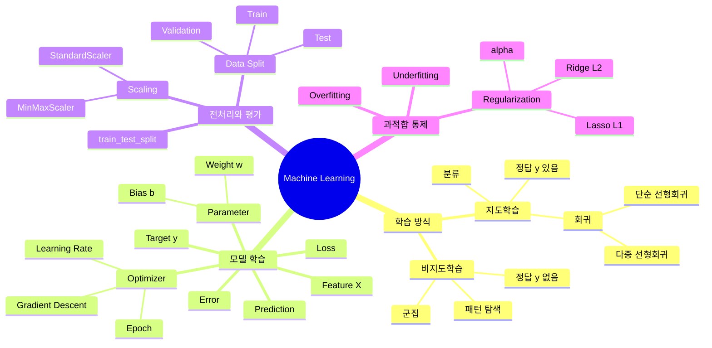

# TIL | 2026-08-27 | Machine Learning 경사하강법·데이터 분할·다중회귀·규제

> **머신러닝으로 자동화 추천이 된다는 건 알고 있었지만... 이렇게 복잡할 줄은 몰랐네...**

> 개별 용어를 외우는 것보다 `데이터 → 모델 → 예측 → 오차 → Loss → 파라미터 조정 → 평가 → 과적합 통제`라는 전체 흐름을 먼저 이해하는 것이 중요했다.

---

## 0. 전체 구조 — 머신러닝 마인드맵



### 핵심 한 줄

```text
Feature(X)
→ Model
→ Prediction(ŷ)
→ 실제값(y)과 비교
→ Error
→ Loss
→ Parameter(w, b) 조정
→ Validation으로 점검
→ Test로 최종 평가
```

---

## 1. What — 무엇을 배웠는가?

### 2장 2강: 경사하강법, 옵티마이저 및 데이터 분할

- **경사하강법(Gradient Descent)**: Loss가 작아지는 방향으로 가중치를 조금씩 수정하는 최적화 방법
- **Learning Rate**: 한 번에 가중치를 얼마나 크게 수정할지 정하는 보폭
- **Epoch**: 전체 Train 데이터를 한 번 학습하는 단위
- **Parameter**: 모델이 학습해서 찾는 값 (`w`, `b`)
- **Hyperparameter**: 사람이 정하는 값 (`learning_rate`, `epoch`, `alpha` 등)
- **Train / Validation / Test**: 학습, 중간 점검, 최종 평가를 분리하기 위한 데이터 구성
- **Scaling**: Feature들의 숫자 크기 차이를 줄이는 전처리
- **StandardScaler**: 평균 0, 표준편차 1 기준으로 Feature를 표준화하는 도구

### 3장 1강: 다중 회귀와 규제 모델

- **단순 선형회귀**: Feature 1개로 연속형 값을 예측
- **다중 선형회귀**: 여러 Feature를 사용해 하나의 연속형 Target을 예측
- **다중공선성(Multicollinearity)**: 독립 변수끼리 지나치게 강한 상관관계를 가져 각 변수의 독립적인 기여도를 구분하기 어려운 현상
- **Ridge(L2)**: 큰 가중치에 제곱 벌점을 부여해 가중치를 전체적으로 줄이는 규제 방식
- **Lasso(L1)**: 가중치 절댓값에 벌점을 부여하며 일부 가중치를 0으로 만들 수 있는 규제 방식
- **alpha**: 규제 강도를 조절하는 하이퍼파라미터

---

## 2. Why — 왜 필요한가?

### 머신러닝은 왜 필요한가?

```text
일반 프로그래밍
데이터 + 사람이 만든 규칙
→ 결과

머신러닝
데이터
→ 패턴 학습
→ 모델
→ 새로운 데이터 예측
```

사람이 모든 경우의 규칙을 직접 작성하기 어려운 문제에서 데이터로부터 패턴을 학습하기 위해 사용한다.

### Loss는 왜 필요한가?

```text
실제값 y = 80
예측값 ŷ = 70
→ Error 발생
→ 여러 Error를 Loss로 계산
→ Loss가 작아지는 방향으로 학습
```

Loss는 모델이 전체적으로 얼마나 틀렸는지 판단하기 위한 기준이다.

### 가중치는 왜 조정하는가?

가중치 `w`는 각 Feature가 예측값에 얼마나 영향을 주는지 나타낸다.

```text
ŷ = wX + b
```

모델은 `fit()` 과정에서 데이터에 맞는 `w`와 `b`를 학습한다.

### 왜 규제를 하는가?

모델이 Train 데이터에 너무 맞춰지면 새로운 데이터에서 성능이 떨어지는 **과적합(Overfitting)**이 생길 수 있다.

```text
Train 데이터에 지나치게 맞춤
→ 일부 가중치가 과도하게 커질 수 있음
→ 새로운 데이터에 일반화가 어려워짐
→ 과적합
```

규제는 Loss에 가중치 벌점을 추가해서 가중치가 지나치게 커지는 것을 억제한다.

```text
가중치 조정
= 예측을 더 잘하기 위해

가중치 규제
= Train 데이터에 지나치게 맞지 않도록 하기 위해
```

### 규제 강도가 너무 크면?

```text
alpha 너무 작음
→ 규제 약함
→ 과적합 위험 증가 가능

alpha 적절함
→ 가중치를 적당히 통제

alpha 너무 큼
→ 규제 과함
→ 필요한 가중치까지 지나치게 작아짐
→ 과소적합(Underfitting) 가능
```

즉:

> **과적합이 나타나면 Ridge/Lasso 같은 규제를 고려할 수 있고, 규제를 너무 강하게 걸면 과소적합이 생길 수 있다.**

---

## 3. How — 선형회귀 구조를 어떻게 읽는가?

### 단순 선형회귀

```text
ŷ = wX + b
```

- `X` = 입력값, Feature
- `y` = 실제 정답값
- `ŷ` = 모델이 예측한 값
- `w` = 가중치, 계수(coefficient)
- `b` = bias, 절편(intercept)

Scikit-learn에서는:

```text
model.coef_
→ w
→ Feature가 예측값에 미치는 영향력

model.intercept_
→ b
→ X=0일 때의 기본 예측값
```

### Bias와 절편

선형회귀에서 `b`는 머신러닝에서는 **bias**, 수학·회귀에서는 **intercept(절편)**라고 부른다.

```text
ŷ = 2X + 5
```

`X=0`일 때:

```text
ŷ = 5
```

따라서 `5`가 절편이며, 예측값의 기본 출발점이라고 볼 수 있다.

### 다중 선형회귀

Feature가 여러 개이면:

```text
ŷ = w1X1 + w2X2 + w3X3 + ... + b
```

예:

```text
G3 예측
= failures × w1
+ goout × w2
+ health × w3
+ b
```

이 식은 **다중 선형회귀**다.

```text
Feature 1개
→ 단순 선형회귀

Feature 여러 개
→ 다중 선형회귀
```

---

## 4. Feature와 coefficient 정리

### Feature

Feature는 모델이 예측할 때 참고하는 **입력 정보**다.

```python
X = df[['failures', 'goout', 'health']]
y = df['G3']
```

```text
failures
→ Feature

goout
→ Feature

health
→ Feature

G3
→ Target(y)
```

### coefficient (`coef_`)

`coefficient`는 계수라는 뜻이며, 선형회귀에서는 거의 **가중치(weight)**라고 이해하면 된다.

```python
model.coef_
```

예:

```text
failures → -2.0
goout    → -0.3
health   →  0.5
```

각 값은 해당 Feature가 예측값에 미치는 영향의 방향과 크기를 나타낸다.

핵심:

> **Feature = 무엇을 보고 예측하는가?**
>
> **coef_ = 그 Feature가 예측값에 얼마나 영향을 주는가?**

---

## 5. Scikit-learn과 `fit()`

### Scikit-learn이란?

`scikit-learn`은 파이썬 머신러닝 라이브러리이며 코드에서는 보통 `sklearn`을 사용한다.

```text
sklearn
├─ linear_model
│  ├─ LinearRegression
│  ├─ Ridge
│  └─ Lasso
├─ preprocessing
│  └─ StandardScaler
└─ model_selection
   └─ train_test_split
```

### 객체 생성과 `fit()`은 다르다

```python
model = Ridge(alpha=0)
```

→ **모델 생성**

```python
model.fit(X, y)
```

→ **모델 학습**

마찬가지로:

```python
scaler = StandardScaler()
```

→ **스케일러 도구 생성**

```python
scaler.fit(X)
```

→ **X에서 변환 기준 학습**

### `fit()`은 객체에 따라 무엇을 배우는지가 다르다

```text
model.fit(X, y)
→ X와 y 관계를 학습
→ w, b 저장

scaler.fit(X)
→ X의 평균과 표준편차 계산
→ 변환 기준 저장
```

즉 `fit()`은 단순히 "함수 실행"이 아니라 **현재 객체가 데이터에서 필요한 값을 학습하게 하는 단계**다.

---

## 6. StandardScaler / fit / transform

### 스케일러란?

Scaler는 Feature들의 숫자 크기를 일정한 기준으로 맞춰주는 **전처리 도구**다.

```text
모델
→ 예측하는 도구

스케일러
→ 모델에 넣기 전에 숫자 크기를 정리하는 도구
```

### StandardScaler

```text
평균 → 0
표준편차 → 1
```

### 실행 흐름

```python
scaler = StandardScaler()
scaler.fit(X)
X_scaled = scaler.transform(X)
```

읽는 순서:

```text
StandardScaler()
→ 스케일러 도구 생성

fit(X)
→ X의 평균과 표준편차를 계산하고 기억

transform(X)
→ 기억한 평균과 표준편차를 기준으로 X를 실제 변환
```

한 번에 실행할 수도 있다.

```python
X_scaled = scaler.fit_transform(X)
```

```text
fit_transform(X)
= fit(X) + transform(X)
```

---

## 7. Train 데이터와 `train_test_split`

### Train 데이터

Train 데이터는 모델이 실제로 **학습하는 데이터**다.

```text
X_train
→ 학습용 입력값

y_train
→ 학습용 정답
```

모델은:

```python
model.fit(X_train, y_train)
```

으로 Train 데이터를 학습한다.

### Test 데이터

Test 데이터는 학습이 끝난 모델을 평가하기 위한 데이터다.

```text
X_test
→ 시험용 입력값

y_test
→ 시험용 정답
```

### `train_test_split()`

```python
from sklearn.model_selection import train_test_split
```

전체 데이터를 학습용 Train과 평가용 Test로 분리해주는 함수다.

```python
X_train, X_test, y_train, y_test = train_test_split(
    X,
    y,
    test_size=0.2,
    random_state=42
)
```

```text
전체 데이터 100%
→ Train 80%
→ Test 20%
```

`test_size=0.2`는 **전체 데이터의 20%를 Test 데이터로 분리한다**는 뜻이다.

### 왜 X와 y를 같이 나누는가?

```text
학생 A의 생활정보 X
↔ 학생 A의 실제 성적 y
```

이 짝을 유지해야 하기 때문에 X와 y를 함께 `train_test_split()`에 넣는다.

---

## 8. Ridge / Lasso / alpha

### Ridge와 Lasso의 위치

Ridge와 Lasso는 모델을 학습할 때 **가중치를 규제하는 두 가지 대표 방식**이다.

```text
과적합 발생 가능
→ 가중치를 통제할 필요
→ 규제
→ Ridge / Lasso
```

### Ridge(L2)

```text
Loss = MSE + alpha × Σ(w²)
```

- 큰 가중치에 제곱 벌점을 줌
- 가중치를 전체적으로 작게 만듦
- 보통 정확히 0으로 만들지는 않음

핵심:

> **Ridge는 튀는 데이터값을 제곱하는 것이 아니라 큰 가중치를 제곱해 벌점을 준다.**

### Lasso(L1)

```text
Loss = MSE + alpha × Σ|w|
```

- 가중치 절댓값에 벌점을 줌
- 일부 가중치를 정확히 0으로 만들 수 있음
- 해당 Feature를 사실상 제거하는 효과 가능

### Ridge와 Lasso 한 줄 비교

```text
Ridge
→ 가중치를 전체적으로 줄인다

Lasso
→ 일부 가중치를 0으로 만들 수도 있다
```

### alpha

`alpha`는 **규제 강도**이며 사람이 정하는 **하이퍼파라미터**다.

```text
alpha 작음
→ 규제 약함

alpha 큼
→ 규제 강함
```

---

## 9. 반복해서 학습해야 할 코드

### 기본 import

```python
import pandas as pd
import numpy as np
import matplotlib.pyplot as plt

from sklearn.model_selection import train_test_split
from sklearn.preprocessing import StandardScaler
from sklearn.linear_model import LinearRegression, Ridge, Lasso
```

### Feature / Target

```python
X = df[['failures', 'goout', 'health']]
y = df['G3']
```

### StandardScaler

```python
scaler = StandardScaler()
scaler.fit(X)
X_scaled = scaler.transform(X)
```

### train_test_split

```python
X_train, X_test, y_train, y_test = train_test_split(
    X,
    y,
    test_size=0.2,
    random_state=42
)
```

### Ridge 기본 흐름

```python
model = Ridge(alpha=0)
model.fit(X, y)

for feature, coef in zip(X.columns, model.coef_):
    print(f'{feature}: {coef}')

print(f'intercept: {model.intercept_}')
```

읽는 순서:

```text
Ridge(alpha=0)
→ 모델 생성

model.fit(X, y)
→ 모델 학습

model.coef_
→ 각 Feature의 가중치

model.intercept_
→ 절편 / bias
```

---

## 10. 2026-08-28 복습에서 새로 정리된 내용

어제 TIL을 다시 읽고 질문하면서 아래 개념을 다시 연결했다.

### 처음 헷갈렸던 것

```text
model.fit()
= 모델 생성 ?

scaler.fit()
= scaler 생성 ?
```

### 다시 정리한 것

```text
Ridge()
→ 모델 생성

model.fit(X, y)
→ 모델 학습

StandardScaler()
→ 스케일러 생성

scaler.fit(X)
→ 평균/표준편차 학습

scaler.transform(X)
→ 실제 X 변환
```

### 회귀식 연결

```text
단순 선형회귀
ŷ = wX + b

w
= coef_
= Feature의 영향력

b
= intercept_
= bias
= X=0일 때의 기본 예측값
```

### 단순 vs 다중 선형회귀

```text
Feature 1개
→ 단순 선형회귀

Feature 여러 개
→ 다중 선형회귀
```

### 규제 흐름

```text
과적합
→ Ridge / Lasso 규제 고려
→ 가중치 통제

하지만
alpha 너무 큼
→ 규제 과함
→ 과소적합 가능
```

---

## 11. KPT 회고

### Keep — 계속할 것

- 모르는 용어를 그냥 넘기지 않고 가장 기초 정의부터 다시 확인한다.
- 코드 한 줄을 외우기보다 `객체 생성 → fit → 결과 사용` 흐름으로 읽는다.
- 비슷한 용어를 직접 비교해서 구분한다.
- 수식에서 각 기호가 실제 코드의 어떤 속성과 연결되는지 확인한다.

```text
w ↔ coef_
b ↔ intercept_
Ridge() ↔ 모델 생성
fit() ↔ 학습
```

### Problem — 반복 취약점 후보

한 세션에서 막힌 내용만으로 확정 취약점으로 보지는 않지만, 반복 확인이 필요한 후보는 다음과 같다.

- 객체 생성과 `fit()`의 역할 구분
- Feature / Target / coefficient / intercept 용어 구분
- `bias = intercept = b`의 의미
- 단순 선형회귀와 다중 선형회귀 구분
- Scaler / StandardScaler / fit / transform 실행 흐름
- Train / Test 데이터 역할
- Ridge / Lasso / alpha와 과적합·과소적합의 연결

### Try — 다음에 시도할 것

- 회귀식과 코드 속성을 연결해서 말로 설명한다.
- `StandardScaler → fit → transform`을 예제 없이 다시 작성한다.
- `train_test_split`을 직접 작성하고 각 반환값의 역할을 설명한다.
- Ridge/Lasso를 `왜 규제하는가? → 어떻게 규제하는가? → alpha가 너무 크면?` 순서로 설명한다.

---

## 12. 이해도 점검

- [x] `Ridge()`와 `model.fit()`이 각각 모델 생성과 학습이라는 차이를 설명할 수 있다.
- [x] `StandardScaler()`와 `scaler.fit()`의 차이를 설명할 수 있다.
- [x] `scaler.fit(X)`가 평균과 표준편차를 계산해 기억한다는 것을 설명할 수 있다.
- [x] `scaler.transform(X)`가 기억한 기준으로 X를 실제 변환한다는 것을 설명할 수 있다.
- [x] Feature가 예측에 사용하는 입력 정보라는 것을 설명할 수 있다.
- [x] `model.coef_`가 Feature의 가중치라는 것을 설명할 수 있다.
- [x] `model.intercept_`가 `b`, bias, 절편이라는 것을 설명할 수 있다.
- [x] Feature 1개와 여러 개일 때 단순/다중 선형회귀를 구분할 수 있다.
- [x] Train 데이터와 Test 데이터의 역할을 구분할 수 있다.
- [x] `test_size=0.2`가 전체의 20%를 Test로 분리한다는 뜻을 설명할 수 있다.
- [x] Ridge와 Lasso가 가중치 규제를 위한 방법이라는 것을 설명할 수 있다.
- [x] alpha가 규제 강도이고 너무 크면 과소적합이 생길 수 있음을 설명할 수 있다.
- [ ] 위 개념들을 코드 없이 처음부터 한 번에 연결해 설명할 수 있다.
- [ ] Ridge/Lasso 코드를 예제 없이 처음부터 작성할 수 있다.

### 현재 이해도

- [ ] ⭐ 아직 거의 이해하지 못했다.
- [ ] ⭐⭐ 일부만 이해했다.
- [x] ⭐⭐⭐ 핵심 개념은 연결되기 시작했지만 코드와 용어는 반복이 필요하다.
- [ ] ⭐⭐⭐⭐ 대부분 이해했고 간단한 코드를 작성할 수 있다.
- [ ] ⭐⭐⭐⭐⭐ 혼자 작성하고 다른 사람에게 설명할 수 있다.

---

## 13. 복습 문제 — 6문제

### 문제 1

다음 두 코드의 차이를 설명해보세요.

```python
model = Ridge(alpha=0)
model.fit(X, y)
```

### 문제 2

선형회귀 식 `ŷ = wX + b`에서 `X`, `w`, `b`, `y`, `ŷ`의 역할을 설명하고, `w`와 `b`가 scikit-learn의 어떤 속성과 연결되는지 말해보세요.

### 문제 3

Feature와 coefficient의 차이를 학생 성적 예측 예시로 설명해보세요.

### 문제 4

다음 코드의 실행 흐름을 설명해보세요.

```python
scaler = StandardScaler()
scaler.fit(X)
X_scaled = scaler.transform(X)
```

### 문제 5

Train 데이터와 Test 데이터의 역할을 설명하고, `test_size=0.2`가 무슨 뜻인지 말해보세요.

```python
X_train, X_test, y_train, y_test = train_test_split(
    X, y,
    test_size=0.2,
    random_state=42
)
```

### 문제 6

Ridge와 Lasso를 왜 사용하는지 설명하고 다음 흐름을 연결해보세요.

```text
과적합
→ 규제
→ Ridge / Lasso
→ alpha
→ 규제가 너무 강할 때 발생할 수 있는 문제
```

---

## 관련 자료

- 2장 2강 교안: `경사하강법, 옵티마이저 및 데이터 분할`
- 3장 1강 교안: `다중 회귀와 규제 모델`
- 예습 노트: `[MACHINE_LEARNING]_선형회귀-오차평가-경사하강법-데이터분할_예습정리.md`
