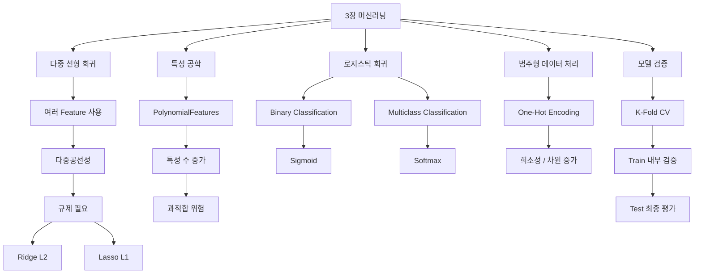
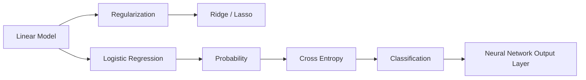

# [MACHINE LEARNING] 다중 회귀·규제·로지스틱 회귀·교차 검증 예습 정리

> **예습 목표: 아침 10분 안에 3장 전체 흐름을 잡는다.**  
> 수식을 외우기보다 **여러 특성을 함께 쓰는 회귀 → 과적합을 막는 규제 → 회귀식으로 분류하는 로지스틱 회귀 → 교차 검증으로 성능을 확인하는 흐름**을 먼저 이해한다.

---

# 🚨 이것만 알고 강의 들어가기

## 핵심 5줄 요약

1. **다중 회귀는 여러 Feature를 함께 사용해 하나의 연속값을 예측하는 선형 회귀**다.
2. Feature끼리 지나치게 비슷한 정보를 담으면 **다중공선성**이 생겨 회귀계수가 불안정해질 수 있다.
3. **Ridge(L2)는 모든 계수를 작게 줄이고, Lasso(L1)는 일부 계수를 정확히 0으로 만들어 특성 선택 효과를 낸다.**
4. **로지스틱 회귀는 이름은 회귀지만 실제로는 분류 모델**이며, 이진 분류에서는 시그모이드, 다중 분류에서는 소프트맥스 개념과 연결된다.
5. 모델 성능은 한 번의 분할만 믿지 않고 **K-Fold 교차 검증**으로 여러 번 확인하며, 마지막 Test Set은 끝까지 따로 남겨둔다.

### 중요도

- 🔥🔥🔥 **다중 회귀와 다중공선성**
- 🔥🔥🔥 **Ridge(L2) vs Lasso(L1)**
- 🔥🔥🔥 **alpha = 규제 강도**
- 🔥🔥🔥 **로지스틱 회귀 = 분류 모델**
- 🔥🔥🔥 **Sigmoid vs Softmax**
- 🔥🔥🔥 **K-Fold 교차 검증**
- 🔥🔥 **One-Hot Encoding / Dummy Variable Trap**
- 🔥 **로그 스케일, max_iter, tol 세부값**

---

# 🗺️ 3장 전체 학습 구조



## 이 장을 한 문장으로

> **Feature가 많아졌을 때 생기는 문제를 규제로 제어하고, 회귀식의 점수를 확률로 바꾸어 분류한 뒤, 교차 검증으로 모델의 진짜 성능을 확인하는 장이다.**

---

# 🥇 1순위: 단순 회귀에서 다중 회귀로

## 단순 선형 회귀

```text
ŷ = w1x1 + b
```

Feature가 1개다.

예:

```text
집 면적 → 집값
```

## 다중 선형 회귀

```text
ŷ = w1x1 + w2x2 + w3x3 + ... + b
```

Feature가 여러 개다.

예:

```text
자습 시간
+ 자유 시간
+ 결석 횟수
      ↓
기말 성적 예측
```

### 핵심

> **Feature가 많아질수록 더 많은 정보를 사용할 수 있지만, 서로 겹치는 Feature가 많으면 문제가 생길 수 있다.**

---

# 🥇 2순위: 다중공선성 = Feature끼리 너무 비슷함

## Multicollinearity

독립변수끼리 강하게 상관되어 서로 비슷한 정보를 반복해서 담고 있는 상태다.

```text
Feature A ─┐
           ├─ 거의 같은 정보
Feature B ─┘
```

### 왜 문제인가

```text
데이터 조금 변경
      ↓
회귀계수 w 크게 변동
      ↓
어떤 Feature가 중요한지 해석 어려움
```

예측 성능이 항상 무조건 나빠진다는 뜻은 아니지만, **계수 해석과 안정성**에 문제가 커질 수 있다.

## VIF

VIF는 다중공선성을 확인하는 대표 지표다.

```text
VIF ≈ 1
→ 거의 문제 없음

VIF 증가
→ 다른 Feature로 해당 Feature를 설명할 수 있는 정도 증가
```

### 주의

`VIF > 5`, `VIF > 10` 같은 기준은 **절대 법칙이 아니라 실무에서 자주 쓰는 경험적 기준**이다.

---

# 🥇 3순위: Feature Engineering

특성 공학은 기존 Feature를 가공해 모델이 더 잘 학습할 수 있는 새로운 Feature를 만드는 과정이다.

예:

```text
x1 = 자습 시간
x2 = 자유 시간
```

새로운 Feature:

```text
x1²
x2²
x1 × x2
```

Scikit-learn:

```python
poly = PolynomialFeatures(degree=2, include_bias=False)
X_poly = poly.fit_transform(X)
```

### 장점

단순 선형 관계만으로 표현하기 어려운 패턴을 더 잘 표현할 수 있다.

### 단점

```text
Feature 추가
→ 모델 복잡도 증가
→ 훈련 데이터 노이즈까지 학습 가능
→ Overfitting 위험
```

그래서 **규제 Regularization**가 등장한다.

---

# 🥇 4순위: 규제 = 가중치가 너무 커지지 않게 브레이크 걸기

기존 선형 회귀는 주로 예측 오차를 줄이는 데 집중한다.

규제 모델은 여기에 하나를 더 본다.

```text
예측 오차
+
가중치 크기 패널티
```

### 핵심 사고

> **훈련 데이터를 지나치게 완벽하게 맞추는 복잡한 모델보다, 조금 단순하더라도 새로운 데이터에 잘 적용되는 모델을 만들자.**

---

# 🥇 5순위: Ridge = L2 규제

Ridge는 가중치 제곱합에 패널티를 준다.

```text
Loss
=
예측 오차
+
alpha × Σ(w²)
```

### 효과

```text
큰 w
 ↓
강한 벌점
 ↓
계수 전체가 작아짐
```

### 특징

- 모든 계수를 전반적으로 줄인다.
- 일반적으로 계수를 정확히 0으로 만들기보다는 0에 가깝게 줄인다.
- 다중공선성이 있을 때 계수를 안정화하는 데 도움이 될 수 있다.

### 기억법

> **Ridge = 전부 살려두되 영향력을 줄인다.**

---

# 🥇 6순위: Lasso = L1 규제

Lasso는 가중치 절대값 합에 패널티를 준다.

```text
Loss
=
예측 오차
+
alpha × Σ|w|
```

### 효과

일부 계수가 정확히 0이 될 수 있다.

```text
w1 = 0.8
w2 = 0
w3 = 0.2
w4 = 0
```

따라서:

```text
불필요한 Feature
      ↓
계수 0
      ↓
특성 선택 효과
```

### 기억법

> **Lasso = 필요 없으면 아예 0으로 만든다.**

---

# 🥇 7순위: Ridge vs Lasso 한눈에

| 구분 | Ridge | Lasso |
|---|---|---|
| 규제 | L2 | L1 |
| 패널티 | `w²` | `|w|` |
| 계수 | 전반적으로 축소 | 일부 0 가능 |
| 특성 선택 | 약함 | 가능 |
| 다중공선성 대응 | 유용 | 가능하지만 불안정한 선택이 생길 수도 있음 |

```text
Ridge
= 모두 조금씩 다이어트

Lasso
= 몇 명은 아예 탈락
```

---

# 🥇 8순위: alpha = 규제 강도

```text
alpha 작음
→ 규제 약함
→ 기존 선형 회귀에 가까움

alpha 큼
→ 규제 강함
→ 계수 더 작아짐
→ 모델 단순화
```

### 너무 크면

규제가 너무 강해져 중요한 패턴까지 놓치는 **Underfitting** 위험이 있다.

### 너무 작으면

복잡한 모델이 그대로 남아 **Overfitting** 위험이 커질 수 있다.

### 핵심

> **alpha도 결국 검증 데이터를 이용해 적절한 값을 찾아야 하는 Hyperparameter다.**

---

# 🥈 9순위: 왜 StandardScaler가 규제 전에 중요할까

규제는 **가중치 크기 자체**에 벌점을 준다.

Feature마다 단위가 다르면:

```text
studytime = 1~4
absences  = 0~93
```

계수 크기를 공정하게 비교하기 어려워진다.

그래서 보통:

```text
Feature
→ StandardScaler
→ Ridge / Lasso
```

### 중요한 실무 원칙

> **데이터를 Train/Test로 먼저 나눈 뒤, Scaler는 Train 데이터에만 fit하고 Validation/Test에는 transform만 해야 데이터 누수를 막을 수 있다.**

---

# 🥇 10순위: 로지스틱 회귀 = 이름은 회귀, 실제는 분류

선형 회귀는 숫자를 그대로 예측한다.

```text
z = wX + b
```

이 값은:

```text
-100
3.7
500
```

처럼 제한이 없다.

하지만 분류에서는 확률이 필요하다.

```text
0 ~ 1
```

그래서 로지스틱 회귀는:

```text
입력 X
 ↓
선형 결합 z = wX + b
 ↓
확률로 변환
 ↓
클래스 결정
```

### 핵심

> **로지스틱 회귀 = 선형 점수를 이용해 클래스 확률을 모델링하는 분류 알고리즘**

---

# 🥇 11순위: Sigmoid = 이진 분류

시그모이드는 하나의 점수 z를 0~1 사이 값으로 바꾼다.

```text
z 매우 작음 → 0에 가까움
z = 0      → 0.5
z 매우 큼  → 1에 가까움
```

예:

```text
스팸일 확률 = 0.87
```

임계값을 0.5로 잡으면:

```text
0.87 ≥ 0.5
→ 스팸
```

### 기억법

> **Sigmoid = YES / NO 두 선택지**

---

# 🥇 12순위: Softmax = 다중 분류

다중 분류에서는 클래스마다 점수(Logit)가 나온다.

예:

```text
Setosa     2.1
Versicolor 0.8
Virginica -1.2
```

Softmax를 통과하면:

```text
Setosa      0.75
Versicolor  0.21
Virginica   0.04
----------------
합계        1.00
```

### 핵심

> **Softmax = 여러 클래스 점수를 전체 합이 1인 확률 분포로 변환**

---

# 🥇 13순위: 회귀는 MSE, 분류는 Cross Entropy

회귀에서는 숫자 차이를 본다.

```text
실제 집값 - 예측 집값
```

분류에서는 **정답 클래스에 얼마나 높은 확률을 줬는지**가 중요하다.

### Cross Entropy 직관

```text
정답 = 고양이

예측: 고양이 0.99
→ 손실 작음

예측: 고양이 0.01
→ 손실 매우 큼
```

> **틀린 것도 문제지만, 틀린 답을 강하게 확신할수록 더 큰 벌점을 준다.**

---

# 🥈 14순위: BCE / CCE / SCCE는 이렇게만 구분

## Binary Cross Entropy

```text
클래스 2개
+ Sigmoid
```

## Categorical Cross Entropy

```text
클래스 여러 개
+ One-Hot Target
```

## Sparse Categorical Cross Entropy

```text
클래스 여러 개
+ 정수 Target
```

예:

```text
CCE
[0, 0, 1]

SCCE
2
```

### 주의

Scikit-learn의 `LogisticRegression`에서는 보통 사용자가 BCE/CCE/SCCE 이름을 직접 지정하지 않는다. 해당 구현은 **log loss**를 내부적으로 최적화하며, 딥러닝 프레임워크의 손실 함수 명칭과 API가 그대로 대응되는 것은 아니다.

---

# 🥇 15순위: One-Hot Encoding

범주형 Feature를 숫자로 바꾸는 대표 방법이다.

잘못된 방식:

```text
사과 = 1
바나나 = 2
딸기 = 3
```

이렇게 하면 숫자 크기에 의미가 있는 것처럼 보일 수 있다.

One-Hot:

```text
사과     [1,0,0]
바나나   [0,1,0]
딸기     [0,0,1]
```

### 핵심

> **범주 간 불필요한 순서 관계를 만들지 않고 각각 독립적인 표시값으로 변환한다.**

---

# 🥈 16순위: Dummy Variable Trap

카테고리가 2개인데 두 열을 모두 만들면:

```text
평일 = 1 → 주말 = 0
평일 = 0 → 주말 = 1
```

한 열만 알아도 다른 열을 완벽하게 알 수 있다.

```text
완전한 선형 종속
→ 다중공선성
```

선형 모델에서는 필요에 따라:

```python
OneHotEncoder(drop='first')
```

처럼 하나를 기준 범주로 제거할 수 있다.

### 보정

규제를 쓰는 일부 모델에서는 더미 변수를 모두 유지해도 계산 자체는 가능할 수 있다. `drop='first'`는 특히 **계수 식별성과 해석** 측면에서 중요하다.

---

# 🥈 17순위: One-Hot의 단점 = 고차원 희소성

카테고리가 매우 많으면:

```text
범주 10,000개
→ 열 10,000개
→ 대부분 0
```

이런 데이터를 **희소(Sparse)**하다고 한다.

### 문제

- 메모리 사용 증가
- 차원 증가
- 계산 비용 증가

### 대안

상황에 따라:

- 희소 행렬 그대로 사용
- 범주 축소
- 해싱
- Target Encoding
- Embedding 등

을 고려한다.

> SCCE는 **Target y 표현 방식**의 메모리를 줄이는 손실 개념이지, Feature X의 원핫 인코딩 차원 폭발을 해결하는 방법은 아니다.

---

# 🥇 18순위: K-Fold Cross Validation

한 번만 Train/Test로 나누면 우연히 쉬운 시험지를 뽑을 수 있다.

K-Fold는 데이터를 K개로 나누어 검증 역할을 번갈아 수행한다.

예: 5-Fold

```text
Fold 1: Valid | Train Train Train Train
Fold 2: Train | Valid Train Train Train
Fold 3: Train Train | Valid Train Train
Fold 4: Train Train Train | Valid Train
Fold 5: Train Train Train Train | Valid
```

마지막에 5개의 검증 점수를 평균낸다.

### 장점

- 한 번의 분할에 덜 의존
- 모델 성능의 변동성 확인
- 데이터가 적을 때 효율적으로 활용

---

# 🥇 19순위: Test Set은 마지막까지 숨긴다

올바른 구조:

```text
전체 데이터
 ↓
Train + Test 분리
 ↓
Train 내부에서 K-Fold CV
 ↓
모델 / Hyperparameter 결정
 ↓
전체 Train 재학습
 ↓
마지막에 Test 1회 평가
```

### 핵심

> **Test를 보면서 모델을 계속 수정하면 Test가 더 이상 진짜 시험지가 아니다.**

---

# 🥈 20순위: KFold와 StratifiedKFold

분류에서는 클래스 비율이 중요하다.

일반 `KFold`도 사용할 수 있지만, 분류 문제에서는 보통 **StratifiedKFold**가 더 적절한 경우가 많다.

```text
전체 클래스 비율
Setosa 33%
Versicolor 33%
Virginica 33%
```

각 Fold에서도 비슷하게 유지한다.

```python
from sklearn.model_selection import StratifiedKFold

cv = StratifiedKFold(
    n_splits=5,
    shuffle=True,
    random_state=42
)
```

> **분류 → Stratified 계열을 먼저 떠올리기**

---

# ⚠️ 강의에서 헷갈릴 가능성이 높은 부분

## 1. 다중 회귀 ≠ 다항 회귀

```text
다중 회귀
= Feature가 여러 개

다항 회귀
= x², x³, x1×x2 같은 고차항 추가
```

두 개를 함께 사용할 수도 있다.

---

## 2. 다중공선성 = 무조건 예측 실패가 아니다

가장 큰 문제는 **회귀계수의 불안정성과 해석 어려움**이다.

예측 자체는 여전히 괜찮을 수도 있다.

---

## 3. Ridge가 계수를 절대 0으로 만들지 않는다고 외우면 안 된다

이론적으로 L2는 **희소해지는 성질이 없어서 일반적으로 정확히 0이 되지 않는다**고 이해하면 충분하다.

핵심은:

```text
Ridge → shrinkage
Lasso → sparsity
```

---

## 4. Lasso가 0으로 만든 Feature = 반드시 쓸모없는 Feature는 아니다

강하게 상관된 Feature가 여러 개 있으면 Lasso가 그중 일부만 남기고 나머지를 0으로 만들 수 있다.

즉:

> **0이 됐다고 곧바로 현실적으로 의미 없는 변수라고 단정하면 안 된다.**

---

## 5. Logistic Regression ≠ Linear Regression + 단순 활성화 함수 하나

입문에서는 그렇게 이해해도 흐름을 잡기 좋지만, 실제로는 로지스틱 회귀가 **분류 확률을 직접 모델링하고 log loss를 최적화하는 별도의 통계 모델**이라고 이해하는 것이 더 정확하다.

---

## 6. Sigmoid ≠ 무조건 이진 분류만

기초에서는:

```text
Sigmoid → 이진 분류
Softmax → 다중 분류
```

로 외우면 충분하다.

다만 딥러닝의 **멀티라벨 분류**에서는 여러 개의 Sigmoid를 동시에 사용할 수도 있다.

---

## 7. Softmax는 점수를 그대로 확률로 읽는 것이 아니다

```text
Logit
→ Softmax
→ Probability
```

순서다.

---

## 8. One-Hot Encoding은 Feature와 Target에서 역할이 다르다

```text
Feature X의 One-Hot
= 범주형 입력을 모델이 사용할 숫자로 변환

Target y의 One-Hot
= 일부 다중 분류 손실 표현에 사용
```

둘을 섞어 생각하지 않는다.

---

## 9. random_state를 안 고정한다고 실전 성능이 좋아지는 것은 아니다

`random_state=42`는 주로 **재현성**을 위한 설정이다.

모델이 특정 분할에 얼마나 민감한지는 교차 검증이나 여러 시드 실험으로 확인한다.

---

# 🔗 앞으로 배울 머신러닝·딥러닝과 연결하기



이번 장에서 배우는 개념은 이후 딥러닝에서 그대로 다시 등장한다.

```text
Regularization
→ 모델 복잡도 통제

Sigmoid / Softmax
→ 출력층 확률 변환

Cross Entropy
→ 분류 손실

Cross Validation
→ 모델 검증 사고방식
```

---

# ⏱️ 아침 10분 예습 코스

## 0~2분 — 다중 회귀와 규제

```text
Feature 여러 개
→ 다중 회귀
→ 공선성 / 과적합 가능
→ Ridge / Lasso
```

말로 구분한다.

```text
Ridge = 모두 줄임
Lasso = 일부 0
```

## 2~4분 — alpha

```text
alpha ↑
→ 규제 강해짐
→ 계수 작아짐
→ 모델 단순화
```

## 4~6분 — 로지스틱 회귀

```text
X
→ z = wX + b
→ 확률
→ 클래스
```

그리고:

```text
Binary → Sigmoid
Multiclass → Softmax
```

## 6~8분 — One-Hot

```text
사과 / 바나나 / 딸기
↓
[1,0,0]
[0,1,0]
[0,0,1]
```

주의:

```text
카테고리 많음
→ 차원 증가
→ 희소 행렬
```

## 8~9분 — Cross Validation

```text
Train 내부
→ 여러 Fold로 번갈아 검증
→ 평균 성능
```

## 9~10분 — 최종 질문

1. 다중공선성이 왜 문제인가?
2. Ridge와 Lasso의 가장 큰 차이는?
3. alpha가 커지면 어떤 일이 생기는가?
4. 로지스틱 회귀가 왜 분류 모델인가?
5. Sigmoid와 Softmax의 차이는?
6. One-Hot Encoding은 왜 필요한가?
7. K-Fold를 왜 사용하는가?
8. Test Set을 왜 마지막까지 남겨야 하는가?

---

# ✅ 예습 완료 기준

> 아래 문장을 스스로 말할 수 있으면 충분하다.

**“다중 회귀는 여러 Feature로 값을 예측하지만, Feature끼리 정보가 겹치면 다중공선성이 생길 수 있다. Ridge는 L2 규제로 모든 계수를 줄이고, Lasso는 L1 규제로 일부 계수를 0으로 만들어 특성 선택 효과를 낸다. 로지스틱 회귀는 선형 점수를 확률로 바꾸어 분류하며, 이진 분류는 시그모이드, 다중 분류는 소프트맥스와 연결된다. 모델 평가는 Train 내부에서 K-Fold 교차 검증을 하고, 마지막 Test Set으로 최종 일반화 성능을 확인한다.”**
