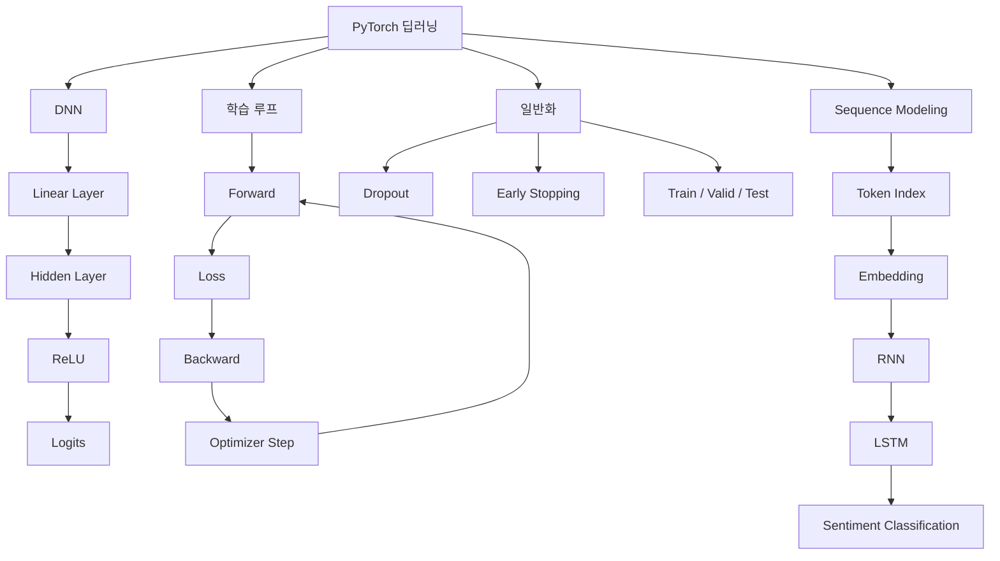
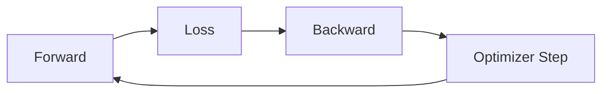
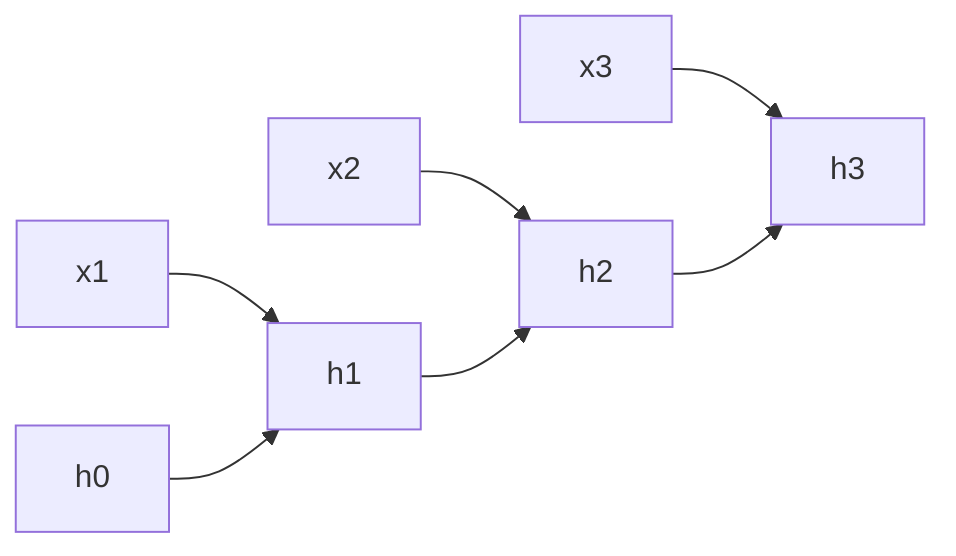
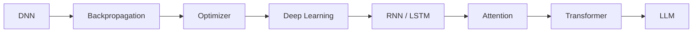

# [MACHINE LEARNING] PyTorch·DNN·역전파·임베딩·RNN·LSTM 예습 정리

> **예습 목표: 아침 10분 안에 4장 전체 흐름을 잡는다.**  
> 코드 세부 문법보다 **신경망이 왜 깊어지는지 → 어떻게 오차를 역전파하는지 → PyTorch가 무엇을 자동화하는지 → 순서가 있는 데이터는 왜 RNN/LSTM으로 처리하는지**를 이해하는 것이 우선이다.

---

# 🚨 이것만 알고 강의 들어가기

## 핵심 5줄 요약

1. **DNN은 입력층과 출력층 사이에 여러 은닉층을 두고, 비선형 활성화 함수를 사용해 복잡한 패턴을 학습하는 신경망**이다.
2. 신경망 학습은 `Forward → Loss → Backpropagation → Optimizer Step`을 반복하는 과정이다.
3. **Backpropagation은 기울기를 계산하고, Optimizer는 그 기울기를 이용해 실제 가중치를 업데이트한다.**
4. 자연어처럼 순서가 중요한 데이터에서는 **Embedding으로 단어를 밀집 벡터로 바꾸고, RNN/LSTM으로 앞선 정보의 맥락을 이어간다.**
5. PyTorch에서는 `nn.Module`, `DataLoader`, `loss.backward()`, `optimizer.step()`, `model.train() / eval()` 흐름을 이해하는 것이 핵심이다.

### 중요도

- 🔥🔥🔥 **Forward → Loss → Backward → Update**
- 🔥🔥🔥 **은닉층 + 비선형 활성화 함수가 필요한 이유**
- 🔥🔥🔥 **ReLU / CrossEntropyLoss / Adam**
- 🔥🔥🔥 **model.train() vs model.eval()**
- 🔥🔥🔥 **Embedding → RNN/LSTM → 마지막 은닉 상태 → 분류**
- 🔥🔥 **Dropout / Early Stopping / Mini-batch**
- 🔥🔥 **Vanishing Gradient / LSTM Gate**
- 🔥 **세부 파라미터 개수 계산 / 그래프 옵션**

---

# 🗺️ 4장 전체 학습 구조



## 이 장을 한 문장으로

> **기존 선형 모델을 여러 층의 신경망으로 확장하고, 역전파로 학습시키며, PyTorch로 이미지와 문장 같은 데이터를 실제로 처리하는 법을 배우는 장이다.**

---

# 🥇 1순위: 왜 은닉층이 필요한가

## 단층 모델

```text
입력 X
 ↓
Linear
 ↓
출력
```

선형 변환만 사용하면 복잡한 곡선 경계를 표현하기 어렵다.

## 다층 신경망

```text
입력
 ↓
Linear
 ↓
ReLU
 ↓
Linear
 ↓
출력
```

은닉층에서 Feature를 여러 번 변환하면서 더 복잡한 표현을 학습한다.

### 중요한 수학적 이유

활성화 함수 없이 Linear Layer만 여러 번 쌓으면:

```text
Linear
→ Linear
→ Linear
```

결국 하나의 Linear 연산으로 합쳐질 수 있다.

> **깊이를 실제 표현력으로 바꾸는 핵심이 비선형 활성화 함수다.**

---

# 🥇 2순위: DNN의 핵심 구조

Fashion MNIST 예시:

```text
28 × 28 이미지
      ↓
Flatten
      ↓
784
      ↓
Linear(784 → 128)
      ↓
ReLU
      ↓
Dropout
      ↓
Linear(128 → 10)
      ↓
10개 클래스 Logit
```

PyTorch 코드 구조:

```python
class Model(nn.Module):
    def __init__(self):
        super().__init__()
        self.flatten = nn.Flatten()
        self.linear1 = nn.Linear(784, 128)
        self.relu = nn.ReLU()
        self.dropout = nn.Dropout(0.2)
        self.linear2 = nn.Linear(128, 10)

    def forward(self, x):
        x = self.flatten(x)
        x = self.linear1(x)
        x = self.relu(x)
        x = self.dropout(x)
        x = self.linear2(x)
        return x
```

### 핵심

> `__init__()` = 레이어 정의  
> `forward()` = 데이터가 흐르는 순서 정의

---

# 🥇 3순위: Flatten은 왜 필요한가

이미지는 2차원 형태다.

```text
28 × 28
```

Fully Connected Layer는 한 줄 벡터를 받는 경우가 많다.

```text
28 × 28
 ↓
784
```

```python
nn.Flatten()
```

### 주의

Flatten은 **정보를 학습하는 레이어가 아니라 모양(shape)을 바꾸는 레이어**다.

---

# 🥇 4순위: 파라미터 = Weight + Bias

예:

```text
Linear(784 → 10)
```

가중치:

```text
784 × 10 = 7,840
```

편향:

```text
10
```

총:

```text
7,850
```

### 핵심

> **신경망이 학습한다 = 내부 Weight와 Bias를 계속 조정한다.**

---

# 🥇 5순위: 신경망 학습 4단계



## 1. Forward Pass

```python
outputs = model(images)
```

현재 Weight로 예측한다.

## 2. Loss Calculation

```python
loss = criterion(outputs, labels)
```

예측과 정답의 차이를 계산한다.

## 3. Backpropagation

```python
loss.backward()
```

각 파라미터에 대한 Gradient를 계산한다.

## 4. Optimizer Step

```python
optimizer.step()
```

Gradient를 이용해 실제 Weight를 수정한다.

---

# 🥇 6순위: zero_grad()를 왜 해야 하나

PyTorch는 기본적으로 Gradient를 **누적**한다.

따라서 매 배치 시작 전에:

```python
optimizer.zero_grad()
```

를 호출한다.

전체 순서:

```python
optimizer.zero_grad()
outputs = model(x)
loss = criterion(outputs, y)
loss.backward()
optimizer.step()
```

### 반드시 외울 흐름

```text
0으로 초기화
→ 예측
→ Loss
→ Backward
→ Step
```

---

# 🥇 7순위: Backpropagation과 Optimizer는 역할이 다르다

## Backpropagation

```text
Loss가 각 Weight에 얼마나 영향을 받는가?
```

를 계산한다.

즉:

```text
Gradient 계산
```

까지가 핵심 역할이다.

## Optimizer

Gradient를 받아:

```text
실제로 Weight 수정
```

한다.

### 한 줄 구분

> **Backward = 방향 계산 / Optimizer = 실제 이동**

---

# 🥇 8순위: Chain Rule

깊은 신경망에서는 출력까지 여러 연산을 거친다.

```text
X
→ Layer1
→ Layer2
→ Layer3
→ Loss
```

앞쪽 Weight가 Loss에 미친 영향을 구하려면 각 단계의 미분값을 연결해야 한다.

```text
미분 × 미분 × 미분
```

이 연결 원리가 **연쇄 법칙(Chain Rule)**이다.

> **Backpropagation = Chain Rule을 이용해 출력 쪽에서 입력 쪽으로 Gradient를 계산하는 알고리즘**

---

# 🥇 9순위: ReLU가 중요한 이유

```text
ReLU(x) = max(0, x)
```

```text
x < 0 → 0
x > 0 → x
```

### 장점

- 계산이 단순하다.
- 양수 구간 Gradient가 1이다.
- Sigmoid보다 깊은 신경망에서 기울기 소실 문제가 덜하다.

### 중요한 보정

ReLU가 **기울기 소실을 완전히 제거하는 것은 아니다.**

또한 음수 영역에서는 Gradient가 0이어서 뉴런이 계속 비활성화되는 **Dead ReLU** 문제가 생길 수 있다.

> 예습에서는 **“은닉층 기본 선택지로 ReLU가 자주 쓰인다”** 정도로 기억하면 충분하다.

---

# 🥈 10순위: Sigmoid와 ReLU 역할 차이

## Sigmoid

```text
출력 범위: 0 ~ 1
```

이진 분류 확률과 연결하기 좋다.

## ReLU

```text
출력 범위: 0 ~ ∞
```

은닉층에서 비선형성을 넣는 데 많이 사용한다.

### 기초 구분

```text
Hidden Layer
→ ReLU 자주 사용

Binary Output
→ Sigmoid 개념

Multiclass Output
→ Softmax 개념
```

---

# 🥇 11순위: CrossEntropyLoss에 Softmax를 직접 넣지 않는 이유

PyTorch:

```python
criterion = nn.CrossEntropyLoss()
```

모델 출력:

```text
Raw Score = Logits
```

즉 모델 마지막에:

```python
nn.Softmax()
```

를 굳이 넣지 않는다.

### 이유

`CrossEntropyLoss`가 내부적으로 Log-Softmax와 NLLLoss에 해당하는 안정적인 계산을 결합한다.

```text
Logits
→ CrossEntropyLoss
→ Loss
```

### 핵심

> **학습 시에는 Logit을 그대로 Loss에 전달한다.**

---

# 🥇 12순위: Optimizer 종류

| Optimizer | 핵심 아이디어 |
|---|---|
| SGD | 현재 Gradient 방향으로 이동 |
| Momentum | 이전 이동 방향의 관성을 추가 |
| RMSprop | 파라미터별 Gradient 크기에 따라 보폭 조절 |
| Adam | Momentum + 적응적 학습률 개념 결합 |

### 초보 단계 기억법

```text
SGD
= 기본

Momentum
= 관성

RMSprop
= 파라미터별 보폭

Adam
= 관성 + 적응적 보폭
```

> Adam이 모든 문제에서 항상 최고라는 뜻은 아니다. 다만 실무와 입문 실습에서 기본 선택지로 매우 자주 쓰인다.

---

# 🥇 13순위: Mini-batch와 DataLoader

전체 데이터를 한 번에 넣지 않고 작은 묶음으로 나눈다.

```text
60,000개 데이터
 ↓
32개씩 Mini-batch
```

PyTorch:

```python
DataLoader(dataset, batch_size=32, shuffle=True)
```

### 이유

- 메모리 절약
- GPU 병렬 연산 활용
- 전체 Batch보다 빠른 업데이트
- 한 샘플씩 학습하는 것보다 안정적

### shuffle=True

Train에서 데이터 순서를 매 Epoch 섞는다.

```text
Train → shuffle=True
Valid/Test → 보통 shuffle=False
```

---

# 🥇 14순위: Train / Eval 모드

## 훈련

```python
model.train()
```

- Dropout 활성화
- BatchNorm이 있다면 학습 모드 동작

## 검증 / 테스트

```python
model.eval()
```

- Dropout 비활성화
- BatchNorm 평가 모드 동작

### 주의

`model.eval()`은 Gradient 계산 자체를 끄지는 않는다.

그래서 검증 시 보통 함께 쓴다.

```python
model.eval()
with torch.no_grad():
    ...
```

---

# 🥇 15순위: torch.no_grad()

검증과 테스트에서는 Weight를 수정하지 않는다.

따라서 Gradient 계산도 필요 없다.

```python
with torch.no_grad():
    outputs = model(x)
```

### 효과

- 메모리 절약
- 계산량 감소
- 추론 속도 개선

### 한 줄 구분

```text
model.eval()
= 모델 동작 모드 변경

no_grad()
= Gradient 기록 끄기
```

---

# 🥇 16순위: Underfitting vs Overfitting

## Underfitting

```text
Train Loss 높음
Valid Loss 높음
```

모델이 기본 패턴도 못 배운 상태다.

해결 예:

- 모델 용량 증가
- 학습 Epoch 증가
- Feature 개선

## Overfitting

```text
Train Loss 계속 감소
Valid Loss 다시 증가
```

훈련 데이터는 잘 외웠지만 새로운 데이터에 약해진 상태다.

해결 예:

- Dropout
- Early Stopping
- Weight Decay
- 데이터 증가
- 모델 단순화

---

# 🥇 17순위: Dropout

훈련 중 일부 뉴런 출력을 무작위로 0으로 만든다.

```text
[● ● ● ● ●]
 ↓ Dropout
[● X ● X ●]
```

### 목적

특정 뉴런 조합에 지나치게 의존하는 것을 줄인다.

```python
nn.Dropout(p=0.2)
```

### 동작

```text
Training → 일부 뉴런 OFF
Evaluation → 모든 뉴런 사용
```

PyTorch에서는 `model.train()` / `model.eval()`에 따라 자동 전환된다.

---

# 🥇 18순위: Early Stopping

검증 Loss가 계속 좋아지다가 다시 나빠지면:

```text
Train Loss ↓↓↓↓↓
Valid Loss ↓↓↓ ↑↑
             ↑
        과적합 신호
```

좋았던 시점의 모델을 저장하고 학습을 중단한다.

```text
Best Validation Loss
→ Weight 저장
→ patience만큼 기다림
→ 개선 없으면 Stop
```

### 핵심

> **Train 성능이 아니라 Validation 성능을 기준으로 멈춘다.**

---

# 🥇 19순위: Embedding = 단어를 학습 가능한 Dense Vector로

원핫 인코딩:

```text
사과
[0,0,0,1,0,0,...]
```

Vocabulary가 20,000개면 벡터 차원도 20,000이 될 수 있다.

Embedding:

```text
사과
→ [0.18, -0.42, 0.91, ...]
```

예: 128차원

```python
nn.Embedding(
    num_embeddings=20000,
    embedding_dim=128
)
```

### 핵심

> **Embedding은 단어 인덱스를 저차원의 학습 가능한 실수 벡터로 매핑한다.**

---

# 🥇 20순위: Embedding은 압축 파일이 아니라 Weight Table

Embedding 내부에는 다음 형태의 Weight 행렬이 있다.

```text
Vocabulary Size × Embedding Dimension
```

예:

```text
20,000 × 128
```

단어 index가 들어오면 해당 행을 꺼낸다.

```text
word id = 51
 ↓
Embedding Table 51번째 행
 ↓
128차원 벡터
```

이 값도 일반 Weight처럼 Backpropagation으로 학습된다.

### 중요한 보정

비슷한 단어가 항상 자동으로 가까워지는 것은 아니다. **학습 목표와 데이터가 의미적 관계를 반영할 때** 유사한 문맥을 가진 단어가 비슷한 벡터를 갖게 되는 경향이 생긴다.

---

# 🥇 21순위: Sequence Data

일반적인 표 데이터에서는 행 순서가 의미 없을 수 있다.

하지만 문장은 순서가 중요하다.

```text
나는 너를 좋아한다
```

vs

```text
너는 나를 좋아한다
```

같은 단어를 사용해도 순서가 바뀌면 의미가 달라진다.

> **Sequence Model은 현재 입력뿐 아니라 앞선 입력의 정보도 함께 사용한다.**

---

# 🥇 22순위: RNN의 핵심 = Hidden State

RNN은 현재 입력과 이전 기억을 함께 사용한다.

```text
x1 + h0 → h1
x2 + h1 → h2
x3 + h2 → h3
```



### 핵심

> **Hidden State = 지금까지 본 시퀀스 정보를 압축해서 다음 시점으로 넘기는 기억 벡터**

---

# 🥇 23순위: Weight Sharing

RNN은 시간 단계마다 새로운 Weight를 만드는 것이 아니다.

```text
t1 → 같은 Weight
 t2 → 같은 Weight
 t3 → 같은 Weight
```

즉 동일한 변환 규칙을 반복해서 사용한다.

### 장점

- 시퀀스 길이가 달라도 처리 가능
- 파라미터 수 절약
- 시간 위치에 동일한 패턴 적용

---

# 🥈 24순위: Vanilla RNN의 문제

시퀀스가 길어지면 Backpropagation도 시간 방향으로 길게 이어진다.

```text
Gradient
× Gradient
× Gradient
× Gradient
× ...
```

이 과정에서:

- Vanishing Gradient
- Exploding Gradient

문제가 발생할 수 있다.

### 중요한 보정

`tanh`의 출력이 -1~1로 제한된다고 해서 **기울기 폭발이 완전히 방지되는 것은 아니다.**

RNN에서는 Gradient Clipping 등 별도의 안정화 기법도 사용한다.

---

# 🥇 25순위: LSTM이 등장한 이유

기본 RNN은 먼 과거 정보를 오래 유지하기 어렵다.

LSTM은 별도의 **Cell State**와 Gate를 도입한다.

```text
과거 정보
   ↓
Forget Gate
   ↓
필요한 것만 유지
   ↓
Input Gate
   ↓
새 정보 추가
   ↓
Output Gate
   ↓
현재 Hidden State
```

### 3개 Gate

| Gate | 역할 |
|---|---|
| Forget Gate | 무엇을 버릴지 결정 |
| Input Gate | 무엇을 새로 저장할지 결정 |
| Output Gate | 무엇을 밖으로 보낼지 결정 |

### 핵심

> **LSTM = RNN의 장기 의존성 문제를 완화하기 위해 기억 흐름을 Gate로 제어하는 구조**

---

# 🥇 26순위: LSTM 입력 Shape

문장 데이터:

```text
Batch × Sequence Length
```

Embedding 후:

```text
Batch × Sequence Length × Embedding Dim
```

LSTM 후:

```text
Batch × Sequence Length × Hidden Dim
```

예:

```text
64 × 32
→ Embedding
64 × 32 × 128
→ LSTM
64 × 32 × 256
```

### 마지막 시점 추출

```python
last_memory = lstm_out[:, -1, :]
```

결과:

```text
Batch × Hidden Dim
```

---

# ⚠️ 27순위: Padding이 있는 문장에서 마지막 시점만 쓰는 문제

교안에서는:

```python
last_memory = lstm_out[:, -1, :]
```

을 사용한다.

하지만 문장을 고정 길이로 Padding했다면 마지막 위치가 실제 단어가 아니라 `<PAD>`일 수 있다.

```text
실제 문장: 재밌는 영화였다
Padding:   재밌는 영화였다 PAD PAD PAD ...
```

따라서 실제 프로젝트에서는:

- 길이 정보를 함께 관리
- `pack_padded_sequence`
- 마지막 실제 토큰 위치 사용
- LSTM이 반환하는 `h_n` 활용

등을 고려할 수 있다.

> 예습에서는 **“마지막 시점 = 항상 마지막 실제 단어”는 아니다**만 기억하면 된다.

---

# 🥇 28순위: BCEWithLogitsLoss

이진 분류 모델 마지막 출력:

```text
Logit
```

모델 안에서 Sigmoid를 적용하지 않고:

```python
criterion = nn.BCEWithLogitsLoss()
```

에 그대로 전달한다.

### 이유

```text
Sigmoid
+
Binary Cross Entropy
```

를 수치적으로 더 안정적인 방식으로 한 번에 계산하기 때문이다.

학습:

```text
Logit
→ BCEWithLogitsLoss
```

추론:

```text
Logit
→ torch.sigmoid()
→ Probability
→ Threshold
→ 0 / 1
```

---

# 🥈 29순위: Threshold

이진 분류 확률:

```text
0.73
```

기준값을 정해 분류한다.

```text
Threshold = 0.5
0.73 ≥ 0.5 → Positive
```

교안에서는 0.6을 사용한다.

### 중요한 점

0.5가 절대 정답은 아니다.

Threshold를 바꾸면:

- Precision
- Recall
- False Positive
- False Negative

가 달라진다.

---

# ⚠️ 강의에서 헷갈릴 가능성이 높은 부분

## 1. Backpropagation ≠ Weight Update

```text
Backpropagation
= Gradient 계산

Optimizer
= Weight Update
```

---

## 2. model.eval() ≠ no_grad()

```text
model.eval()
= Dropout / BatchNorm 동작 모드 변경

no_grad()
= Gradient 추적 비활성화
```

둘을 함께 쓰는 경우가 많다.

---

## 3. ReLU = 기울기 소실 완전 해결이 아니다

Sigmoid보다 유리하지만 깊은 모델에서는 여전히 최적화 문제가 존재할 수 있다.

---

## 4. Dropout = 뉴런 삭제가 아니다

훈련 중 일부 출력을 **일시적으로 0**으로 만드는 것이다.

모델 구조에서 실제 뉴런을 영구 삭제하는 것이 아니다.

---

## 5. DNN이 CNN보다 이미지에 항상 좋지는 않다

Fashion MNIST를 Flatten해서 MLP로 처리할 수는 있지만, 이미지의 공간 구조를 활용하려면 보통 CNN이 더 적합하다.

```text
MLP
= 픽셀을 한 줄로 펼침

CNN
= 주변 픽셀의 공간 관계 활용
```

---

## 6. torchvision에 모든 유명 비전 모델이 들어있는 것은 아니다

`torchvision`은 여러 데이터셋, 전처리 함수, 대표 비전 모델을 제공하지만 **모든 모델이나 YOLO 계열 전체를 기본 제공하는 것은 아니다.**

---

## 7. RNN에서 tanh를 쓴다고 Gradient Explosion이 사라지는 것은 아니다

출력 범위를 제한하는 효과는 있지만, 반복 Weight 곱 때문에 폭발 문제가 여전히 생길 수 있다.

---

## 8. 마지막 Hidden State가 항상 문장 전체 의미를 완벽히 담는 것은 아니다

긴 문장에서는 정보 손실이 생길 수 있고, 이 한계를 개선하기 위해 LSTM, GRU, Attention, Transformer 등이 등장했다.

---

# 🔗 앞으로 배울 딥러닝·LLM과 연결하기



이번 장은 이후 LLM을 이해하기 위한 매우 중요한 다리다.

```text
Embedding
→ 단어를 벡터로 표현

Sequence Modeling
→ 순서를 처리

RNN / LSTM
→ 과거 정보를 전달

Attention / Transformer
→ 더 먼 관계를 효율적으로 처리
```

즉:

> **이번 장은 “LLM 이전 세대의 언어 모델링이 어떻게 발전해 왔는가”를 이해하는 기반이다.**

---

# ⏱️ 아침 10분 예습 코스

## 0~2분 — DNN 구조

```text
Input
→ Linear
→ ReLU
→ Hidden
→ Linear
→ Logits
```

그리고:

```text
비선형 활성화 함수가 없으면
깊게 쌓아도 결국 Linear
```

## 2~4분 — 학습 루프

```text
zero_grad
→ forward
→ loss
→ backward
→ optimizer.step
```

이 다섯 단어를 순서대로 말한다.

## 4~5분 — Train / Eval

```text
model.train()
= 학습 모드

model.eval()
= 평가 모드

no_grad()
= Gradient 끄기
```

## 5~6분 — 과적합

```text
Train Loss ↓
Valid Loss ↑
→ Overfitting
```

대응:

```text
Dropout
Early Stopping
```

## 6~8분 — Embedding / RNN

```text
Token ID
→ Embedding
→ Dense Vector
→ RNN
→ Hidden State
```

## 8~9분 — LSTM

```text
RNN 장기 기억 한계
→ LSTM
→ Cell State + Gate
```

## 9~10분 — 최종 질문

1. 은닉층에 활성화 함수가 왜 필요한가?
2. `loss.backward()`와 `optimizer.step()`의 차이는?
3. `optimizer.zero_grad()`를 왜 호출하는가?
4. `model.train()`과 `model.eval()`은 무엇이 다른가?
5. Dropout과 Early Stopping은 왜 필요한가?
6. Embedding은 원핫 인코딩보다 무엇이 좋은가?
7. RNN의 Hidden State는 무엇인가?
8. LSTM은 RNN의 어떤 문제를 해결하려고 등장했는가?
9. `BCEWithLogitsLoss`를 쓸 때 모델 안에 Sigmoid를 넣지 않는 이유는?

---

# ✅ 예습 완료 기준

> 아래 문장을 스스로 말할 수 있으면 충분하다.

**“딥러닝 신경망은 Linear Layer 사이에 ReLU 같은 비선형 활성화 함수를 넣어 복잡한 패턴을 학습한다. PyTorch의 학습은 `zero_grad → forward → loss → backward → optimizer.step` 순서로 이루어지며, 역전파는 기울기를 계산하고 옵티마이저는 실제 가중치를 수정한다. 자연어처럼 순서가 중요한 데이터는 단어를 Embedding으로 밀집 벡터화한 뒤 RNN이나 LSTM으로 이전 정보를 Hidden State에 이어가며 처리한다.”**
