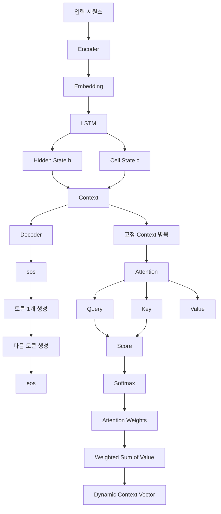
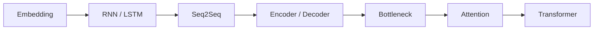

# [MACHINE LEARNING] 시퀀스투시퀀스·인코더·디코더·어텐션 예습 정리

> **예습 목표: 아침 10분 안에 5장 전체 흐름을 잡는다.**  
> 세부 수식보다 **입력 문장을 인코더가 읽고 → 디코더가 출력 문장을 만들고 → 고정 컨텍스트 벡터의 한계를 어텐션이 해결하는 흐름**을 먼저 이해한다.

---

# 🚨 이것만 알고 강의 들어가기

## 핵심 5줄 요약

1. **Seq2Seq는 입력 시퀀스를 다른 길이의 출력 시퀀스로 바꾸는 Encoder-Decoder 구조**다.
2. Encoder는 입력을 읽어 Hidden State와 Cell State로 요약하고, Decoder는 그 상태를 받아 출력 토큰을 하나씩 생성한다.
3. **Teacher Forcing은 학습 중 이전 예측값 대신 실제 정답 토큰을 다음 입력으로 넣는 방법**이다.
4. 기존 Seq2Seq는 긴 문장을 하나의 고정 크기 Context Vector에 압축해서 **Bottleneck**이 생긴다.
5. **Attention은 디코더가 출력 토큰을 만들 때마다 Encoder의 모든 상태를 다시 참고하고, Q-K-V를 이용해 필요한 정보에 가중치를 준다.**

### 중요도

- 🔥🔥🔥 **Encoder / Decoder 역할 구분**
- 🔥🔥🔥 **Hidden State / Cell State / Context Vector**
- 🔥🔥🔥 **Teacher Forcing**
- 🔥🔥🔥 **Bottleneck Problem**
- 🔥🔥🔥 **Attention = 모든 Encoder 상태를 다시 참고**
- 🔥🔥🔥 **Query / Key / Value**
- 🔥🔥 **Softmax → Attention Weight**
- 🔥 **세부 번역 코드 / 그래프 옵션**

---

# 🗺️ 5장 전체 학습 구조



## 이 장을 한 문장으로

> **Seq2Seq가 문장을 압축하고 생성하는 기본 구조를 배우고, 긴 문장에서 생기는 정보 손실을 Attention으로 해결하는 장이다.**

---

# 🥇 1순위: Seq2Seq = Sequence를 다른 Sequence로

Seq2Seq는 길이가 다른 입력과 출력을 처리할 수 있다.

```text
입력:  I love machine learning
출력:  나는 머신러닝을 사랑한다
```

입력 길이와 출력 길이가 같을 필요가 없다.

대표 예:

- 번역
- 요약
- 질의응답
- 대화 생성

### 핵심

```text
Input Sequence
      ↓
Encoder
      ↓
Context
      ↓
Decoder
      ↓
Output Sequence
```

---

# 🥇 2순위: Encoder 역할

Encoder는 입력 문장을 앞에서부터 읽는다.

```text
hello
  ↓
Embedding
  ↓
LSTM
  ↓
hidden, cell
```

LSTM 기반 Encoder:

```python
embedded = self.embedding(x)
outputs, (hidden, cell) = self.lstm(embedded)
return hidden, cell
```

### Hidden State

현재까지 읽은 정보를 요약한 상태 벡터다.

### Cell State

LSTM 내부에서 장기 정보를 전달하는 메모리 통로다.

### 핵심

> **Encoder = 입력을 읽고 내부 상태로 요약하는 역할**

---

# 🥇 3순위: Decoder 역할

Decoder는 Encoder가 넘긴 상태를 초기 상태로 사용한다.

```text
Encoder Context
      ↓
Decoder 초기 hidden / cell
      ↓
<sos>
      ↓
첫 토큰 예측
      ↓
다음 토큰 예측
      ↓
<eos>
```

PyTorch 흐름:

```python
prediction, (hidden, cell) = decoder(
    decoder_input,
    (hidden, cell)
)
```

### 핵심

> **Decoder = Context를 바탕으로 출력 토큰을 순서대로 생성하는 역할**

---

# 🥇 4순위: <sos> / <eos>

## <sos>

문장 생성을 시작하라는 신호다.

```text
<sos>
  ↓
첫 번째 단어 생성
```

## <eos>

문장이 끝났다는 신호다.

```text
단어 생성
  ↓
<eos>
  ↓
생성 종료
```

### 핵심

> Decoder는 길이를 미리 아는 게 아니라 **<eos>를 예측할 때까지 생성**할 수 있다.

---

# 🥇 5순위: Teacher Forcing

학습 초기에 Decoder는 자주 틀린다.

예:

```text
정답: 나는 머신러닝을 사랑한다
예측: 나는 고양이를 ...
```

예측값을 다음 입력으로 계속 넣으면 오류가 이어질 수 있다.

Teacher Forcing:

```text
이전 예측값 X
실제 정답 토큰 O
```

즉:

```python
decoder_input = tgt_t[:, t:t+1]
```

### 장점

- 초기 학습 안정화
- 더 빠른 수렴

### 한계

학습 때는 정답을 보고, 추론 때는 자기 예측을 사용한다.

```text
Train
= Ground Truth 입력

Inference
= 자기 예측 입력
```

이 차이를 **Exposure Bias**라고 부르기도 한다.

---

# 🥇 6순위: 기본 Seq2Seq의 Context Vector

기본 구조에서는 Encoder 마지막 상태를 Decoder에 전달한다.

```text
입력 전체 문장
     ↓
마지막 hidden + cell
     ↓
Context
```

교안의 LSTM 기반 구조에서는:

```text
Context
≈ (h_T, c_T)
```

### 주의

"Context Vector = 항상 하나의 벡터"라고만 외우기보다는, **Encoder가 최종적으로 압축해 Decoder로 넘기는 상태 정보**라고 이해하는 것이 좋다.

---

# 🥇 7순위: Bottleneck Problem

짧은 문장:

```text
hello
↓
작은 Context에 충분히 압축 가능
```

긴 문장:

```text
아주 긴 입력 문장........
          ↓
같은 크기 Context
          ↓
정보 유실 가능
```

### 문제의 핵심

> **입력 길이는 계속 늘어나는데 전달 공간은 고정**

그래서 긴 시퀀스일수록 초반 정보가 잘 보존되지 않을 수 있다.

---

# 🥇 8순위: Attention이 왜 등장했나

기존 Seq2Seq:

```text
Encoder 모든 정보
      ↓
마지막 Context 하나
      ↓
Decoder
```

Attention:

```text
Encoder h1 h2 h3 h4 ...
   ↑   ↑   ↑   ↑
Decoder가 매 출력 시점마다
필요한 위치를 다시 참고
```

### 핵심 변화

> **한 번 압축해서 끝내는 방식 → 출력할 때마다 필요한 입력 부분을 다시 보는 방식**

---

# 🥇 9순위: Query / Key / Value

검색으로 비유하면 가장 쉽다.

## Query

```text
내가 지금 찾고 싶은 것
```

Seq2Seq Attention에서는 보통 현재 Decoder 상태와 연결된다.

## Key

```text
각 입력 정보가 무엇인지 비교하기 위한 이름표
```

Encoder 상태들과 연결된다.

## Value

```text
실제로 가져올 내용
```

Encoder의 정보 벡터와 연결된다.

### 기억법

```text
Query = 질문
Key   = 비교용 이름표
Value = 실제 내용
```

---

# 🥇 10순위: Attention 계산 3단계

## 1. Score

Query와 Key가 얼마나 관련 있는지 계산한다.

```text
Score = Q · Kᵀ
```

점수가 높을수록 관련성이 크다고 본다.

## 2. Softmax

Score를 가중치로 바꾼다.

```text
[2.1, 0.5, -1.0]
      ↓ Softmax
[0.78, 0.16, 0.06]
```

합계:

```text
1.0
```

## 3. Weighted Sum

각 Value에 가중치를 곱해서 더한다.

```text
Context
= 0.78×V1
+ 0.16×V2
+ 0.06×V3
```

### 핵심

```text
Q와 K 비교
→ Attention Weight
→ Value 가중합
→ Context
```

---

# 🥇 11순위: 고정 Context vs 동적 Context

## 기존 Seq2Seq

```text
입력 문장 하나
→ Context 하나
```

출력하는 모든 단어가 같은 요약 정보를 바탕으로 한다.

## Attention

```text
출력 단어 1
→ Context 1

출력 단어 2
→ Context 2

출력 단어 3
→ Context 3
```

현재 출력할 단어에 따라 참조 위치가 달라진다.

> **Attention의 Context Vector는 시점마다 달라지는 동적 요약 정보다.**

---

# 🥇 12순위: 어순이 달라도 연결할 수 있다

영어:

```text
I love ML
```

한국어:

```text
나는 ML을 사랑한다
```

순서가 다르다.

Attention은 각 출력 시점에서:

```text
나는        → I에 집중
머신러닝을   → ML에 집중
사랑한다     → love에 집중
```

할 수 있다.

### 핵심

> **위치가 아니라 현재 예측과의 관련성을 기준으로 정보를 선택한다.**

---

# 🥈 13순위: Attention Map

Attention Weight를 행렬로 보면:

```text
               Input
            I   love   ML
나는       .9    .05   .05
머신러닝   .05   .05   .90
사랑한다   .05   .90   .05
```

짙은 위치가 모델이 더 집중한 부분이다.

### 주의

Attention Map이 사람이 생각하는 **완벽한 설명 또는 인과관계**를 의미하는 것은 아니다.

> **Attention Weight는 모델 내부의 정보 가중치를 보여주는 신호이지, 그 자체가 완전한 설명 가능성 보장은 아니다.**

---

# 🥈 14순위: Dot Product

두 벡터:

```text
Q = [1, 2]
K = [3, 4]
```

내적:

```text
1×3 + 2×4 = 11
```

Attention에서는 이런 내적을 이용해 관련성 점수를 계산할 수 있다.

### 핵심

> 방향과 값의 패턴이 잘 맞을수록 큰 Score가 나올 수 있다.

---

# 🥈 15순위: 기본 Attention과 Transformer Attention의 연결

이번 강의에서는 Encoder-Decoder RNN 위에 Attention을 추가한다.

앞으로 Transformer에서는 이 Q/K/V 구조가 더 중심이 된다.

```text
RNN Seq2Seq
→ Attention 추가
→ Q / K / V
→ Self-Attention
→ Transformer
→ LLM
```

### 아주 중요한 연결

> **이번 5장은 Transformer를 이해하기 직전 단계다.**

---

# ⚠️ 강의에서 헷갈릴 가능성이 높은 부분

## 1. Context Vector = 무조건 하나의 숫자 벡터라고만 보면 안 된다

LSTM Encoder에서는 마지막 `hidden`, `cell` 상태 세트를 Decoder 초기 상태로 사용할 수 있다.

핵심은:

```text
Encoder가 입력을 요약해서
Decoder에 넘겨주는 상태 정보
```

이다.

---

## 2. Teacher Forcing은 추론 때 쓰지 않는다

```text
Training
→ 실제 정답 입력 가능

Inference
→ 실제 정답 없음
→ 자기 예측을 다음 입력으로 사용
```

---

## 3. Attention이 Long-Term Dependency를 완전히 제거한다고 외우지 않는다

고정 Context 병목을 크게 완화하지만 모델 구조, 학습 데이터, 최적화에 따른 다른 문제는 여전히 있을 수 있다.

---

## 4. Query / Key / Value가 항상 서로 다른 원본 데이터라는 뜻은 아니다

Attention 종류에 따라 Q/K/V는 같은 입력에서 만들어질 수도 있다.

나중에 Self-Attention에서는:

```text
같은 Sequence
→ Q
→ K
→ V
```

가 만들어진다.

---

## 5. Dot Product Score는 기본 형태 중 하나다

Attention Score 계산 방법은 여러 종류가 있다.

- Dot-product
- Scaled Dot-product
- Additive Attention

등이 있다.

이번 강에서는 **Q와 K의 관련성을 점수화한다**는 개념이 핵심이다.

---

## 6. Attention Weight = 정답 확률이 아니다

```text
Attention Weight
= 입력 정보에 얼마나 집중할지

Output Probability
= 어떤 토큰을 출력할지
```

서로 다른 확률 분포다.

---

# 🔗 이전 4장과 연결하기



4장에서 배운:

```text
Embedding
RNN
LSTM
Hidden State
Cell State
```

가 이번 5장에서 그대로 사용된다.

즉:

> **4장 = 한 시퀀스를 이해하는 법**  
> **5장 = 한 시퀀스를 다른 시퀀스로 바꾸고, Attention으로 필요한 입력에 집중하는 법**

---

# ⏱️ 아침 10분 예습 코스

## 0~2분 — Seq2Seq

```text
Input
→ Encoder
→ Context
→ Decoder
→ Output
```

말로 설명한다.

```text
Encoder = 읽기
Decoder = 쓰기
```

## 2~4분 — LSTM 상태

```text
Hidden State
= 현재까지의 요약

Cell State
= 장기 정보 통로
```

그리고:

```text
Encoder 마지막 상태
→ Decoder 초기 상태
```

## 4~5분 — Teacher Forcing

```text
학습 중
모델의 이전 예측 대신
실제 정답을 다음 입력으로 사용
```

## 5~6분 — Bottleneck

```text
긴 입력
→ 고정 크기 Context 하나
→ 정보 손실
```

## 6~8분 — Attention

```text
Query
→ Key와 비교
→ Score
→ Softmax
→ Weight
→ Value 가중합
→ Context
```

## 8~9분 — 고정 vs 동적 Context

```text
기존 Seq2Seq
= Context 하나

Attention
= 출력 시점마다 Context 다시 계산
```

## 9~10분 — 최종 질문

1. Encoder와 Decoder의 역할은 무엇인가?
2. Hidden State와 Cell State는 무엇인가?
3. Teacher Forcing은 왜 사용하는가?
4. 기본 Seq2Seq의 Bottleneck은 왜 발생하는가?
5. Attention은 Bottleneck을 어떻게 완화하는가?
6. Query / Key / Value를 각각 한 문장으로 설명할 수 있는가?
7. Softmax는 Attention에서 왜 필요한가?
8. 기존 Context와 Attention Context는 무엇이 다른가?

---

# ✅ 예습 완료 기준

> 아래 문장을 스스로 말할 수 있으면 충분하다.

**“Seq2Seq는 Encoder가 입력 시퀀스를 읽어 상태 정보로 요약하고, Decoder가 그 정보를 바탕으로 출력 시퀀스를 한 토큰씩 생성하는 구조다. 학습할 때는 Teacher Forcing으로 정답 토큰을 다음 입력으로 넣을 수 있다. 하지만 긴 문장을 고정 크기 Context에 모두 압축하면 병목이 생기기 때문에, Attention은 Decoder가 매 시점마다 Query와 Encoder의 Key를 비교해 가중치를 만들고 Value를 가중합하여 필요한 정보 중심의 새로운 Context를 만든다.”**
