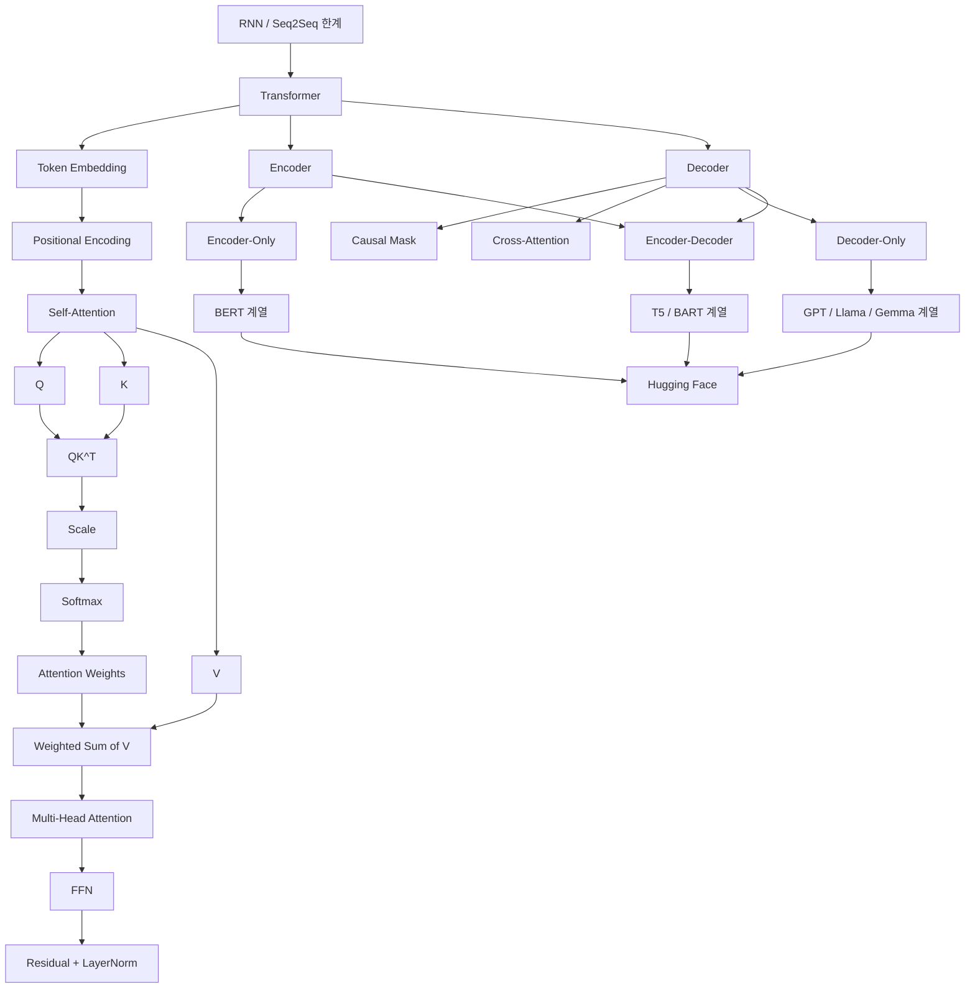
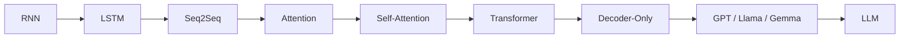

# [MACHINE LEARNING] 트랜스포머·셀프 어텐션·허깅페이스 예습 정리

> **예습 목표: 아침 10분 안에 6장 전체 흐름을 잡는다.**  
> 세부 수식보다 **RNN 한계 → Transformer → 위치 정보 주입 → Self-Attention → Multi-Head → Encoder/Decoder 구조 → Hugging Face로 실제 모델 사용**의 연결을 먼저 이해한다.

---

# 🚨 이것만 알고 강의 들어가기

## 핵심 5줄 요약

1. **Transformer는 RNN의 순차 처리 한계를 줄이고 Attention 중심으로 문장을 병렬 처리하는 구조**다.
2. 모든 토큰을 한꺼번에 처리하기 때문에 순서 정보가 사라질 수 있어 **Positional Encoding**을 더한다.
3. **Self-Attention은 같은 문장 안에서 각 토큰이 Q, K, V를 만들어 서로 얼마나 관련 있는지 계산하는 핵심 연산**이다.
4. Multi-Head Attention은 여러 관점의 Attention을 병렬로 계산하고, Encoder와 Decoder는 Self-Attention·FFN·Residual·LayerNorm 등을 조합해 구성된다.
5. Hugging Face를 사용하면 Tokenizer와 사전학습 모델을 불러와 **분류·요약·생성** 같은 Transformer 태스크를 빠르게 실행할 수 있다.

### 중요도

- 🔥🔥🔥 **RNN/Seq2Seq 한계 → Transformer 등장 이유**
- 🔥🔥🔥 **Positional Encoding**
- 🔥🔥🔥 **Self-Attention: Q/K/V → Score → Scaling → Softmax → V 가중합**
- 🔥🔥🔥 **Multi-Head Attention**
- 🔥🔥🔥 **Encoder-Only / Decoder-Only / Encoder-Decoder**
- 🔥🔥🔥 **Causal Mask / Cross-Attention**
- 🔥🔥 **Residual + LayerNorm + FFN**
- 🔥🔥 **Hugging Face: Tokenizer / AutoModel / Pipeline**
- 🔥 **BPE / WordPiece / SentencePiece 세부 차이**

---

# 🗺️ 6장 전체 학습 구조



## 이 장을 한 문장으로

> **Transformer가 문장 전체를 병렬로 처리하면서도 Self-Attention과 위치 정보를 이용해 토큰 관계를 이해하고, 이 구조가 BERT·GPT·T5 계열 모델과 Hugging Face 생태계로 이어지는 장이다.**

---

# 🥇 1순위: Transformer가 왜 등장했나

RNN 기반 모델:

```text
토큰 1 처리
 ↓
토큰 2 처리
 ↓
토큰 3 처리
 ↓
...
```

앞 단계 계산이 끝나야 다음 단계로 갈 수 있다.

### 문제

- 병렬화가 어렵다.
- 긴 시퀀스에서 먼 토큰 관계를 학습하기 어렵다.
- Seq2Seq는 한정된 Context에 정보를 압축하는 병목도 있었다.

Transformer:

```text
토큰 1  토큰 2  토큰 3  토큰 4
   └────── 동시에 처리 ──────┘
```

### 핵심 변화

> **순서대로 기억하는 방식 → 토큰끼리 직접 관계를 계산하는 방식**

---

# 🥇 2순위: Transformer의 병렬 처리와 순서 문제

문장:

```text
I love you
```

Embedding만 하면 각 토큰의 의미 벡터는 있지만, Transformer 자체에는 RNN처럼 시간 순서가 내장되어 있지 않다.

그래서:

```text
Token Embedding
+
Position Information
```

를 함께 사용한다.

> **의미는 Embedding, 위치는 Positional Encoding**

---

# 🥇 3순위: Positional Encoding

고전 Transformer는 위치마다 다른 Sine/Cosine 패턴을 생성해 Embedding에 더한다.

```text
Final Input
= Token Embedding + Positional Encoding
```

### 왜 더하는가

```text
love라는 단어의 의미
+
문장에서 2번째라는 위치
```

를 동시에 모델에 전달하기 위해서다.

### 핵심 직관

> **같은 단어라도 위치가 달라지면 Transformer에 들어가는 최종 벡터가 달라진다.**

---

# 🥈 4순위: Sine / Cosine 위치 인코딩은 이렇게만 이해

각 위치마다 서로 다른 주기의 사인/코사인 값을 만든다.

```text
Position 1 → 특정 파형 조합
Position 2 → 다른 파형 조합
Position 3 → 또 다른 조합
```

다양한 주기를 섞기 때문에 위치별 패턴이 달라진다.

### 중요한 보정

교안처럼 “모든 위치가 절대 겹치지 않는다”, “학습에서 보지 못한 훨씬 긴 문장도 항상 안정적으로 일반화한다”라고 강하게 단정하기보다,

> **삼각함수 방식은 위치와 상대적 거리 패턴을 표현하기 좋은 고정식 위치 표현 방식 중 하나**

라고 이해하는 것이 안전하다.

현대 Transformer에는 학습형 위치 임베딩, RoPE, ALiBi 등 다른 위치 표현 방식도 많이 사용된다.

---

# 🥇 5순위: Self-Attention = 문장 안에서 서로를 본다

문장:

```text
The animal didn't cross the street because it was tired.
```

`it`이 무엇을 가리키는지 이해하려면 다른 단어를 참고해야 한다.

Self-Attention은 각 토큰이 같은 문장 속 다른 토큰들을 보며 관련성을 계산한다.

```text
현재 토큰
 ↓
문장 속 모든 토큰과 관계 점수 계산
 ↓
중요한 토큰에 더 높은 가중치
 ↓
새로운 문맥 벡터 생성
```

---

# 🥇 6순위: Q, K, V

하나의 입력 벡터 X에서 서로 다른 가중치 행렬을 곱해 Q, K, V를 만든다.

```text
X × Wq → Q
X × Wk → K
X × Wv → V
```

## Query

```text
내가 지금 어떤 정보를 찾고 싶은가?
```

## Key

```text
나는 어떤 정보와 관련 있는가?
```

## Value

```text
선택되면 실제로 전달할 내용은 무엇인가?
```

### 기억법

> **Q = 질문 / K = 비교표 / V = 실제 내용**

---

# 🥇 7순위: Self-Attention 계산 순서

반드시 이 순서를 기억한다.

```text
1. Q × Kᵀ
2. √d_k 로 나누기
3. Softmax
4. V와 곱하기
```

수식 형태:

```text
Attention(Q,K,V)
= Softmax(QKᵀ / √d_k) V
```

### 1단계: Score

```text
QKᵀ
```

토큰끼리 관련성 점수를 만든다.

### 2단계: Scaling

```text
Score / √d_k
```

차원이 커질수록 내적값이 커질 수 있어 Softmax가 지나치게 뾰족해지는 것을 완화한다.

### 3단계: Softmax

각 Query가 Key들에 얼마나 집중할지 비율로 만든다.

### 4단계: Value 가중합

```text
Attention Weight × V
```

관련성이 높은 정보가 더 많이 섞인 새로운 토큰 표현을 만든다.

---

# ⚠️ 8순위: Scaling 이유 정확히 잡기

교안에는 “값이 커질수록 Softmax 계산 시 기울기 소실을 막기 위해”라고 적혀 있지만, 더 정확하게는:

> **d_k가 커질수록 Q·K 내적의 분산과 절댓값이 커져 Softmax가 포화 영역으로 들어가기 쉬워지므로 이를 완화하기 위해 √d_k로 나눈다.**

즉 단순히 “기울기 소실 방지” 한 문장으로만 외우지 않는다.

---

# 🥇 9순위: Multi-Head Attention

하나의 Attention만 쓰는 대신 여러 Head가 서로 다른 투영 공간에서 Attention을 수행한다.

```text
Input
 ├─ Head 1
 ├─ Head 2
 ├─ Head 3
 └─ Head 4
      ↓
Concatenate
      ↓
Linear Projection
```

### 왜 여러 개 쓰나

서로 다른 관계 패턴을 동시에 표현할 수 있는 능력을 늘린다.

예를 들어 한 Head는 가까운 문법 관계를, 다른 Head는 장거리 관계를 학습할 수 있다.

### 중요한 보정

> 각 Head가 반드시 “주어용, 시제용, 대명사용”으로 깔끔하게 역할 분담한다고 보장되지는 않는다.

그런 해석은 직관적 비유일 뿐이다.

---

# 🥇 10순위: Multi-Head의 Shape

예:

```text
d_model = 256
num_heads = 4
```

각 Head:

```text
head_dim = 256 / 4 = 64
```

입력:

```text
[Batch, Seq, 256]
```

분할:

```text
[Batch, 4, Seq, 64]
```

각 Head 계산 후 다시:

```text
[Batch, Seq, 256]
```

으로 합친다.

---

# 🥇 11순위: FFN은 토큰별 가공 공장

Attention이 토큰 간 정보를 섞었다면 FFN은 각 토큰 벡터를 개별적으로 비선형 변환한다.

```text
d_model
 ↓
Linear
 ↓
d_ff
 ↓
Activation
 ↓
Linear
 ↓
d_model
```

예:

```text
512 → 2048 → 512
```

### 중요한 포인트

> **FFN은 같은 가중치를 모든 토큰 위치에 독립적으로 적용한다.**

Positionwise라는 말이 이 뜻이다.

---

# 🥇 12순위: Residual Connection

```text
Output = x + Sublayer(x)
```

원래 입력을 우회시켜 결과에 더한다.

### 효과

- 깊은 네트워크 학습 안정화
- Gradient 흐름 개선
- 기존 정보 보존에 도움

### 기억법

> **Residual = 원래 정보를 버리지 않는 우회도로**

---

# 🥇 13순위: Layer Normalization

토큰 하나의 hidden dimension 내부 값들을 기준으로 정규화한다.

```text
한 토큰 벡터
[x1, x2, x3, ... xd]
```

이 벡터 내부의 평균/분산을 사용한다.

### BatchNorm과 구분

```text
BatchNorm
= 배치 축 통계 사용

LayerNorm
= 한 샘플/토큰 내부 Feature 축 통계 사용
```

Transformer에는 LayerNorm이 핵심적으로 사용된다.

---

# 🥇 14순위: Encoder Layer

기본 Encoder 흐름:

```text
Input
 ↓
Self-Attention
 ↓
Add & Norm
 ↓
FFN
 ↓
Add & Norm
```

Self-Attention에서는:

```text
Q = x
K = x
V = x
```

라는 뜻이 아니라, **같은 입력 x를 서로 다른 Wq/Wk/Wv로 투영해서 Q/K/V를 만든다.**

---

# 🥇 15순위: Decoder Layer

기본 Decoder에는 3개 핵심 블록이 있다.

```text
Masked Self-Attention
 ↓
Cross-Attention
 ↓
FFN
```

## Masked Self-Attention

미래 토큰을 보지 못하게 한다.

## Cross-Attention

```text
Q = Decoder 현재 표현
K = Encoder Output
V = Encoder Output
```

원문 정보를 참고해 출력 토큰을 생성한다.

---

# 🥇 16순위: Causal Mask

디코더가 미래 정답을 미리 보면 안 된다.

예:

```text
[1,0,0,0]
[1,1,0,0]
[1,1,1,0]
[1,1,1,1]
```

미래 위치 Score를 매우 큰 음수로 바꾸면:

```text
Softmax → 거의 0
```

### 핵심

> **현재 토큰은 현재와 과거만 본다.**

이게 Decoder-only LLM의 Autoregressive 생성 기반이다.

---

# 🥇 17순위: Padding Mask와 Causal Mask는 다르다

## Padding Mask

```text
<PAD> 토큰 무시
```

## Causal Mask

```text
미래 토큰 차단
```

### 한 줄 구분

> **Padding = 의미 없는 자리 숨김 / Causal = 미래 숨김**

---

# 🥇 18순위: Transformer 3가지 구조

## Encoder-Only

```text
입력 전체 이해
```

대표:

- BERT 계열

적합:

- 분류
- NER
- 문장 이해

## Decoder-Only

```text
이전 토큰 → 다음 토큰 생성
```

대표:

- GPT 계열
- Llama 계열
- Gemma 계열

적합:

- 텍스트 생성
- 대화
- 코드 생성

## Encoder-Decoder

```text
입력 이해
+
새 출력 생성
```

대표:

- T5
- BART

적합:

- 번역
- 요약
- 입력→출력 변환

---

# 🥇 19순위: GPT는 왜 Decoder-Only인가

다음 토큰을 예측하는 Autoregressive 학습이 핵심이기 때문이다.

```text
나는
 ↓
나는 오늘
 ↓
나는 오늘 학교에
 ↓
나는 오늘 학교에 갔다
```

매 시점:

```text
과거 토큰만 보고
다음 토큰 예측
```

그래서 Causal Mask가 필수다.

---

# 🥈 20순위: BERT는 왜 Encoder-Only인가

BERT 계열은 기본적으로 문장의 양방향 문맥을 이용해 입력 표현을 풍부하게 만드는 데 초점을 둔다.

```text
앞 문맥 ← 단어 → 뒤 문맥
```

그래서 분류·추출·이해 태스크에 강하다.

### 주의

“Encoder = 이해만 가능, 생성은 절대 불가능”처럼 절대적으로 외우지 않는다.

구조적으로 기본 목적이 다르다는 뜻이다.

---

# 🥇 21순위: Transformer 파라미터 어디에 많이 있나

## Embedding

```text
Vocab Size × d_model
```

Vocabulary가 커지면 커진다.

## Attention Projection

기본적으로:

```text
Wq + Wk + Wv + Wo
≈ 4 × d_model²
```

## FFN

```text
d_model × d_ff
+
d_ff × d_model
```

보통 d_ff가 d_model보다 크기 때문에 FFN도 큰 비중을 차지한다.

### 주의

실제 모델 파라미터 계산에는 Bias, LayerNorm, 공유 Embedding 여부 등도 포함될 수 있다.

---

# 🥇 22순위: Hugging Face란

Transformer 모델 생태계를 쉽게 사용할 수 있게 해주는 플랫폼/라이브러리 생태계다.

대표 흐름:

```text
Model ID
 ↓
Tokenizer 로드
 ↓
Model 로드
 ↓
Text Tokenize
 ↓
Tensor
 ↓
Model Inference
 ↓
Logits / Generated Tokens
 ↓
Decode
```

---

# 🥇 23순위: Tokenizer의 역할

모델은 문자열을 직접 계산하지 않는다.

```text
"오늘 너무 좋아"
 ↓
Tokenize
 ↓
토큰 조각
 ↓
Token ID
 ↓
Tensor
```

Tokenizer는 보통:

- 문장 분할
- Subword 분리
- Token ID 변환
- Padding
- Truncation
- Special Token 추가

등을 처리한다.

---

# 🥈 24순위: BPE / WordPiece / SentencePiece

## BPE

자주 등장하는 단위 쌍을 반복 병합해 Subword Vocabulary를 만든다.

## WordPiece

BPE와 유사한 Subword 방식이지만 병합 기준이 동일하지 않다. BERT 계열에서 널리 알려져 있다.

## SentencePiece

공백까지 문자처럼 취급해 Raw Text에서 직접 Subword 모델을 학습할 수 있는 토크나이저 프레임워크다.

### 중요한 보정

> **SentencePiece는 BPE와 완전히 반대되는 토큰화 알고리즘이 아니라, BPE 또는 Unigram 같은 알고리즘을 사용할 수 있는 언어 독립적 토크나이징 프레임워크**라고 이해하는 것이 더 정확하다.

즉:

```text
BPE / Unigram
= 토큰 분할 알고리즘

SentencePiece
= 이를 Raw Text에 적용할 수 있는 프레임워크/도구
```

---

# 🥇 25순위: AutoTokenizer / AutoModel

Hugging Face의 AutoClasses는 모델 설정을 보고 적절한 클래스를 선택한다.

예:

```python
tokenizer = AutoTokenizer.from_pretrained(model_name)
model = AutoModelForSequenceClassification.from_pretrained(model_name)
```

### 핵심

> **모델 이름만 바꿔도 같은 인터페이스로 여러 모델을 다룰 수 있게 표준화해준다.**

---

# 🥇 26순위: Pipeline

Pipeline은 토큰화부터 후처리까지 묶은 고수준 API다.

```python
from transformers import pipeline

generator = pipeline("text-generation", model=model_name)
```

### 장점

- 빠른 실험
- 코드 짧음
- 추론 과정 추상화

### 단점

- 내부 동작을 세밀하게 제어할 때는 저수준 AutoClass 사용이 더 적합할 수 있다.

---

# 🥇 27순위: 분류 모델 추론 흐름

```text
Text
 ↓
Tokenizer
 ↓
Input IDs / Attention Mask
 ↓
Encoder Model
 ↓
Logits
 ↓
Softmax
 ↓
Class Probability
```

PyTorch:

```python
with torch.no_grad():
    outputs = model(**encoded_inputs)
    logits = outputs.logits
```

---

# 🥇 28순위: 요약 모델 추론 흐름

Encoder-Decoder:

```text
원문
 ↓
Tokenizer
 ↓
Encoder
 ↓
Decoder generate()
 ↓
Output Token IDs
 ↓
Decode
 ↓
요약문
```

`generate()`에는:

- max_new_tokens / max_length
- num_beams
- temperature
- top_p
- no_repeat_ngram_size

등 다양한 생성 옵션이 있다.

---

# 🥇 29순위: Decoder-only 생성 흐름

```text
Prompt
 ↓
Tokenizer
 ↓
Decoder-only Transformer
 ↓
Next Token
 ↓
다시 입력에 붙임
 ↓
Next Token
 ↓
반복
```

> **LLM 대화 생성의 기본은 결국 Autoregressive Next-Token Prediction이다.**

---

# ⚠️ 강의에서 헷갈릴 가능성이 높은 부분

## 1. Transformer = 모든 연산이 완전히 병렬은 아니다

학습 시 입력 토큰 표현은 병렬 처리에 유리하지만, **Decoder-only 모델의 실제 Autoregressive 생성 단계에서는 다음 토큰이 이전 토큰에 의존하므로 순차적 생성이 필요하다.**

---

## 2. Positional Encoding이 없다면 토큰 순열에 대한 민감도가 크게 떨어진다

하지만 “I love you와 You love me의 Attention Score가 무조건 완전히 동일하다”고 단정하면 과하다.

핵심은:

> **순서 정보를 명시적으로 주입하지 않으면 Self-Attention 자체는 위치를 자연스럽게 알 수 없다.**

---

## 3. Self-Attention의 Q/K/V는 같은 값이 아니다

같은 입력 X에서 출발하지만:

```text
Q = XWq
K = XWk
V = XWv
```

처럼 서로 다른 Weight로 투영된다.

---

## 4. Multi-Head는 차원을 복제하는 것이 아니다

전체 차원을 Head별로 나누어 각각 다른 Projection을 통해 계산한 뒤 합친다.

---

## 5. Attention Weight = 인간이 이해하는 이유 설명과 동일하지 않다

높은 Attention Weight는 모델 내부 참조 비중을 보여주지만, 이것만으로 모델 판단의 인과적 설명 전체를 대체할 수는 없다.

---

## 6. Encoder-Only / Decoder-Only 분류는 주된 사용 패턴이다

현대 모델은 구조와 학습 목표가 다양하므로 모든 태스크가 정확히 이 세 분류에만 갇히는 것은 아니다.

---

## 7. SentencePiece = 한국어 전용 기술이 아니다

다국어/언어 독립적 Subword 처리에 유용하며 한국어에서도 자주 쓰인다.

---

## 8. Hugging Face 모델 이름과 실제 기반 아키텍처를 확인해야 한다

모델 카드에서:

- Base Model
- Tokenizer
- Label Mapping
- License
- Input Length
- Fine-tuning Task

를 확인하는 습관이 중요하다.

---

# 🔗 5장 → 6장 → LLM 연결



5장에서:

```text
Decoder가 Encoder 어디를 볼지 Attention
```

을 배웠다면,

6장에서는:

```text
문장 속 모든 토큰이 서로를 보는 Self-Attention
```

으로 확장된다.

### 가장 중요한 연결

> **Attention은 부가 기능이었고, Transformer에서는 Attention이 중심 계산 구조가 된다.**

---

# ⏱️ 아침 10분 예습 코스

## 0~2분 — Transformer 등장 이유

```text
RNN
= 순차 처리
= 병렬화 어려움

Transformer
= Attention 중심
= 병렬 처리에 유리
```

## 2~3분 — 위치 정보

```text
Token Embedding
+
Positional Encoding
```

## 3~5분 — Self-Attention 공식

이 순서만 외운다.

```text
QKᵀ
→ /√d_k
→ Softmax
→ ×V
```

## 5~6분 — Multi-Head

```text
여러 Head
→ 각각 Attention
→ Concat
→ Linear
```

## 6~7분 — Encoder / Decoder

```text
Encoder
= Self-Attention + FFN

Decoder
= Masked Self-Attention
+ Cross-Attention
+ FFN
```

## 7~8분 — 3가지 모델 유형

```text
BERT
= Encoder-Only

GPT / Gemma
= Decoder-Only

T5 / BART
= Encoder-Decoder
```

## 8~9분 — Hugging Face

```text
Tokenizer
→ Model
→ Inference
→ Output
```

## 9~10분 — 최종 질문

1. Transformer는 RNN의 어떤 한계를 줄였는가?
2. Positional Encoding이 왜 필요한가?
3. Q, K, V를 각각 한 문장으로 설명할 수 있는가?
4. `QKᵀ / √d_k → Softmax → V` 순서를 말할 수 있는가?
5. Multi-Head Attention을 왜 사용하는가?
6. Causal Mask와 Padding Mask 차이는?
7. Cross-Attention에서 Q/K/V는 어디서 오는가?
8. BERT, GPT, T5 계열의 구조 차이는?
9. Tokenizer는 무엇을 하는가?
10. Pipeline과 AutoClass의 차이는?

---

# ✅ 예습 완료 기준

> 아래 문장을 스스로 말할 수 있으면 충분하다.

**“Transformer는 RNN처럼 토큰을 하나씩 순차 처리하지 않고 Self-Attention을 중심으로 토큰 간 관계를 직접 계산한다. 병렬 처리 때문에 부족한 순서 정보는 Positional Encoding으로 보완하고, Self-Attention에서는 Q와 K의 유사도를 계산해 Softmax 가중치를 만든 뒤 V를 가중합한다. 이 연산을 여러 Head로 확장한 것이 Multi-Head Attention이며, Encoder-Only는 이해 태스크, Decoder-Only는 Autoregressive 생성, Encoder-Decoder는 입력을 다른 시퀀스로 변환하는 태스크에 주로 사용된다. Hugging Face는 이런 사전학습 Transformer 모델과 Tokenizer를 표준 인터페이스로 쉽게 불러와 사용할 수 있게 해준다.”**
