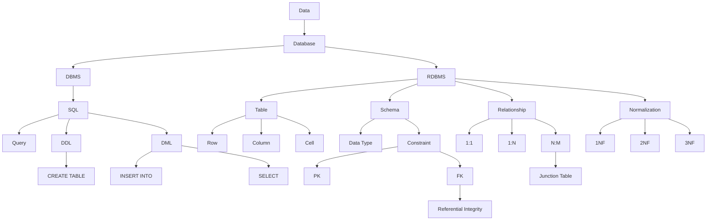
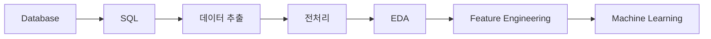

# [SQL] 데이터베이스 기초·구조·관계·테이블 생성 예습 정리

> **예습 목표: 아침 10분 안에 SQL 1장의 전체 구조를 잡는다.**  
> 세부 문법 암기보다 **SQL이 왜 필요한지 → 데이터베이스가 어떻게 생겼는지 → 테이블이 어떻게 연결되는지 → 직접 CREATE/INSERT 하는 흐름**을 먼저 이해한다.

---

# 🚨 이것만 알고 강의 들어가기

## 핵심 5줄 요약

1. **SQL은 데이터베이스에서 필요한 데이터를 직접 조회·가공·집계하기 위한 언어**다.
2. 관계형 데이터베이스는 데이터를 **테이블(Row/Column)** 형태로 저장하고, DBMS가 이를 관리한다.
3. **PK는 행을 유일하게 식별하고, FK는 다른 테이블을 연결한다.**
4. 데이터 중복과 이상 현상을 줄이기 위해 **정규화(1NF→2NF→3NF)** 를 적용한다.
5. 실제 SQL에서는 **DDL로 구조를 만들고, DML로 데이터를 넣고 조회한다.**

### 중요도

- 🔥🔥🔥 **DB / DBMS / SQL / Query 차이**
- 🔥🔥🔥 **Table / Row / Column / Cell**
- 🔥🔥🔥 **PK / FK / 참조 무결성**
- 🔥🔥🔥 **1:1 / 1:N / N:M 관계**
- 🔥🔥🔥 **CREATE TABLE / INSERT INTO**
- 🔥🔥 **정규화 1NF / 2NF / 3NF**
- 🔥🔥 **SQL 작성 순서 vs 실행 순서**
- 🔥 **ERD 기호 / 데이터 타입 / DDL·DML 분류**

---

# 🗺️ SQL 1장 전체 학습 구조



## 이 장을 한 문장으로

> **SQL 1장은 데이터베이스의 구조를 이해하고, 테이블 간 관계를 읽고, 직접 테이블을 만들고 데이터를 넣는 기초 체력을 만드는 장이다.**

---

# 🥇 1순위: SQL이 왜 필요한가

데이터 사이언스 업무 흐름을 먼저 본다.

```text
비즈니스 문제
 ↓
필요한 데이터 정의
 ↓
SQL로 데이터 추출
 ↓
전처리 / EDA
 ↓
머신러닝 모델링
 ↓
평가 / 인사이트
```

### 핵심

> **모델링 전에 먼저 데이터를 가져와야 한다.**

SQL을 못하면 필요한 데이터를 매번 다른 사람에게 요청해야 한다.

SQL을 알면:

- 필요한 데이터 직접 조회
- 조건 필터링
- 집계
- 여러 테이블 결합
- 모델링용 데이터셋 생성

이 가능하다.

---

# 🥇 2순위: Data / Database / DBMS / Query / SQL 구분

## Data

사실을 표현하는 원시 값.

```text
이름
나이
구매금액
가입일
```

## Database

데이터를 구조적으로 저장해 둔 공간.

## DBMS

Database를 만들고 관리하고 조회하게 해주는 소프트웨어.

예:

- PostgreSQL
- MySQL
- Oracle
- SQL Server

## Query

데이터베이스에 보내는 질문이나 명령.

## SQL

Query를 작성하는 언어.

### 기억법

```text
Database = 창고
DBMS = 창고 관리자
Query = 요청서
SQL = 요청서를 쓰는 언어
```

---

# 🥇 3순위: 관계형 데이터베이스 구조

관계형 데이터베이스(RDBMS)는 데이터를 테이블로 저장한다.

```text
Table
 ├─ Row
 ├─ Row
 └─ Row

Column → 속성
```

예:

| user_id | name | email |
|---:|---|---|
| 1 | 김민수 | minsu@example.com |
| 2 | 이지현 | jihyun@example.com |

### 구성 요소

```text
Table
= 데이터 묶음

Row / Record
= 데이터 한 건

Column / Field
= 속성

Cell
= Row와 Column이 만나는 값 하나
```

---

# 🥇 4순위: SQL 작성 순서와 실행 순서

## 작성 순서

```sql
SELECT
FROM
WHERE
GROUP BY
HAVING
ORDER BY
```

## 논리적 실행 순서

```text
FROM
→ WHERE
→ GROUP BY
→ HAVING
→ SELECT
→ ORDER BY
```

### 왜 중요할까

예를 들어 SELECT에서 만든 별칭을 WHERE에서 바로 못 쓰는 경우가 있다.

이유:

```text
WHERE가 SELECT보다 먼저 평가되기 때문
```

### 예습 단계 핵심

> **SQL은 위에서 아래로 적지만, 논리적으로는 FROM부터 시작한다고 기억한다.**

---

# 🥇 5순위: 데이터 타입

Column에는 어떤 종류의 데이터가 들어갈지 정한다.

| 타입 | 의미 | 예 |
|---|---|---|
| INT | 정수 | 25 |
| VARCHAR(n) | 길이 제한 문자열 | 이름, 이메일 |
| TEXT | 긴 문자열 | 게시글 |
| DATE | 날짜 | 2026-08-24 |
| DECIMAL(p,s) | 정확한 소수 | 가격 |
| BOOLEAN | 참/거짓 | true / false |

### 중요한 이유

잘못된 데이터가 들어가는 것을 막는다.

```text
나이 INT
→ '홍길동' 입력
→ 오류
```

---

# ⚠️ VARCHAR와 TEXT 보정

교안에는 VARCHAR가 성능상 더 효율적이라고 되어 있지만 PostgreSQL에서는 일반적인 저장/성능 측면에서 `TEXT`와 `VARCHAR` 사이에 큰 성능 차이가 있다고 단정하기 어렵다.

### 실무적으로는

```text
길이 제한 자체가 비즈니스 규칙이면
→ VARCHAR(n)

길이를 굳이 제한하지 않아도 되면
→ TEXT도 자연스러움
```

> **핵심은 성능보다 데이터 규칙을 어떻게 표현할지다.**

---

# 🥇 6순위: Schema

Schema는 데이터베이스의 설계도다.

```text
users 테이블
 ├─ user_id INT PK
 ├─ username VARCHAR NOT NULL
 ├─ email VARCHAR UNIQUE
 └─ created_at DATE
```

Schema에는:

- Table 이름
- Column 이름
- Data Type
- Constraint
- Table 간 관계

등이 포함된다.

### 한 줄

> **Schema = 데이터가 어떤 구조와 규칙으로 저장될지 정의한 설계도**

---

# 🥇 7순위: PK

Primary Key는 한 Row를 유일하게 식별한다.

```text
users
user_id = PK
```

규칙:

```text
중복 X
NULL X
```

예:

```text
user_id 1
user_id 2
user_id 3
```

### 복합키

여러 Column을 합쳐 하나의 PK를 만들 수도 있다.

```text
(student_id, course_id)
```

> **테이블에는 하나의 Primary Key 제약만 두지만, 그 PK가 여러 컬럼으로 구성될 수 있다.**

---

# 🥇 8순위: FK

Foreign Key는 다른 테이블의 Key를 참조한다.

```text
users
user_id PK

orders
order_id PK
user_id FK
```

연결:

```text
orders.user_id
       ↓
users.user_id
```

### 의미

```text
order_id = 101
user_id = 1
```

이면:

```text
1번 회원의 주문
```

임을 알 수 있다.

---

# 🥇 9순위: 참조 무결성

FK가 참조하는 값은 실제 부모 테이블에 존재해야 한다.

```text
users에 user_id=5 없음

orders에 user_id=5 INSERT
→ 오류
```

### 핵심

> **존재하지 않는 부모를 참조하는 고아 데이터 생성을 막는 규칙**

---

# 🥈 10순위: ON DELETE 옵션

부모 Row를 삭제할 때 자식 데이터를 어떻게 처리할지 정할 수 있다.

## 기본 동작

참조 중이면 삭제가 제한될 수 있다.

## CASCADE

```text
부모 삭제
→ 관련 자식도 삭제
```

## SET NULL

```text
부모 삭제
→ 자식 FK를 NULL 처리
```

### 주의

`SET NULL`을 쓰려면 해당 FK Column이 NULL을 허용해야 한다.

---

# 🥇 11순위: 정규화가 왜 필요한가

중복 데이터가 많으면:

```text
회원 등급명 = GOLD
```

이 여러 Row에 반복된다.

등급명이 바뀌면 모든 Row를 수정해야 한다.

일부만 수정하면:

```text
GOLD
골드
VIP GOLD
```

처럼 데이터가 깨질 수 있다.

정규화:

```text
중복 줄이기
→ 테이블 분리
→ FK로 연결
→ 데이터 일관성 개선
```

---

# 🥇 12순위: 1NF

> **한 칸에는 하나의 값만**

잘못된 예:

```text
course_names
= SQL, Python, ML
```

1NF:

```text
한 Cell에 하나의 원자값
```

### 핵심

```text
여러 값을 한 칸에 욱여넣지 않는다.
```

---

# 🥇 13순위: 2NF

2NF는 **복합키**가 있을 때 특히 중요하다.

PK:

```text
(student_id, course_id)
```

그런데:

```text
student_name
→ student_id 하나에만 의존

course_name
→ course_id 하나에만 의존
```

복합키 전체에 의존하지 않는다.

따라서 분리한다.

```text
students
courses
enrollments
```

### 기억법

> **2NF = 복합키 일부에만 의존하는 컬럼 제거**

---

# 🥇 14순위: 3NF

PK가 아닌 일반 Column이 다른 일반 Column을 결정하는 경우를 제거한다.

예:

```text
user_id PK
grade_id
grade_name
```

```text
grade_id → grade_name
```

그러므로 grade 정보를 별도 테이블로 분리한다.

### 기억법

> **3NF = 일반 컬럼끼리의 종속 관계를 분리**

---

# 🥈 15순위: 정규화는 무조건 많이 하는 게 아니다

정규화 장점:

- 중복 감소
- 수정 이상 감소
- 무결성 향상

단점:

- 테이블 수 증가
- JOIN 증가
- 조회가 복잡해질 수 있음

따라서 실무에서는 경우에 따라 반정규화를 사용한다.

> **설계의 핵심은 정규화 자체가 목적이 아니라 정확성과 성능의 균형이다.**

---

# 🥇 16순위: 테이블 관계 3종류

## 1:1

```text
회원 1
↕
회원 상세 1
```

예:

- 회원 ↔ 회원 상세정보

## 1:N

```text
회원 1
 ↓
주문 여러 개
```

가장 자주 본다.

예:

- 회원 : 주문
- 게시글 : 댓글
- 부서 : 직원

## N:M

```text
학생 여러 명
↕
강의 여러 개
```

직접 표현하지 않고 중간 테이블을 둔다.

```text
students
   ↓ 1:N
enrollments
   ↑ N:1
courses
```

---

# 🥇 17순위: Junction Table

N:M 관계를 풀기 위한 중간 테이블이다.

```text
students
student_id PK

courses
course_id PK

enrollments
student_id FK
course_id FK
```

보통:

```text
(student_id, course_id)
```

를 복합 PK 또는 UNIQUE 조합으로 설정할 수 있다.

### 핵심

> **N:M → 중간 테이블 → 두 개의 1:N으로 분해**

---

# 🥇 18순위: ERD

ERD는 데이터베이스 구조를 그림으로 보여준다.

```text
Entity
= Table

Attribute
= Column

Relationship
= Table 연결
```

ERD를 보면:

- 어떤 테이블이 있는지
- PK/FK가 무엇인지
- 몇 대 몇 관계인지
- JOIN 경로가 무엇인지

파악할 수 있다.

---

# 🥈 19순위: Crow's Foot 읽는 법

핵심 기호만 본다.

```text
O = 0개 가능
| = 1개
< = 여러 개
```

조합:

```text
O< = 0개 이상
|< = 1개 이상
|| = 정확히 1개
```

예:

```text
회원 || —— O< 주문
```

읽기:

```text
회원 1명은 주문 0개 이상 가능
주문 1개는 회원 정확히 1명에 속함
```

---

# 🥇 20순위: DDL vs DML

## DDL

Data Definition Language

```text
데이터베이스 구조를 정의
```

대표:

```sql
CREATE
ALTER
DROP
```

## DML

Data Manipulation Language

```text
데이터를 조회/추가/수정/삭제
```

대표:

```sql
SELECT
INSERT
UPDATE
DELETE
```

### 기억법

```text
DDL = 그릇 만들기
DML = 그릇 속 데이터 다루기
```

---

# 🥇 21순위: CREATE TABLE

기본 구조:

```sql
CREATE TABLE users (
    user_id INT PRIMARY KEY,
    username VARCHAR(50) NOT NULL,
    email VARCHAR(100) UNIQUE,
    created_at DATE NOT NULL
);
```

읽는 순서:

```text
Column 이름
→ Data Type
→ Constraint
```

---

# 🥇 22순위: Constraint

| Constraint | 의미 |
|---|---|
| PRIMARY KEY | 유일 식별자 |
| NOT NULL | 값 필수 |
| UNIQUE | 중복 금지 |
| DEFAULT | 값 없을 때 기본값 |
| REFERENCES | 다른 테이블 참조 |

예:

```sql
user_id INT REFERENCES users(user_id)
```

---

# 🥇 23순위: INSERT INTO

권장 방식:

```sql
INSERT INTO users (
    user_id,
    username,
    email,
    created_at
)
VALUES (
    1,
    '홍길동',
    'hong@example.com',
    '2024-01-01'
);
```

### 왜 Column 이름을 쓰나

테이블의 Column 순서에 덜 의존하고, 어떤 값이 어디에 들어가는지 명확하다.

> **초보 단계에서는 컬럼명을 명시하는 습관이 안전하다.**

---

# 🥇 24순위: 여러 행 INSERT

```sql
INSERT INTO users (user_id, username)
VALUES
    (1, '홍길동'),
    (2, '김영희'),
    (3, '이철수');
```

### 구조

```text
VALUES
(행1),
(행2),
(행3);
```

한 번에 여러 Row를 추가할 수 있다.

---

# 🥈 25순위: DROP TABLE

```sql
DROP TABLE users;
```

테이블 구조와 데이터가 사라진다.

### 주의

> **DROP은 조회가 아니라 구조 삭제 명령이다.**

실무에서는 매우 신중하게 사용한다.

---

# 🥈 26순위: PostgreSQL에서 구조 확인

`psql` 콘솔에서는:

```sql
\d users
```

처럼 메타 명령을 사용할 수 있다.

### 주의

`\d`는 표준 SQL 문법이 아니라 **psql 클라이언트의 메타 명령**이다.

GUI 도구나 다른 DBMS에서는 방식이 다를 수 있다.

---

# ⚠️ 강의에서 헷갈릴 가능성이 높은 부분

## 1. DB와 DBMS는 다르다

```text
DB
= 데이터 저장 구조/집합

DBMS
= 그 DB를 관리하는 프로그램
```

PostgreSQL은 DB 자체라기보다 DBMS 제품이다.

---

## 2. Query와 SQL은 같은 말이 아니다

```text
Query
= DB에 보내는 요청

SQL
= 그 요청을 표현하는 언어
```

---

## 3. PK는 '컬럼 하나'라는 뜻이 아니다

PK 제약은 하나지만 여러 컬럼을 묶어 구성할 수 있다.

```text
(student_id, course_id)
```

---

## 4. FK가 꼭 PK만 참조해야 하는 것은 아니다

SQL 표준/DBMS에서는 일반적으로 **UNIQUE 등 후보키**를 참조할 수도 있다.

예습에서는:

```text
FK → 다른 테이블의 유일한 Key를 참조
```

정도로 이해하면 충분하다.

---

## 5. N:M 관계는 논리적으로 존재하지만 물리 테이블 설계에서는 중간 테이블로 구현한다

```text
N:M
→ Junction Table
→ 1:N + N:1
```

---

## 6. SQL 실행 순서는 '논리적 처리 순서'

DBMS 내부 엔진은 Optimizer가 실제 물리 실행 계획을 다르게 만들 수 있다.

따라서:

```text
FROM → WHERE → GROUP BY ...
```

는 SQL을 이해하기 위한 **논리적 실행 순서**라고 보면 된다.

---

## 7. 정규화는 테이블을 많이 쪼개는 게임이 아니다

목적:

```text
중복 감소
이상 현상 방지
일관성 유지
```

이다.

---

# 🔗 머신러닝 학습과 연결하기



머신러닝에서 배운:

```text
결측치 처리
이상치 처리
Feature 선택
Train/Test Split
```

을 하려면 그 전에 **원본 데이터를 어디에서 어떤 조건으로 가져왔는지**가 중요하다.

> **SQL은 머신러닝보다 앞단의 데이터 확보·가공 파이프라인을 담당한다.**

---

# 🛍️ 실무 비유로 한 번에 이해하기

쇼핑몰을 예로 들면:

```text
users
= 고객 마스터

orders
= 주문

products
= 상품

order_items
= 주문 안의 상품 상세
```

관계:

```text
users 1 : N orders
orders 1 : N order_items
products 1 : N order_items
```

즉 상품과 주문은 사실상:

```text
orders N : M products
```

이고 `order_items`가 중간 테이블 역할을 한다.

이 구조를 읽을 수 있어야 나중에:

```text
고객별 구매금액
상품별 판매량
카테고리별 매출
재구매 고객
```

같은 분석 쿼리를 만들 수 있다.

---

# ⏱️ 아침 10분 예습 코스

## 0~2분 — SQL의 위치

```text
DB
→ SQL
→ 데이터 추출
→ Python/EDA
→ ML
```

말로 설명한다.

## 2~3분 — 테이블 구조

```text
Table
Row
Column
Cell
```

각각 무엇인지 말한다.

## 3~4분 — PK / FK

```text
PK
= 나를 식별

FK
= 다른 테이블과 연결
```

## 4~5분 — 관계

```text
1:1
1:N
N:M → 중간 테이블
```

## 5~6분 — 정규화

```text
1NF = 한 칸 한 값
2NF = 복합키 일부 종속 제거
3NF = 일반 컬럼 간 종속 제거
```

## 6~7분 — ERD

```text
Entity = Table
Attribute = Column
Relationship = 연결
```

## 7~8분 — DDL / DML

```text
DDL = 구조
DML = 데이터
```

## 8~9분 — CREATE / INSERT

```sql
CREATE TABLE ...
INSERT INTO ... VALUES ...
```

형태만 눈에 익힌다.

## 9~10분 — 최종 질문

1. SQL은 왜 데이터 사이언티스트에게 필요한가?
2. DB와 DBMS의 차이는?
3. Row와 Column의 차이는?
4. PK와 FK의 역할은?
5. 참조 무결성이란?
6. 1:N과 N:M의 차이는?
7. N:M은 실제 테이블에서 어떻게 구현하는가?
8. 1NF, 2NF, 3NF를 한 줄씩 설명할 수 있는가?
9. DDL과 DML의 차이는?
10. SQL 작성 순서와 논리적 실행 순서는 어떻게 다른가?

---

# ✅ 예습 완료 기준

> 아래 문장을 스스로 말할 수 있으면 충분하다.

**“SQL은 데이터베이스에 저장된 데이터를 직접 조회하고 가공하기 위한 언어다. 관계형 데이터베이스는 테이블의 행과 열로 데이터를 저장하고, PK로 각 행을 식별하며 FK로 테이블을 연결한다. N:M 관계는 중간 테이블로 풀어내고, 정규화를 통해 중복과 데이터 이상을 줄인다. 실제 SQL에서는 DDL의 CREATE TABLE로 구조를 만들고 DML의 INSERT INTO로 데이터를 입력한다.”**
