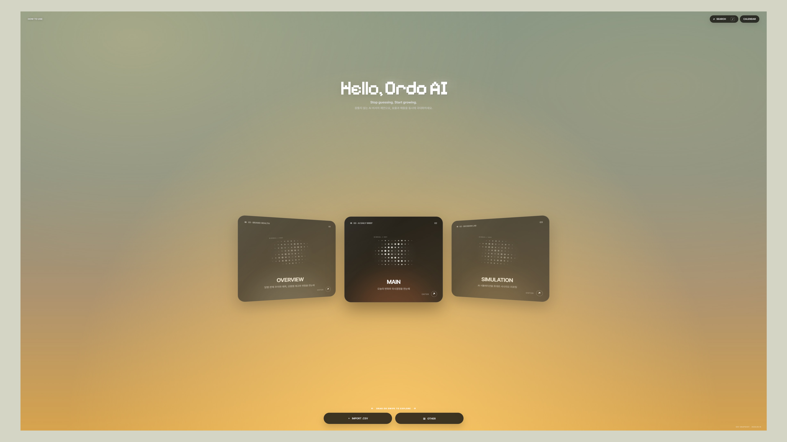
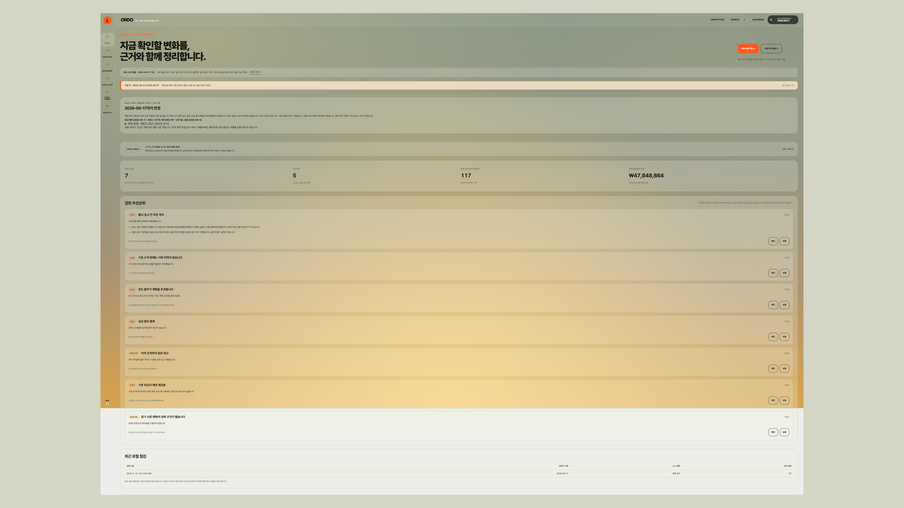
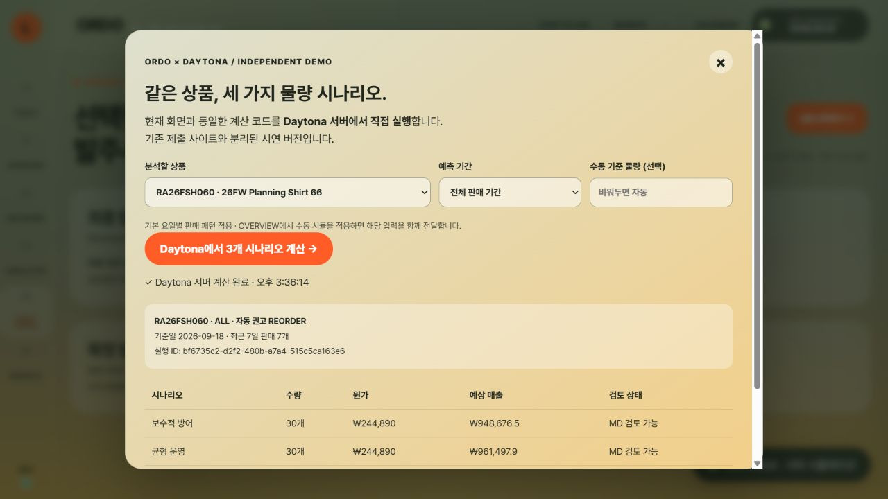

# ORDO AI

> ## 예감이 아닌 예측 시스템
>
> **매주 데이터와 씨름하지 마세요. 쉬지 않는 ORDO AI가 최적의 지표와 물량을 대신 관리할게요.**

패션 커머스 브랜드의 매출·물량·재고·현금·발주 데이터를 하나로 연결해 실시간 현황 확인부터 예측, 리스크 탐지, 리오더 판단과 물량 제안까지 지원하는 AI MD 의사결정 프로토타입입니다.

**Version 1.1.0 · 2026-09-19 · Daytona verified demo**

[DEV Demo](https://ordo-ai-decision-os-jihyu.jihyunkims495.chatgpt.site/#entry) · [최종 3분 영상](./docs/video/Ordo-AI_DEV-Demo_3MIN_FINAL_v4.mp4) · [최종 릴리스 기록](./docs/FINAL_RELEASE.md)




## 해결하려는 문제

브랜드 운영의 핵심인 매출·물량·발주 관리는 현재 상태와 미래 수요, 결품·과잉재고 위험을 동시에 판단해야 하는 고강도 업무입니다. 그러나 실무에서는 여러 CSV와 쿼리를 반복해서 추출·가공하고, 판매·재고·원가·환율·시즌 정보를 기획자의 경험과 예감으로 종합하는 경우가 많습니다. 이 과정은 판단 시간을 늘리고 대응을 늦추며, 결품과 과잉재고 위험을 키웁니다.

ORDO AI는 반복되는 데이터 가공과 모니터링을 AI 기반 의사결정 흐름으로 전환합니다. 현황·예측·리스크를 한 화면에서 연결해 매일 KPI와 발주 후보를 재평가하고, MD는 근거와 대안을 검토해 최종 결정을 내릴 수 있습니다.

```text
주문·판매·재고·원가·환율·시즌 데이터
→ 상품별 모니터링과 이상 신호 탐지
→ REORDER / WATCH / HOLD 분류
→ 수량 및 시나리오 비교
→ 근거·리스크·예상 결과 설명
→ MD의 최종 승인 또는 보류
```

## Version 1 기록

Version 1은 리오더 의사결정 경험을 검증하기 위한 첫 제출 가능 기준본입니다.

- 포함: Entry, Today, Overview, Decisions, Simulator, Final Order, Reports, Calendar와 Quick Guide
- 판단 범위: 상품별 REORDER·WATCH·HOLD, 수량 시나리오, KPI 변화, 판단 근거와 리스크
- 데이터: 가상 패션 PB 브랜드의 버전 고정형 주문·판매·재고·원가·환율 fixture
- 검증: JavaScript 문법, JSON 파싱, 정적 자산 참조, README 링크, 16:9 스크린샷과 민감정보 검사
- Version 1.0 제외: 라이브 Supabase, 운영 주문·재고 API, 외부 AI 추론, 실제 발주 전송, Daytona Sandbox 실행
- **Version 1.1 추가:** Daytona 호스팅, 서버 시나리오 계산 API, 자동·수동 입력의 원격 실행 검증. 외부 LLM과 실제 발주 전송은 여전히 제외합니다.

## 핵심 기능

| 화면 | 역할 |
| --- | --- |
| Today | 당일 데이터 수집 상태, 검토 우선순위, 다음 주 주요 일정 확인 |
| Overview | 요일별 판매 흐름, 전주 비교, KPI, 재평가 상품, 환율 변화 모니터링 |
| Decisions | 전체 후보를 REORDER·WATCH·HOLD로 구분하고 상품별 근거와 리스크 검토 |
| Simulator | 보수·균형·확대 시나리오와 수동 물량 조정에 따른 KPI 및 아소트 변화 비교 |
| Final Order | 선택 상품과 수량을 최종 검토하고 로컬 발주 기록·발주서를 확정하는 시연 |
| Reports | 상품별 보고서와 종합 보고서에서 관측값·예측값·판단·리스크 확인 |



## AI 활용 방식

- 주문·판매·재고·원가·환율·시즌 데이터를 함께 분석해 가상 패션 PB 브랜드의 상품·SKU별 실적과 현재 상태를 해석합니다.
- SKU별 판매실적을 기준으로 리오더 여부와 물량안, 목표 매출과 추가 매출 기회, 결품·과잉재고 위험 및 대응 대안을 제안합니다.
- 매일 KPI와 발주 후보를 같은 기준으로 재평가해, 여러 CSV를 반복 추출·가공하지 않고도 판단 흐름을 이어갈 수 있도록 설계했습니다.
- 수치 계산은 재현 가능한 규칙 기반 로직이 담당합니다. 검증된 결과를 외부 LLM으로 해석·요약하는 구조는 확장 계획이며, 현재 공개 웹과 최종 Daytona 시연은 외부 LLM을 호출하지 않습니다.
- 최종 발주는 자동 확정하지 않고 MD가 승인하거나 보류하는 Human-in-the-loop 구조로 설계했습니다.

### 도구별 역할

- **Codex**: 핵심 구현 도구로 활용해 데이터 구조와 결정 규칙을 정리하고, 관측·예측값 가공, KPI 계산, 화면 구현과 검증을 수행했습니다.
- **Supabase**: 일별 주문·판매, 재고, 예상 판매일수, 리드타임, MOQ, 원가와 환율 샘플을 담는 데이터 모델의 기반으로 검토했습니다. 공개 데모는 라이브 Supabase가 아닌 버전 고정형 정적 스냅샷을 사용합니다.
- **Figma·Claude**: Today, Overview, Decisions, Simulator, Reports 등 주요 Feature별 정보 구조, 사용자 동선, 핵심 관리 지표의 우선순위와 와이어프레임 설계에 활용했습니다.

## 샘플 데이터 구성

가상의 패션 PB 브랜드를 기준으로 메인 상품과 브랜드 역할을 구분했습니다.

- 상의 메인: 니트(사입)
- 하의 메인: 데님(제조)
- 기획 상품: 티셔츠
- 시즌 메인: 슬랙스·아우터
- 컨셉 상품: 잡화
- SS 컨셉: 반팔 코튼 혼방 라운드 니트
- FW 컨셉: 긴팔 캐시미어 블렌디드 니트
- 하의 컨셉: 셀비지 스트레이트 데님

Supabase 기반 데이터 모델을 검토하며 SKU별 주문, 일별 판매, 재고, 예상 판매일수, 리드타임, MOQ, 원가와 환율 샘플을 구성했습니다. 공개 데모는 외부 데이터베이스를 직접 호출하지 않고 버전이 고정된 정적 스냅샷을 사용합니다. 관측값과 예측값, 예측 매출과 무발주 기준을 분리해 비교할 수 있도록 만들었습니다.

## Figma·Claude 활용

Figma와 Claude는 Today에서 Reports까지 이어지는 주요 Feature별 정보 구조, 사용자 동선, 지표 우선순위와 와이어프레임을 설계하는 데 사용했습니다. 복잡한 데이터를 한 화면에 나열하기보다 `모니터링 → 분석 → 판단 → 시뮬레이션 → 보고` 순서로 배치해 처음 사용하는 MD도 다음 행동을 찾을 수 있도록 했습니다.


## 현재 결과

- 매주 여러 쿼리와 CSV를 오가던 리오더 검토 흐름을 하나의 UI로 통합했습니다.
- 상품별 REORDER·WATCH·HOLD 판단, 수량 시나리오, 예상 매출, 잔여 재고와 결품 손실을 같은 맥락에서 비교할 수 있습니다.
- 상품별 분석과 종합 리포트, 판단 리스크와 다음 행동을 함께 제시합니다.
- 그래프는 탭과 관측 기간에 따라 변화하며 hover·focus·touch와 좌→우 reveal interaction을 지원합니다.

## 시행착오와 한계

현재 데이터는 샘플이므로 예측 그래프에서 실무 데이터만큼 상품별 차이가 뚜렷하게 드러나지는 않습니다. 실 매출 비중, 시즌성, 상품 타입과 역할, 요일 가중치, 리드타임 및 시나리오 계산을 분리해 획일적인 움직임을 보완했지만, 예측 정확도 검증과 실제 발주 시스템 연동은 아직 부족합니다.

현재 버전은 정적 화면에 독립 서버 계산을 추가한 시연입니다. 실시간 주문 수집, 운영 Supabase 연결, 외부 AI 추론, 실제 PO 전송, 예측 백테스트는 아직 연결되지 않았습니다.



## 최종 시연 영상과 화면

[**최종 3분 MP4 보기 / 다운로드 — v4**](./docs/video/Ordo-AI_DEV-Demo_3MIN_FINAL_v4.mp4)

영상은 메인 탐색, 주요 화면, 주간 판매 수동 시뮬과 최종 발주 흐름을 담은 기존 최종 편집본입니다.GitHub가 미리보기를 제공하지 않으면 영상 파일 페이지에서 다운로드할 수 있습니다.

| 최신 캡처 | 화면 |
| --- | --- |
| [Entry](./docs/screenshots/01-main-entry.jpg) | 메인 탐색 |
| [Today](./docs/screenshots/02-today.jpg) | 당일 검토 우선순위 |
| [Overview](./docs/screenshots/03-overview.jpg) | 주간 판매·예측 KPI |
| [Decisions](./docs/screenshots/04-decisions.jpg) | 상품 판단 |
| [Simulator](./docs/screenshots/05-simulator.jpg) | 시나리오 비교 |
| [Reports](./docs/screenshots/06-reports.jpg) | 종합 위험·리포트 |
| [Final Order](./docs/screenshots/07-final-order.jpg) | 발주 검토함 |
| [Daytona 실행](./docs/screenshots/08-daytona-server.jpg) | 실제 서버 계산 완료 |
| [Daytona 결과 상세](./docs/screenshots/09-daytona-results.jpg) | 세 시나리오 전체 결과와 데이터 경계 |

## 향후 업그레이드 계획

1. 주문·판매·재고 API와 실데이터를 연결하고 예측 백테스트를 반복해 정확도와 학습력을 높입니다.
2. 실 매출 비중, 시즌, 상품 타입별 성과와 이상 징후를 지속 학습하고 리오더 마감 시점과 위험을 알리는 모니터링을 연결합니다.
3. 운영 브랜드의 컨셉과 상품 명세를 업로드하면 AI가 브랜드 현 컨디션, 시장과 유저를 함께 분석하도록 확장합니다.
4. 학습된 브랜드 맥락을 기반으로 시즌 초 P&L과 카테고리·SKU별 물량 계획을 제안합니다.
5. 정확도가 검증된 결과에 한해 발주 시스템과 연결하되 최종 승인 권한은 MD에게 유지합니다.
6. 커머스 MD가 가장 어려워 하고 감에 의존하고 있는, 앞으로의 시장 확장성과 내외부 유저 분석에 따른 수익화 현금 계획과 최초 물량 계획을 AI가 브랜드들의 명세를 읽어 시뮬레이션하여 시나리오를 제안합니다.
7. 최종 발주 후, 생산처에서 excel로 관리되는 수주 시스템을 csv로 자동 변환해 본사에서도 생산처의 현황을 실시간 모니터링 할 수 있도록 합니다.
8. 리오더된 물량이 본사 물류로 입고된 후, 실시간 고객 주문에 따른 물류 AI 피킹 로봇이 직접 수불과 입출고를 관리하게 합니다.
   

## 기술 구성

- Prototype UI: HTML, CSS, Vanilla JavaScript
- Data fixture: versioned JSON/JavaScript snapshot
- Data modeling foundation: Supabase schema and synthetic sample design
- UX architecture and wireframe: Figma
- Isolated execution: Daytona Sandbox + Node.js HTTP API (실행 검증 완료)


## 공개 데모의 데이터 경계

주문·재고·예측·추천은 실제 운영 구조를 모사한 합성 데모 데이터입니다. 환율 위젯은 이와 별도로 외부 일별 공시 API를 조회하며, 조회 실패 시 실패 상태를 표시합니다. 실시간 체결 환율이 아닙니다. 현재 공개 버전은 라이브 데이터베이스, 운영 스케줄러, 외부 AI 추론 또는 실제 발주 전송이 연결된 제품이라고 주장하지 않습니다.


